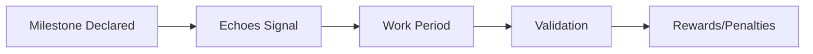

# CLAUDE.md - Studio3 Documentation Project

## Project Overview

This project creates a comprehensive 50+ page MkDocs + Material documentation site for Studio3, a venture building platform that uses gamified belief signals, public milestones, and community validation to help startups grow from idea to sovereignty.

## Key Concepts

### Platform Philosophy
- **Studio3** is a venture engine where "belief becomes momentum"
- Startups are built through public **Arenas** with transparent milestones
- **NOT** an incubator, accelerator, or traditional DAO
- Gamified entrepreneurship with real stakes and rewards

### Core Mechanics

#### 1. The $SIGNAL Token
- **Utility token** for expressing belief or doubt (NOT a security or bet)
- Earned through accurate predictions, burned through failures
- Represents conviction about execution ability, not financial speculation

#### 2. Three NFT System
- **Spark NFT** 🎨: Original idea, created from remixed IP-NFTs via Flambette marketplace
- **Signal NFT** 📡: Dynamic venture identity, tracks entire journey
- **Halo NFT** 🛡️: Soulbound sovereignty seal, unlocked only at exit

#### 3. Container DAO Model
- Lightweight governance wrapper for each venture
- Houses all NFTs in a **Genesis Wallet** (multisig)
- Enables community participation without equity dilution
- Progressive decentralization as venture grows

#### 4. Seven Phase Lifecycle
1. **Spark** ✨: Ideas enter and gather initial belief
2. **Forge** ⚔️: Founders compete in duels for ownership
3. **Ignition** 🚀: Container DAO forms, MVP development
4. **Drift** 🌊: Find product-market fit through iteration
5. **Orbit** 🛸: Achieve stable operations
6. **Flare** 🔥: Scale with capital and growth
7. **Ascension** 🎖️: Graduate to full sovereignty

### Three Roles
- **Founders (Senders)**: Build ventures through public milestones
- **Supporters (Echoes)**: Signal belief/doubt, earn through accuracy
- **Validators (Anchors)**: Guide ventures and validate progress

## Technical Architecture

### Documentation Stack
```
MkDocs + Material Theme
├── Custom CSS animations (Signal Orb, Arena Cards)
├── Interactive JavaScript components
├── Mermaid diagram support
├── Responsive design with dark/light modes
└── Search, navigation, and TOC integration
```

### Key Files
- `mkdocs.yml`: Main configuration with navigation structure
- `generate_docs.py`: Python script to generate all content
- `docs/stylesheets/extra.css`: Custom styling for Studio3 branding
- `docs/javascripts/extra.js`: Interactive components

## Important Implementation Notes

### Language & Framing
- **ALWAYS** refer to "$SIGNAL tokens" (never $STUDIO)
- **NEVER** describe signals as "bets" or "securities"
- **EMPHASIZE** belief/doubt as conviction about execution
- **AVOID** mentioning the underlying Echion protocol
- **FOCUS** on Studio3 as the user-facing platform

### Content Priorities
1. **Practical guides** over technical theory
2. **Visual examples** with Arena cards and phase indicators
3. **Clear progression paths** for each role
4. **Real stakes and consequences** in the gamified system
5. **Community-driven validation** as core principle

### Style Guidelines
- Use **arena-card** class for important callouts
- **ALWAYS** add `markdown="1"` attribute to arena-card divs for proper markdown rendering
- Apply **phase-indicator** classes with appropriate colors
- Format tokens with **token-display** class
- Include **emoji indicators** for visual navigation
- Maintain **conversational but authoritative** tone

## Project Structure

```
studio3-docs/
├── docs/
│   ├── getting-started/     # Introduction and basics
│   ├── arena/              # Arena system mechanics
│   ├── lifecycle/          # 7-phase journey details
│   ├── nfts/              # NFT system explanation
│   ├── founders/          # Founder-specific guides
│   ├── echoes/            # Supporter guides
│   ├── anchors/           # Validator guides
│   ├── tokens/            # $SIGNAL economics
│   ├── tools/             # Platform features
│   ├── cases/             # Success stories
│   └── resources/         # Templates and FAQ
├── mkdocs.yml             # Configuration
├── generate_docs.py       # Content generator
└── improvement_commands.sh # Expansion scripts
```

## Key Interactions

### Arena Flow


### NFT Evolution
1. **Spark Phase**: Spark NFT minted from remixed IPs
2. **Forge Phase**: Winner receives Signal NFT
3. **Ignition Phase**: Halo NFT created in Genesis Wallet
4. **Ascension Phase**: All NFTs bought back for sovereignty

### Technology Readiness Levels (TRL)
- Maps each phase to TRL 1-9 progression
- Provides clear maturity indicators
- Guides appropriate milestone setting

## Common Patterns

### Successful Ventures
- Clear problem definition from remixed IPs
- Realistic milestone progression
- Active community engagement
- Consistent delivery record
- Strategic use of doubt signals for improvement

### Arena Best Practices
- Declare specific, measurable milestones
- Engage with both belief and doubt signals
- Iterate based on community feedback
- Build reputation through consistency
- Graduate through all phases systematically

## Edge Cases & Considerations

### Milestone Failures
- Tokens are burned, not redistributed to system
- Reputation (XP) impacts are permanent
- Failed ventures can pivot in Drift phase
- Resurrection Duels allow second chances

### Signal Dynamics
- Early signals earn higher multipliers
- Contrarian correct predictions reward more
- Herd behavior is naturally discouraged
- Anchor opinions carry significant weight

### Exit Mechanics
- Buyback requires repurchasing Spark + Signal NFTs
- Halo NFT only unlocks after complete buyback
- Genesis Wallet ownership transfers to founders
- Graduated ventures can launch sub-studios

## Future Enhancements

### Planned Features
- Conditional signals ("I believe IF...")
- Cross-venture signal strategies
- Advanced Arena types
- Recursive studio creation
- Enhanced analytics dashboard

### Documentation Expansion
- Video tutorials for each role
- Interactive Arena simulator
- Real-time venture tracker
- Community contribution system
- Multi-language support

## Debugging Tips

### Common Issues
1. **Missing content**: Run `python3 generate_docs.py`
2. **Styling broken**: Check `extra.css` is loaded
3. **Navigation errors**: Verify `mkdocs.yml` structure
4. **Search not working**: Rebuild with `mkdocs build`

### Performance Optimization
- Minimize custom CSS animations on mobile
- Lazy load images and heavy components
- Use static generation for production
- Enable caching headers

## Related Systems

### Flambette Marketplace
- Source of remixable IP-NFTs
- Integration point for Spark creation
- Browse research and patents
- Combine IPs into venture concepts
- Bridge to **Caelum Protocol** for IP financing and fractionalization
- Enables IP-NFT fractions to be assembled into Spark NFTs

### MindfulTech Institute
- Circle of founders focused on collaborative learning
- Bridge to **Aletheia Protocol** for trust infrastructure
- Uses **Koras** (trust hubs) for founder verification
- Facilitates recruiting and HR through **Traces** (verifiable credentials)
- Helps ventures build trusted teams with verified backgrounds
- Provides mentorship networks with authenticated expertise

### At Bryde Ud Ecosystem
- Meta-protocol coordination layer
- Rewards cross-protocol interactions
- Studio3 operates independently within it
- $BRYDE governance (background only)

### Protocol Touchpoints
- **Aletheia Integration**: Trust verification for founders and team members via MindfulTech
- **Caelum Integration**: IP financing and fractionalization through Flambette
- These remain mostly invisible to users but enhance Studio3's capabilities

## Success Metrics

### Documentation Goals
- 50+ comprehensive pages
- Clear role-based navigation
- Interactive examples throughout
- Mobile-responsive design
- Fast search and loading

### User Success Indicators
- Quick understanding of core concepts
- Clear path to participation
- Reduced support questions
- High engagement with guides
- Successful venture launches

---

**Remember**: Studio3 is about making belief matter through transparent, gamified venture building. The documentation should inspire participation while clearly explaining the mechanics and rewards.
