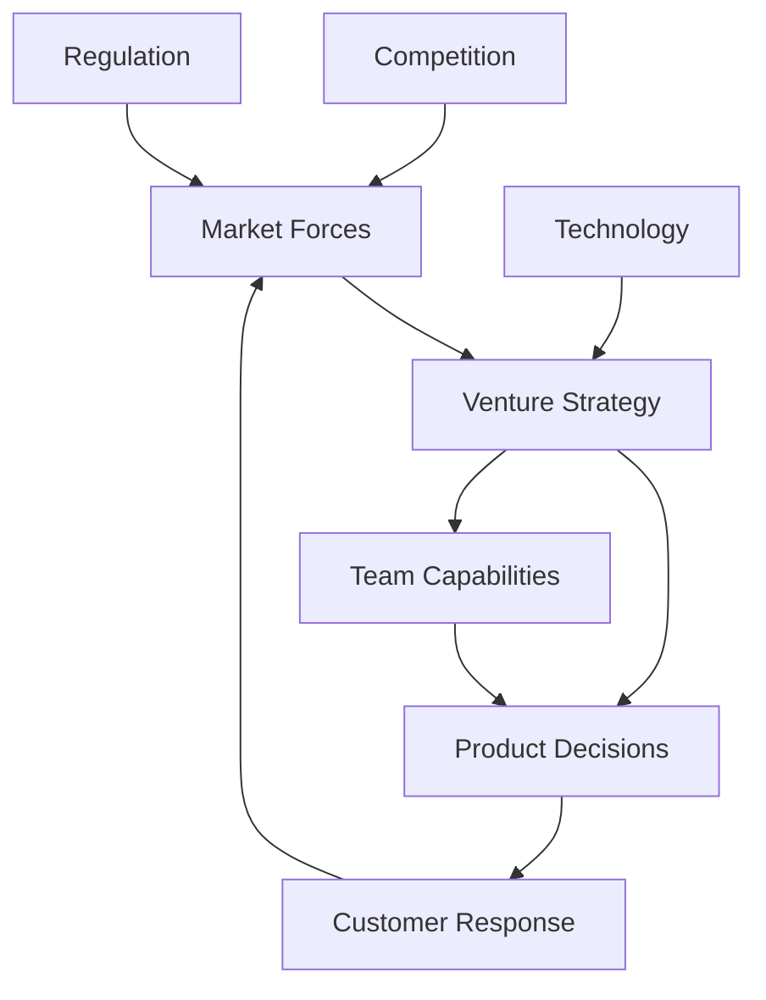

# Strategic Advice

## Providing High-Level Strategic Guidance

<h3>🎯 Shaping Venture Trajectories</h3>

Strategic advice is where Anchors provide their highest value - helping founders see beyond daily execution to build ventures that can scale, compete, and ultimately succeed. This guide teaches you to think and advise strategically at the level ventures need.

## Strategic Thinking Framework

### The Strategic Mindset

<h3>🧠 Thinking Like a Strategist</h3>

**Strategic vs Tactical Thinking:**

| Tactical | Strategic |

|----------|-----------|

| How to build | What to build |

| This week | Next year |

| Features | Positioning |

| Execution | Direction |

| Trees | Forest |

**Strategic Questions:**

<ul>
<li>**Where is the market going?**</li>
<li>What's our unique advantage?</li>
<li>How do we win long-term?</li>
<li>What must we become?</li>
<li>When do we pivot/persist?</li>

</ul>

**Strategic Perspective:**

<ul>
<li>**Industry dynamics**</li>
<li>Competitive forces</li>
<li>Technology trends</li>
<li>Regulatory environment</li>
<li>Economic cycles</li>

</ul>

### Systems Thinking

<h3>🔄 Understanding Interconnections</h3>

**Systems Elements:**

**Systems Analysis:**

1. **Identify Components**

<ul>
<li>Internal elements</li>

<li>External forces</li>

<li>Relationships</li>

<li>Feedback loops</li>

</ul>

2. **Map Interactions**

<ul>
<li>Cause and effect</li>

<li>Time delays</li>

<li>Amplifying loops</li>

<li>Balancing forces</li>

</ul>

3. **Find Leverage Points**

<ul>
<li>Maximum impact areas</li>

<li>Intervention opportunities</li>

<li>Unintended consequences</li>

<li>System constraints</li>

</ul>

## Market Strategy

### Market Analysis

<h3>📊 Understanding Market Dynamics</h3>

**Market Assessment Framework:**

**TAM/SAM/SOM Analysis:**

This framework visualizes market opportunity as nested layers, starting with the Total Addressable Market at the broadest level, narrowing down to your Serviceable Addressable Market (what you can realistically reach), then to your Serviceable Obtainable Market (what you can capture), and finally focusing on your initial target market of the first 100 customers. Each layer represents a more focused and achievable segment of the overall opportunity.

**Market Dynamics:**

<ul>
<li>**Growth rate**</li>
<li>Maturity stage</li>
<li>Disruption potential</li>
<li>Consolidation trends</li>
<li>Technology shifts</li>

</ul>

**Strategic Questions:**

1. Is the market growing or shrinking?

2. What forces drive change?

3. Where is opportunity greatest?

4. When should we enter/expand?

5. How do we capture value?

### Competitive Strategy

<h3>⚔️ Winning in the Market</h3>

**Porter's Five Forces Applied:**

1. Competitive Rivalry

<ul>
<li>**Current competitors**</li>
<li>Intensity factors</li>
<li>Differentiation opportunities</li>
<li>Exit barriers</li>
</ul>

2. Supplier Power

<ul>
<li>**Key dependencies**</li>
<li>Switching costs</li>
<li>Integration opportunities</li>
<li>Alternative sources</li>
</ul>

3. Buyer Power

<ul>
<li>**Customer concentration**</li>
<li>Price sensitivity</li>
<li>Switching costs</li>
<li>Bargaining leverage</li>
</ul>

4. Threat of Substitutes

<ul>
<li>**Alternative solutions**</li>
<li>Switching triggers</li>
<li>Performance comparison</li>
<li>Price-value equation</li>
</ul>

5. Threat of New Entrants

<ul>
<li>**Entry barriers**</li>
<li>Capital requirements</li>
<li>Network effects</li>
<li>Regulatory moats</li>

</ul>

### Positioning Strategy

<h3>🎯 Finding Your Space</h3>

**Positioning Framework:**

**Value Proposition Canvas:**

This strategic tool maps three key connections: First, it links what customers are trying to accomplish (their jobs) to your products and services. Second, it connects customer pain points to your specific pain relievers. Third, it aligns what customers hope to gain with your gain creators. This ensures your offering directly addresses real customer needs.

**Differentiation Strategies:**

1. **Cost Leadership**

<ul>
<li>Operational efficiency</li>

<li>Scale economics</li>

<li>Process innovation</li>

<li>Automation focus</li>

</ul>

2. **Differentiation**

<ul>
<li>Unique features</li>

<li>Superior quality</li>

<li>Brand strength</li>

<li>Customer experience</li>

</ul>

3. **Focus/Niche**

<ul>
<li>Segment specialization</li>

<li>Geographic focus</li>

<li>Use case expert</li>

<li>Industry vertical</li>

</ul>

## Business Model Strategy

### Revenue Architecture

<h3>💰 Designing Sustainable Models</h3>

**Revenue Model Options:**

**Transaction-Based**

<ul>
<li>**One-time purchase**</li>
<li>Pay-per-use</li>
<li>Commission/fees</li>
<li>Marketplace take</li>

</ul>

**Recurring Revenue**

<ul>
<li>**SaaS subscriptions**</li>
<li>Membership fees</li>
<li>Maintenance contracts</li>
<li>Platform access</li>

</ul>

**Hybrid Models**

<ul>
<li>**Freemium**</li>
<li>Land and expand</li>
<li>Platform + services</li>
<li>Hardware + software</li>

</ul>

**Strategic Considerations:**

<ul>
<li>**Customer lifetime value**</li>
<li>Acquisition costs</li>
<li>Churn implications</li>
<li>Growth dynamics</li>
<li>Margin structure</li>

</ul>

### Unit Economics

<h3>📈 Building Profitable Growth</h3>

**Unit Economic Framework:**

The fundamental business health metrics show that Lifetime Value (LTV) equals your Average Revenue Per User times Gross Margin times how long customers stay. Customer Acquisition Cost (CAC) is calculated by dividing total marketing and sales spend by new customers acquired. Healthy ventures typically target an LTV to CAC ratio greater than 3:1, meaning each customer generates at least three times what it costs to acquire them, with payback periods under 12 months for sustainable growth.

<strong>Optimization Strategies:</strong>

1. **Increase LTV**

<ul>
<li>Improve retention</li>
<li>Upsell/cross</li>
<li>sell</li>

<li>Price optimization</li>

<li>Value enhancement</li>

</ul>

2. **Reduce CAC**

<ul>
<li>Channel efficiency</li>

<li>Referral programs</li>

<li>Content marketing</li>

<li>Product virality</li>

</ul>

3. **Improve Margins**

<ul>
<li>Cost reduction</li>

<li>Pricing power</li>

<li>Operational efficiency</li>

<li>Automation</li>

</ul>

## Growth Strategy

### Growth Framework

<h3>🚀 Scaling Strategically</h3>

**Growth Stages:**

**Stage 1: Product-Market Fit**

<ul>
<li>**Problem validation**</li>
<li>Solution refinement</li>
<li>Early adopters</li>
<li>Retention focus</li>

</ul>

**Stage 2: Growth Traction**

<ul>
<li>**Channel discovery**</li>
<li>Scaling experiments</li>
<li>Team building</li>
<li>Process creation</li>

</ul>

**Stage 3: Scaling**

<ul>
<li>**Channel optimization**</li>
<li>Market expansion</li>
<li>Competitive defense</li>
<li>Culture preservation</li>

</ul>

**Stage 4: Market Leadership**

<ul>
<li>**Category creation**</li>
<li>Ecosystem building</li>
<li>M&A opportunities</li>
<li>International expansion</li>

</ul>

### Channel Strategy

<h3>📢 Distribution Excellence</h3>

**Channel Assessment Matrix:| Channel | CAC | Scale Potential | Control | Fit |**

|---------|-----|----------------|---------|-----|

| Direct Sales | High | Medium | High | B2B |

| Content/SEO | Low | High | High | Long-term |

| Paid Ads | Medium | High | Medium | B2C |

| Partnerships | Low | High | Low | Varies |

| Community | Low | Medium | High | Engaged |

**Channel Strategy Questions:**

1. Where are our customers?

2. What channels scale?

3. How do channels interact?

4. When to add new channels?

5. Which to prioritize?

## Innovation Strategy

### Innovation Framework

<h3>💡 Staying Ahead</h3>

**Innovation Horizons:**

**Horizon 1: Core (70%)**

<ul>
<li>**Current business**</li>
<li>Incremental improvement</li>
<li>Optimization focus</li>
<li>Near-term returns</li>

</ul>

**Horizon 2: Emerging (20%)**

<ul>
<li>**Adjacent opportunities**</li>
<li>New segments</li>
<li>Channel expansion</li>
<li>Medium-term bets</li>

</ul>

**Horizon 3: Transformational (10%)**

<ul>
<li>**Breakthrough innovation**</li>
<li>New business models</li>
<li>Long-term bets</li>
<li>Future options</li>

</ul>

**Innovation Process:**

1. Continuous scanning

2. Rapid experimentation

3. Fail fast learning

4. Scale what works

5. Kill what doesn't

### Technology Strategy

<h3>🔧 Technical Strategic Decisions</h3>

**Technology Choices:**

**Build vs Buy vs Partner Decision Framework:**

**Build When:**

<ul>
<li>Core differentiator</li>
<li>No good solutions</li>
<li>Control critical</li>
<li>IP valuable</li>
</ul>

**Buy When:**

<ul>
<li>Commodity function</li>
<li>Time critical</li>
<li>Cost effective</li>
<li>Support available</li>
</ul>

**Partner When:**

<ul>
<li>Complementary skills</li>
<li>Market access</li>
<li>Risk sharing</li>
<li>Speed needed</li>
</ul>

</ul>

<strong>Technical Debt Management:</strong>

<ul>
<li>**Strategic debt (conscious)**</li>
<li>Accidental debt (fix)</li>
<li>Payback planning</li>
<li>Refactoring rhythm</li>

</ul>

## Team & Culture Strategy

### Organizational Design

<h3>👥 Building for Scale</h3>

**Organizational Evolution:**

**Founder-Led (1-10)**

<ul>
<li>**Flat structure**</li>
<li>Direct communication</li>
<li>Rapid decisions</li>
<li>Culture by example</li>

</ul>

**Team-Based (10-50)**

<ul>
<li>**Functional teams**</li>
<li>Clear roles</li>
<li>Process emergence</li>
<li>Culture codification</li>

</ul>

**Scaled Organization (50+)**

<ul>
<li>**Hierarchical elements**</li>
<li>Specialized functions</li>
<li>Formal processes</li>
<li>Culture programs</li>

</ul>

**Strategic Considerations:**

<ul>
<li>**Communication paths**</li>
<li>Decision velocity</li>
<li>Innovation capacity</li>
<li>Cultural preservation</li>

</ul>

### Talent Strategy

<h3>🌟 Winning the Talent War</h3>

**Talent Acquisition:**

<ul>
<li>**Employer brand**</li>
<li>Sourcing strategy</li>
<li>Assessment process</li>
<li>Onboarding excellence</li>

</ul>

**Talent Development:**

<ul>
<li>**Skill mapping**</li>
<li>Growth paths</li>
<li>Mentorship programs</li>
<li>Leadership pipeline</li>

</ul>

**Talent Retention:**

<ul>
<li>**Compensation philosophy**</li>
<li>Equity strategy</li>
<li>Culture investment</li>
<li>Career development</li>

</ul>

**Strategic Questions:**

1. What talent do we need when?

2. Build, buy, or borrow?

3. How to compete for talent?

4. Culture vs compensation?

5. Succession planning?

## Financial Strategy

### Funding Strategy

<h3>💵 Capital Planning</h3>

**Funding Options Analysis:**

**Bootstrapping**

<ul>
<li>**Full control**</li>
<li>Slow growth</li>
<li>Customer funded</li>
<li>Sustainable focus</li>

</ul>

**Angel/Seed**

<ul>
<li>**Validation capital**</li>
<li>Smart money value</li>
<li>Network access</li>
<li>Flexibility retained</li>

</ul>

**Venture Capital**

<ul>
<li>**Growth acceleration**</li>
<li>Expertise access</li>
<li>Pressure increase</li>
<li>Control dilution</li>

</ul>

**Alternative Funding**

<ul>
<li>**Revenue financing**</li>
<li>Crowdfunding</li>
<li>Grants/competitions</li>
<li>Strategic partners</li>

</ul>

**Strategic Framework:**

1. How much do we need?

2. What will we achieve?

3. What are we trading?

4. Who adds most value?

5. What's our timeline?

### Exit Strategy

<h3>🎯 Planning the Endgame</h3>

**Exit Options:**

**Acquisition**

<ul>
<li>**Strategic buyers**</li>
<li>Financial buyers</li>
<li>Competitor consolidation</li>
<li>Customer acquisition</li>

</ul>

**IPO**

<ul>
<li>**Public markets**</li>
<li>Liquidity event</li>
<li>Continued independence</li>
<li>Regulatory burden</li>

</ul>

**Secondary Sale**

<ul>
<li>**Founder liquidity**</li>
<li>Investor returns</li>
<li>Continued operation</li>
<li>New growth capital</li>

</ul>

**Studio3 Ascension**

<ul>
<li>**Full independence**</li>
<li>Token mechanics</li>
<li>Community ownership</li>
<li>Ecosystem value</li>

</ul>

**Exit Preparation:**

<ul>
<li>**Clean financials**</li>
<li>Scalable operations</li>
<li>Strong management</li>
<li>Growth trajectory</li>
<li>Strategic value</li>

</ul>

## Risk Strategy

### Risk Assessment

<h3>⚠️ Strategic Risk Management</h3>

**Risk Categories:**

**Market Risks**

<ul>
<li>**Demand disappearance**</li>
<li>Competition intensity</li>
<li>Technology disruption</li>
<li>Economic downturn</li>

</ul>

**Execution Risks**

<ul>
<li>**Team capability**</li>
<li>Technical complexity</li>
<li>Operational scaling</li>
<li>Financial management</li>

</ul>

**External Risks**

<ul>
<li>**Regulatory changes**</li>
<li>Platform dependencies</li>
<li>Supplier concentration</li>
<li>Geopolitical factors</li>

</ul>

**Risk Mitigation:**

1. Identify systematically

2. Assess probability/impact

3. Develop contingencies

4. Monitor indicators

5. Act decisively

## Strategic Communication

### Board/Stakeholder Management

<h3>📊 Strategic Alignment</h3>

**Communication Framework:**

**Strategic Updates**

<ul>
<li>**Market dynamics**</li>
<li>Competitive position</li>
<li>Progress metrics</li>
<li>Strategic pivots</li>
<li>Resource needs</li>

</ul>

**Decision Frameworks**

<ul>
<li>**Options analysis**</li>
<li>Recommendation rationale</li>
<li>Risk assessment</li>
<li>Resource implications</li>
<li>Success metrics</li>

</ul>

**Stakeholder Alignment:**

<ul>
<li>**Vision consistency**</li>
<li>Strategy understanding</li>
<li>Expectation management</li>
<li>Conflict resolution</li>
<li>Long-term focus</li>

</ul>

## Strategic Tools

### Analysis Frameworks

<h3>🛠️ Strategic Toolbox</h3>

**Essential Frameworks:**

1. **SWOT Analysis**

2. **Value Chain Analysis**

3. **BCG Matrix**

4. **Ansoff Matrix**

5. **Blue Ocean Strategy**

6. **Jobs-to-be-Done**

7. **OKR Planning**

**When to Use Each:**

<ul>
<li>**SWOT: Initial assessment**</li>
<li>Value Chain: Efficiency</li>
<li>BCG: Portfolio decisions</li>
<li>Ansoff: Growth options</li>
<li>Blue Ocean: Differentiation</li>
<li>JTBD: Innovation</li>
<li>OKRs: Execution alignment</li>

</ul>

## Next Steps

### Advanced Strategic Topics

Continue developing with:

1. [Crisis Management](crisis-management.md) - Strategic crisis response
2. [Ecosystem Governance](ecosystem-governance.md) - Platform strategy
3. [Anchor Progression](anchor-progression.md) - Career strategy

---

!!! tip "Strategic Excellence"
    Great strategic advice helps founders see around corners, make hard decisions, and build ventures that matter. Your strategic insight can be the difference between good and great.

!!! success "Impact Multiplier"
    While tactical advice helps today, strategic guidance shapes years. Invest time in developing strategic thinking skills - they're your highest leverage contribution as an Anchor.