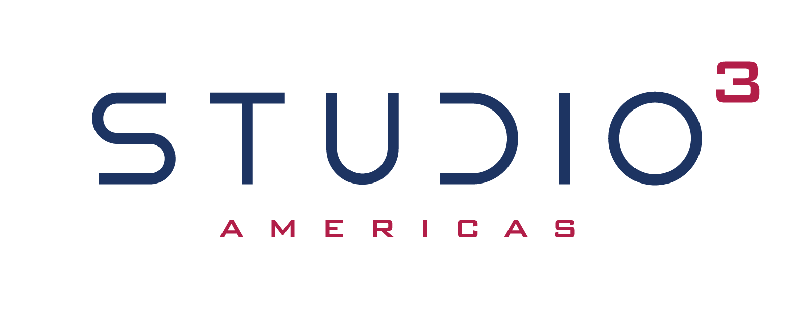

# Welcome to Studio3

<h1>Where Belief Becomes Momentum</h1>

The gamified venture building platform that transforms ideas into reality through transparent milestones, community validation, and tangible rewards.

## 🚀 Start Your Journey

<h3>🏗️ For Builders</h3>
Turn your ideas into ventures through public execution and community support.

[Start Building →](getting-started/roles/#founders-senders)

<h3>📡 For Supporters</h3>
Signal belief in ventures and earn rewards for accurate predictions.

[Start Supporting →](getting-started/roles/#supporters-echoes)

<h3>⚓ For Validators</h3>
Guide ventures and ensure ecosystem integrity through expert validation.

[Start Validating →](getting-started/roles/#validators-anchors)

## 🎯 What Makes Studio3 Different?

<h3>Not Your Average Incubator</h3>

Studio3 revolutionizes how ventures are built:

- **🏟️ Public Arenas** - All progress happens transparently
- **📊 Belief Signals** - Community conviction drives support  
- **🎮 Gamified Journey** - Seven phases from idea to sovereignty
- **🏆 Real Stakes** - Success brings rewards, failure has consequences
- **🤝 Community-Driven** - Collective intelligence guides development

## 📚 Quick Links

- [What is Studio3?](getting-started/what-is-studio3.md) - Understand our mission
- [Core Concepts](getting-started/core-concepts.md) - Master the fundamentals
- [The Arena System](arena/belief-doubt.md) - Learn signal mechanics
- [7-Phase Lifecycle](lifecycle/overview.md) - Navigate the journey
- [NFT System](nfts/) - Explore the three-NFT model

## 🌟 Recent Successes

<h4>🚀 DataVault</h4>

Graduated to 🎖️ Ascension in record time with revolutionary privacy tech

<strong>$SIGNAL Raised:</strong> 0

<h4>⚡ EnergyDAO</h4>

From ✨ Spark to 🔥 Flare in 6 months

<strong>Impact:</strong> 0+ homes powered

<h4>🎮 PlayForge</h4>

Community-built gaming platform in 🛸 Orbit

<strong>Active Users:</strong> 0+

## 📊 Platform Statistics

<h4>Active Ventures</h4>

0

Building in public

<h4>Total Signals</h4>

0

Belief expressed

<h4>Success Rate</h4>

0

Ventures reaching Orbit+

## 🎓 Ready to Begin?

<h2 style="color: white; border: none;">Start Your Studio3 Journey Today</h2>

Join thousands of builders, supporters, and validators creating the future of venture building.

<a href="getting-started/" class="md-button" style="background: white; color: var(--studio3-navy);">Get Started</a>
<a href="getting-started/what-is-studio3/" class="md-button" style="background: transparent; border: 2px solid white; color: white;">Learn More</a>

!!! tip "Join the Revolution"
    Studio3 is more than a platform - it's a movement toward transparent, community-driven innovation. Your journey starts with a single signal.
