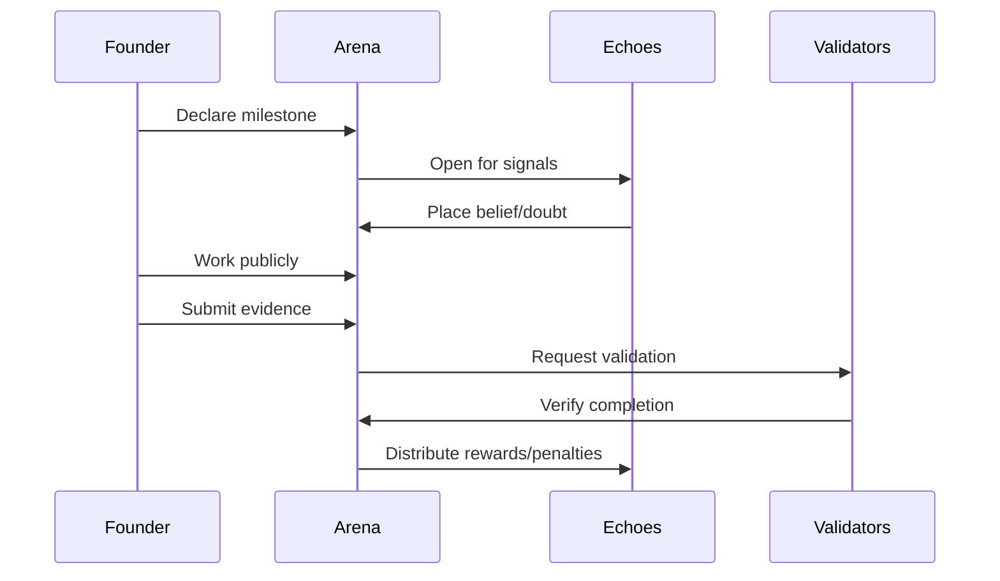
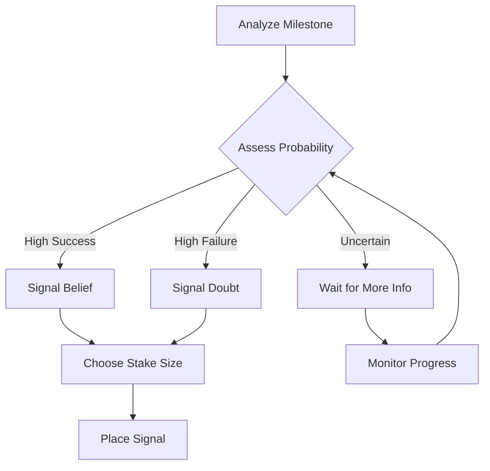

# The Arena System

## Where Ventures Prove Themselves

The Arena is Studio3's revolutionary public execution environment where ventures build, fail, and succeed under the watchful eyes of the community.

## What is an Arena?

### The Digital Colosseum

An Arena is a transparent, public space where:

- **Ventures declare** their milestones
- **Supporters signal**  their belief or doubt
- **Progress unfolds** in real-time
- **Results determine**  rewards and penalties**
!!! quote "The Arena Philosophy"
    "In the Arena, there are no hidden failures, no private pivots, no secret struggles. Everything happens in the open, creating radical accountability."

## Arena Types

### Different Stages, Different Rules

        <h3>✨ Spark Arena</h3>
        
**Purpose:**

**Idea validation
**

        
**Duration:** 7-14 days

**Stakes:**

**Initial belief gathering
**

        
Where ideas compete for attention and initial support

    

        <h3>⚔️ Forge Arena</h3>
        
**Purpose:**

**Founder selection
**

        
**Duration:** 3-5 days

**Stakes:**

**Venture ownership
**

        
Where founders duel for the right to build

    

        <h3>🎯 Milestone Arena</h3>
        
**Purpose:**

**Progress validation
**

        
**Duration:**

**Variable (per milestone)
**

        
**Stakes:**

**Token rewards/burns
**

        
Where ventures prove their execution ability

    

        <h3>✅ Validation Arena</h3>
        
**Purpose:**

**Achievement verification
**

        
**Duration:** 24-48 hours

**Stakes:**

**Milestone completion
**

        
Where Anchors verify claimed progress

## Arena Mechanics

### How Arenas Work

### Core Components

| Component | Function | Participants |
|-----------|----------|-------------|
| **Declaration** | Public commitment to specific goals | Founders |
| **Signaling** | Token-backed belief or doubt | Echoes |
| **Execution** | Transparent work toward goals | Founders |
| **Validation** | Independent verification of results | Anchors |
| **Settlement** | Automated reward/penalty distribution | System |

## Arena Rules

### Universal Principles

!!! warning "Non-Negotiable Rules"
    1. **All work must be public**  - No private development**
1. 
2. **All milestones are binding**  - Once declared, must be attempted
2. 
- 3.** All signals are final
- No takebacks after placing**
- **4.**  All validations are independent
- No founder influence
- **5.** All settlements are automatic
- No manual overrides**### Phase-Specific Rules

#### Spark Arena Rules
- Minimum 100 $SIGNAL initial support to proceed
- At least 10 unique supporters required
- Ideas can iterate based on feedback
- Failed Sparks can be re-submitted after 30 days

#### Forge Arena Rules  
- Winner takes all 
- only one founder proceeds
- Minimum stake of 1,000 $SIGNAL to enter
- 72-hour preparation period before duel
- Judgment based on vision, capability, and commitment

#### Milestone Arena Rules
- Milestones must be SMART (Specific, Measurable, Achievable, Relevant, Time-bound)
- Minimum 48-hour signal period before work begins
- Evidence must be submitted before deadline
- Extensions only granted by Anchor majority

## Signal Dynamics

### The Belief Economy

<h3>📡 Signal Mechanics</h3>

**Belief Signals** 👍

<ul>
<li>**Stake tokens on successful completion**</li>
<li>Earn 1.5x</li>

<li>3x multiplier if correct</li>

<li>Lose entire stake if wrong</li>

</ul>

**Doubt Signals** 👎

<ul>
<li>**Stake tokens on milestone failure**</li>
<li>Earn 1.2x</li>

<li>2x multiplier if correct</li>

<li>Lose entire stake if wrong</li>

</ul>

** Multiplier Factors:**

<ul>
<li>**Early signals earn higher multipliers**</li>
<li>Contrarian correct signals bonus</li>
<li>Reputation level affects multipliers</li>
<li>Phase difficulty impacts rewards</li>

</ul>

### Signal Strategies

## Arena Transparency

### Everything is Visible
** Public Information:**
- **All milestone declarations**
- All signal amounts and timing
- All founder updates and evidence
- All validator comments and scores
- All reward distributions

** Performance Metrics:**
- **Success/failure rates by founder**
- Signal accuracy by Echo
- Validation quality by Anchor
- Phase progression timelines
- Token flow analysis

## Arena Participation

### For Founders

!!! tip "Arena Best Practices"

- **Declare realistic milestones**
- Under-promise, over-deliver

- **Update progress daily**
- Keep supporters engaged

- **Share challenges openly**
- Build trust through transparency

- **Submit evidence early**
- Allow time for validation

- **Engage with feedback**
- Community wisdom is valuable

### For Echoes

!!! tip "Signaling Strategies"

- **Research thoroughly**
- Past performance predicts future

- **Diversify signals**
- Don't put all tokens on one milestone

- **Time entries well**
- Early signals earn more

- **Monitor actively**
- Adjust strategies based on progress

- **Learn from losses**
- Failed signals teach valuable lessons

### For Anchors

!!! tip "Validation Excellence"

- **Set clear criteria**
- Define success before evaluation

- **Document thoroughly**
- Justify all decisions

- **Remain impartial**
- Ignore signal dynamics

- **Provide feedback**
- Help ventures improve

- **Maintain standards**
- Ecosystem quality depends on you

## Arena Technology

### The Technical Stack

    

        <h4>🔗 Smart Contracts</h4>
        
Automated settlement and token distribution

    

    

        <h4>📊 Real-time Updates</h4>
        
WebSocket feeds for live progress tracking

    

    

        <h4>🖼️ IPFS Storage</h4>
        
Immutable evidence and documentation

    

    

        <h4>🤖 AI Monitoring</h4>
        
Pattern detection and anomaly alerts

    

## Arena Analytics

### Key Metrics

| Metric | Description | Why It Matters |
|--------|-------------|----------------|
| **Signal Velocity** | Speed of belief/doubt accumulation | Indicates market confidence |
| **Completion Rate** | % of milestones achieved | Shows execution quality |
| **Accuracy Score** | % of correct signals | Measures Echo expertise |
| **Validation Time** | Hours to verify completion | Indicates Anchor efficiency |
| **Token Multiplier** | Average reward multiple | Shows risk/reward balance |

## Arena Evolution

### Continuous Improvement

The Arena system evolves through:

- 1.** Community Proposals
- Suggest rule changes
2. **A/B Testing**
- Try variations in parallel
3. **Data Analysis**
- Optimize based on outcomes
4. **Feedback Loops**
- Incorporate learner insights**### Future Enhancements

!!! info "Coming Soon"

    - **Conditional Signals** - "I believe IF X happens"**
    - **Signal Combinations** - Portfolio strategies**
    - **Arena Leagues** - Competitive seasons**
    - **Achievement Badges** - Visual reputation markers**
    - **Arena Streaming** - Live video updates

## Success Stories

### Arena Champions

#### 🏆 DataMesh Protocol

**Arena Performance:** 12/12 milestones completed

<ul>
<li>**Total Signals:**  2.3M $SIGNAL beliefOutcome:</li>

</ul>

Graduated in record time**> "The Arena's transparency forced us to be better. Every day we knew thousands were watching, believing, and holding us accountable."

<ul>
<li>DataMesh Founder</li>

</ul>

#### 💡 EcoChain Initiative

**Arena Performance:**

**Pivoted after milestone 3 failure**

<ul>
<li>**Community Response:**  80% maintained belief post</li>
<li>pivotOutcome:</li>

</ul>

Successful with new direction**> "Failing in public was painful but invaluable. The Arena's feedback helped us find our real product

<ul>
<li>market fit."</li>
<li>EcoChain Founder</li>

</ul>

## Common Pitfalls

### What to Avoid

!!! danger "Arena Mistakes"

- **Over-promising**
- Unrealistic milestones destroy credibility
- **-**Under-communicating**
- Silent founders lose support -**Ignoring feedback**
- Community wisdom is valuable

- **Gaming metrics**
- Artificial activity is easily detected

- **Blame-shifting**
- Take responsibility for failures**## Getting Started

### Your First Arena

- 1. ** Observe
- Watch active Arenas to understand dynamics
2. **Analyze**
- Study successful and failed patterns
3. **Prepare**
- Plan your approach carefully
4. **Enter**
- Start with appropriate stakes
5. **Learn**
- Every Arena teaches something valuable**## Next Steps

- Master [Belief & Doubt Signals](belief-signals.md) mechanics
- Understand the [Seven Phase Lifecycle](seven-phases.md)
- Learn about [Milestone System](milestones.md) best practices
- Explore [Roles Overview](roles-overview.md) for your path