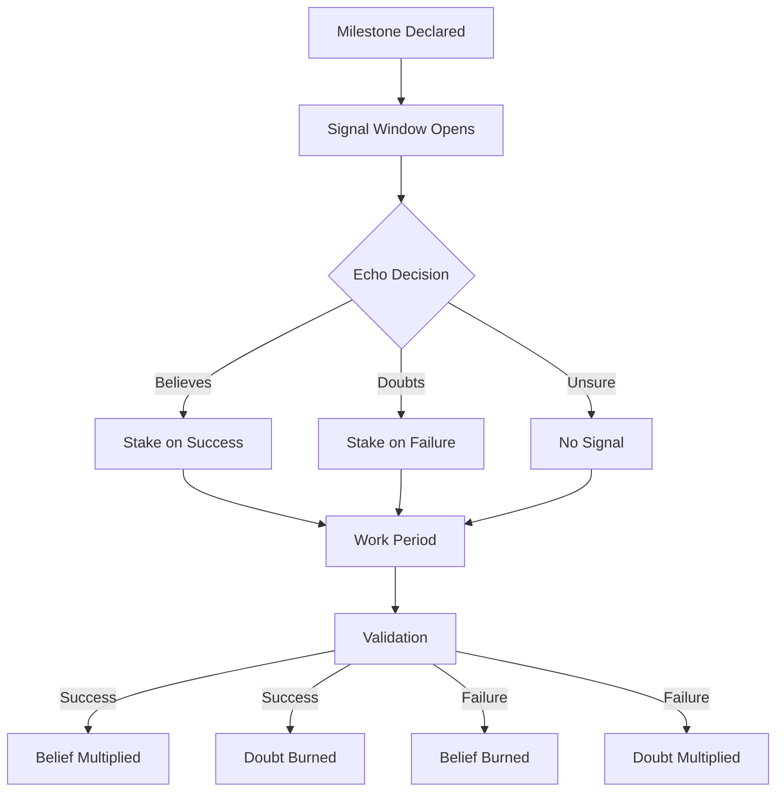
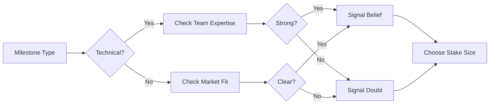

# Belief & Doubt Signals

## The Currency of Conviction

In Studio3, belief isn't just an opinion - it's a commitment backed by tokens. The signal system transforms abstract confidence into concrete support, creating a powerful mechanism for community-driven venture validation.

## Understanding Signals

### What Are Signals?

Signals are token-backed predictions about a venture's ability to achieve specific milestones:

<div class="grid cards">
<div class="arena-card">

<h3>👍 Belief Signals</h3>
<p>Express confidence that a milestone will be achieved</p>


<ul>
<li>Stake $SIGNAL tokens on success</li>


<li>Earn multipliers if correct (1.5x</li>


<li>3x)</li>


<li>Lose entire stake if wrong</li>

</ul>
</div>
    
<div class="arena-card">

<h3>👎 Doubt Signals</h3>
<p>Express skepticism that a milestone will be achieved</p>


<ul>
<li>Stake $SIGNAL tokens on failure</li>


<li>Earn multipliers if correct (1.2x</li>


<li>2x)</li>


<li>Lose entire stake if wrong</li>

</ul>
</div>
</div>

!!! important "Not Financial Instruments"
    Signals represent conviction about execution ability, not financial speculation. They're utility mechanisms for community curation and support.

## Signal Mechanics

### How Signals Work



### Signal Lifecycle

1. **Declaration Phase** (0-2 hours) - Founder declares specific milestone

- System verifies milestone validity

- Arena opens for signaling

2. **Signal Phase** (48-168 hours) - Echoes analyze milestone feasibility

- Signals placed with token stakes

- Real-time sentiment tracking

3. **Execution Phase** (Variable) - Founder works toward milestone

- Progress updates posted

- No new signals accepted

4. **Validation Phase** (24-48 hours) - Evidence submitted by founder

- Anchors verify achievement

- Results determined

5. **Settlement Phase** (Automatic) - Rewards distributed to correct signals

- Wrong signals burned permanently

- Reputation points updated

## Signal Economics

### Reward Multipliers

<div class="arena-card">

<h3>📊 Multiplier Formula</h3>
<p><strong> Base Multipliers:</strong></p>
<ul>
<li><strong>Belief (Success): 1.5x base</strong></li>
<li>Doubt (Failure): 1.2x base Bonus Factors:</li>
<li><strong>Early Signal: +0.1x per 24 hours early</strong></li>
<li>Contrarian: +0.3x if against majority</li>
<li>Reputation: +0.01x per 1000 XP</li>
<li>Phase Difficulty: +0.1x per phase level</li>

</ul>
<p><strong> Maximum Possible:</strong></p>
<ul>
<li><strong>Belief: 3x multiplier</strong></li>
<li>Doubt: 2x multiplier</li>

</ul>
</div>

### Example Calculations

| Scenario | Stake | Result | Calculation | Payout |
|----------|-------|--------|-------------|--------|
| Early belief, success | 1000 | ✅ | 1000 × (1.5 + 0.3) | 1800 |
| Late doubt, failure | 1000 | ✅ | 1000 × (1.2 + 0.1) | 1300 |
| Belief, failure | 1000 | ❌ | 1000 × 0 | 0 |
| Contrarian belief, success | 1000 | ✅ | 1000 × (1.5 + 0.3 + 0.3) | 2100 |

## Signal Strategy

### For Echoes

!!! tip "Successful Signaling"
    1. **Research Thoroughly**

- **Review founder's track record**
- Analyze milestone specificity

- Check available resources

- Consider market conditions
    
1. 
2. **Time Your Entry**

- **Early signals earn more**
- But less information available

- Balance risk vs reward
    
2. 
3. **Size Your Stakes**

- **Never signal more than you can lose**
- Diversify across multiple milestones

- Increase stakes as confidence grows
    
    4. **Monitor Progress**

- **Follow daily updates**
- Engage with founders

- Learn from outcomes

### Signal Patterns



## Advanced Signaling

### Portfolio Approach

<div class="grid cards">
    <div class="card">
        <h4>🎯 Focused Strategy</h4>
        <p>Large stakes on high-confidence milestones</p>
        <p><strong>Pros:</strong> Higher potential returns</p>
        <p><strong>Cons:</strong> Higher risk concentration</p>
    </div>
    
    <div class="card">
        <h4>🌐 Diversified Strategy</h4>
        <p>Small stakes across many milestones</p>
        <p><strong>Pros:</strong> Risk distribution</p>
        <p><strong>Cons:</strong> Lower individual returns</p>
    </div>
    
    <div class="card">
        <h4>🎲 Contrarian Strategy</h4>
        <p>Signal against crowd sentiment</p>
        <p><strong>Pros:</strong> Bonus multipliers</p>
        <p><strong>Cons:</strong> Often wrong</p>
    </div>
</div>

### Reading Signal Markets

!!! info "Market Indicators"

    - **Signal Velocity**: How fast signals accumulate
-Belief Ratio: Belief vs doubt balance
-Whale Activity: Large stake movements
-Anchor Sentiment: Validator early opinions
-Historical Patterns**: Similar milestone outcomes**## Signal Psychology

### Cognitive Biases to Avoid

| Bias | Description | Mitigation |
|------|-------------|------------|
| **Herd Mentality** | Following the crowd | Do independent research |
| **Confirmation Bias** | Seeking supporting info only | Consider contrary evidence |
| **Sunk Cost Fallacy** | Throwing good tokens after bad | Accept losses, move on |
| **Recency Bias** | Overweighting recent events | Look at full history |
| **Overconfidence** | Believing you can't be wrong | Size stakes appropriately |

## Signal Rights & Responsibilities

### Your Rights as an Echo

✅ You have the right to:

- **Signal on any open milestone**
- Access all public information
- Change strategy between milestones
- Withdraw unused tokens anytime
- Build reputation through accuracy

### Your Responsibilities

⚠️ You must:

- **Accept permanent loss risk**
- Not manipulate markets
- Not coordinate signals illegally
- Respect validation outcomes
- Learn from your mistakes

## Special Signal Types

### Coming Soon

<div class="arena-card">

<h3>🔮 Future Signal Features</h3>
<p><strong>Conditional Signals</strong> 🎯</p>
<ul>
<li><strong>"I believe IF [condition] is met"</strong></li>
<li>Automated trigger mechanisms</li>
<li>Complex strategy options</li>

</ul>
<p><strong>Signal Combinations</strong> 🧮</p>
<ul>
<li><strong>Bundle multiple milestones</strong></li>
<li>Create signal portfolios</li>
<li>Share strategies with others</li>

</ul>
<p><strong>Signal Insurance</strong> 🛡️</p>
<ul>
<li><strong>Partial loss protection</strong></li>
<li>Paid from insurance pools</li>
<li>For verified edge cases</li>

</ul>
</div>

## Signal Analytics

### Key Metrics to Track

```python
# Your Signal Performance
Total Signals Placed: 127
Successful Signals: 89 (70.1%)
Total Staked: 45,000 $SIGNAL
Total Earned: 67,500 $SIGNAL
Net Profit: 22,500 $SIGNAL (50%)
Average Multiplier: 1.83x
Best Signal: 2.7x on DataMesh Phase 3
Worst Loss: 5,000 $SIGNAL on QuickPay
```

### Performance Improvement

!!! tip "Level Up Your Signaling"
    1. **Track Everything** - Log all signals and outcomes
1. 
2. **Analyze Patterns** - Find what works for you
2. 
3. **Specialize**
- Focus on domains you understand
- **4. Network
- Learn from successful Echoes
- **5. Stay Humble
- Markets can humble anyone

### FAQ

**Q: Can I cancel a signal after placing it?**A: No, all signals are final once placed.

**Q: What happens if a milestone is cancelled?**A: All signals are returned in full.

**Q: Can I signal on my own venture?**A: No, founders cannot signal on their own milestones.

**Q: Is there a minimum signal amount?**A: Yes, currently 10 $SIGNAL minimum.

**Q: How quickly are rewards distributed?**A: Immediately after validation completes.

## Signal Ethics

### The Code of Signals

!!! quote "The Signal Oath"
    "I signal with my own conviction, based on my own research, accepting my own consequences. I neither follow blindly nor lead astray. My signals reflect my true beliefs about execution, not price."

### Prohibited Behaviors

❌ Never:

- **Coordinate signals in private groups**
- Spread false information to influence signals
- Use insider information
- Create fake accounts for signaling
- Attempt to bribe validators

## Success Stories

### Signal Legends

<div class="arena-card">

<h4>🏆 EchoMaster_7</h4>
<p><strong>Stats:</strong> 342 signals, 78% accuracy</p>

<p><strong>Specialty:</strong></p>

<p><strong>Technical infrastructure milestones</strong></p>

<p><strong>Best Call:</strong> 2.9x on CloudScale's Phase 5</p>

<blockquote>"I only signal on what I understand deeply. Better to miss opportunities than lose on ignorance."</blockquote>

</div>

<div class="arena-card">

<h4>🌟 SignalSavant</h4>
<p><strong>Stats:</strong> 567 signals, 71% accuracy</p>

<p><strong>Specialty:</strong></p>

<p><strong>Early-stage technical ventures</strong></p>

<p><strong>Strategy:</strong></p>

<p><strong>Small stakes, high volume</strong></p>

<blockquote>"Diversification is my protection. I'd rather earn steady 1.5x returns than chase 3x moonshots."</blockquote>

</div>

## Getting Started with Signals

### Your First Signal

1. **Start Small**
- Use minimum stakes initially
2. **Pick Carefully**
- Choose milestones you understand
3. **Document Why**
- Write down your reasoning
4. **Track Results**
- Learn from every outcome
5. **Adjust Strategy**
- Refine based on results

- Explore the [Three-NFT System](nft-system.md) for ownership mechanics
- Study the [Milestone System](milestones.md) for better predictions
- Learn about [Rewards & Penalties](rewards-system.md) in detail
- Review [Echo Basics](../echoes-guide/echo-basics.md) for role mastery