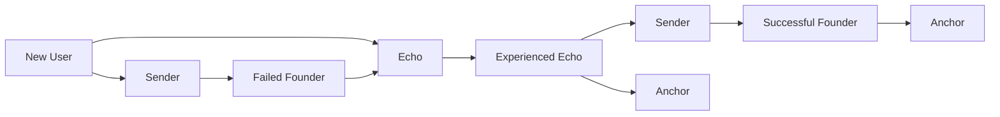

# Choosing Your Role

## Finding Your Place in Studio3

Every participant in Studio3 plays a vital role in the ecosystem's success. Understanding which role aligns with your skills, goals, and resources is the first step to meaningful participation.

## The Three Paths

<h3>🏗️ Become a Sender</h3>

<strong>You should be a Sender if you:</strong>

<ul>
<li><strong>Have a venture idea ready to build</strong></li>
<li>Enjoy public accountability</li>
<li>Thrive under pressure</li>
<li>Want full ownership potential</li>
<li>Can handle transparent failure</li>

</ul>

<strong> Required:</strong>

<ul>
<li><strong>Entrepreneurial drive</strong></li>
<li>Execution ability</li>
<li>Communication skills</li>
<li>Risk tolerance</li>
<li>Long-term vision</li>

</ul>

<h3>📡 Become an Echo</h3>

<strong> You should be an Echo if you:</strong>

<ul>
<li><strong>Enjoy evaluating opportunities</strong></li>
<li>Have capital to deploy</li>
<li>Want diversified exposure</li>
<li>Like community participation</li>
<li>Seek merit-based returns</li>

</ul>

<strong> Required:</strong>

<ul>
<li><strong>$SIGNAL tokens</strong></li>
<li>Analytical mindset</li>
<li>Risk management</li>
<li>Active engagement</li>
<li>Learning appetite</li>

</ul>

<h3>⚓ Become an Anchor</h3>

<strong> You should be an Anchor if you:</strong>

<ul>
<li><strong>Have venture experience</strong></li>
<li>Enjoy mentoring founders</li>
<li>Want ecosystem impact</li>
<li>Value quality standards</li>
<li>Seek consistent income</li>

</ul>

<strong> Required:</strong>

<ul>
<li><strong>Proven track record</strong></li>
<li>Validation skills</li>
<li>Time commitment</li>
<li>Fair judgment</li>
<li>Mentor mindset</li>

</ul>

## Role Comparison

### Time Commitment

| Role | Daily Time | Peak Periods | Flexibility |
|------|------------|--------------|-------------|
| **Sender** | 8-12 hours | Milestone deadlines | Low - must deliver |
| **Echo** | 0.5-2 hours | New opportunities | High - choose engagement |
| **Anchor** | 2-4 hours | Validation windows | Medium - scheduled work |

### Financial Requirements

| Role | Initial Capital | Ongoing Costs | Potential Returns |
|------|----------------|---------------|-------------------|
| **Sender** | 1,000+ $SIGNAL | Operating expenses | Unlimited upside |
| **Echo** | 100+ $SIGNAL | Signal stakes | 1.2x - 3x per signal |
| **Anchor** | Minimal | Time investment | 3-10% per validation |

### Risk Profile

<h3>⚖️ Risk vs Reward Analysis</h3>

<strong>Highest Risk, Highest Reward: Sender</strong>

<ul>
<li><strong>Can lose entire venture</strong></li>
<li>Can achieve full sovereignty</li>
<li>Reputation permanently affected</li>
<li>Unlimited value creation</li>

</ul>

<strong>Moderate Risk, Moderate Reward: Echo</strong>

<ul>
<li><strong>Can lose signal stakes</strong></li>
<li>Can earn consistent multipliers</li>
<li>Diversification possible</li>
<li>Compound growth potential</li>

</ul>

<strong>Lowest Risk, Steady Reward: Anchor</strong>

<ul>
<li><strong>Minimal financial risk</strong></li>
<li>Steady fee income</li>
<li>Reputation-based growth</li>
<li>Network value accrual</li>

</ul>

## Skills Assessment

### For Potential Senders

Rate yourself 1-5 on each:

- **Vision & Strategy**
- Can you see the big picture?
- **Execution Speed**
- Do you ship fast?
- **Public Communication**
- Are you transparent?
- **Stress Management**
- Can you handle pressure?
- **Team Building**
- Can you attract talent?

**Score 20+**: You're ready to be a Sender  
**Score 15-19**: Build skills first  
**Score <15**: Consider Echo or Anchor role

### For Potential Echoes

Rate yourself 1-5 on each:

- **Market Analysis**
- Can you spot opportunities?
- **Risk Assessment**
- Do you manage downside?
- **Pattern Recognition**
- Can you identify trends?
- **Patience**
- Can you hold through volatility?
- **Community Engagement**
- Are you active?

**Score 20+**: Perfect Echo material  
**Score 15-19**: Start small and learn  
**Score <15**: Study successful Echoes first

### For Potential Anchors

Rate yourself 1-5 on each:

- **Industry Expertise**
- Deep knowledge in domains?
- **Mentorship Skills**
- Can you guide others?
- **Objective Judgment**
- Are you impartial?
- **Communication**
- Can you give hard feedback?
- **Time Management**
- Can you meet deadlines?

**Score 20+**: Apply for Anchor status  
**Score 15-19**: Gain more experience  
**Score <15**: Build expertise as Echo first

## Multiple Roles

### Can You Play Multiple Roles?

** Yes, with restrictions:**

- **Echo + Future Sender**:
  Common progression path
- **Successful Sender → Anchor**:
  Natural evolution
- **Echo + Anchor**:
  Allowed with disclosure

** Conflicts to avoid:**

- **Don't signal on ventures you validate**
- Don't validate ventures you founded
- Always disclose any relationships

## Role Progression

### Typical Journeys

### Starting Recommendations

<h4>🌱 Complete Beginner</h4>

Start as an<strong>Echo</strong> with small signals to:

<ul>
<li><strong>Learn the ecosystem</strong></li>
<li>Build reputation</li>
<li>Network with others</li>
<li>Understand ventures</li>
<li>Minimize risk</li>

</ul>

<h4>🚀 Experienced Entrepreneur</h4>

Jump in as a<strong>Sender</strong> if you have:

<ul>
<li><strong>Clear venture idea</strong></li>
<li>Execution track record</li>
<li>Risk tolerance</li>
<li>Time to commit</li>
<li>Public comfort</li>

</ul>

<h4>🎓 Industry Expert</h4>

Consider<strong>Anchor</strong> role if you have:

<ul>
<li><strong>5+ years experience</strong></li>
<li>Mentorship history</li>
<li>Quality standards</li>
<li>Available time</li>
<li>Ecosystem vision</li>

</ul>

## Decision Framework

### Step 1: Assess Your Resources

- **Time**:
  How many hours per day?
- **Capital**:
  How much $SIGNAL available?
- **Skills**:
  What's your superpower?
- **Risk**:
  What can you afford to lose?
- **Goals**:
  What do you want to achieve?

### Step 2: Match to Role

| If You Have... | Best Role | Why |
|----------------|-----------|-----|
| Venture idea + time | Sender | Build your vision |
| Capital + analysis skills | Echo | Earn through signals |
| Experience + mentorship | Anchor | Guide and validate |
| Just curiosity | Echo | Lowest barrier entry |

### Step 3: Start Small

Whatever role you choose:

1. **Observe first**
- Watch active participants
2. **Start minimal**
- Small stakes/commitments
3. **Learn actively**
- Engage with community
4. **Build reputation**
- Consistency matters
5. **Scale gradually**
- Grow with experience

### Choosing Wrong Role

!!! warning "Avoid These Pitfalls"

- **Ego-driven Sender**: Starting a venture for status
- **Speculative Echo**: Treating signals as pure speculation without research
-Biased Anchor: Validating based on relationships
-Overcommitted: Taking on too much too fast
-Undercommitted**: Not giving enough effort**### Role Misalignment Signs

- **Senders**: Constant stress, missing deadlines, poor communication
- **Echoes**: All signals failing, emotional decisions, portfolio concentration
- **Anchors**: Validation disputes, mentor conflicts, time management issues

## Making Your Choice

### Final Questions

1. **What excites you most about Studio3?**

- **Building ventures → Sender**
- Finding opportunities → Echo
- Guiding others → Anchor

2. **What's your primary constraint?**

- **Need capital → Sender**
- Need time → Echo
- Need purpose → Anchor

3. **How do you handle failure?**

- **Public learning → Sender**
- Private analysis → Echo
- Teaching moment → Anchor

### Ready to Commit?

Once you've chosen your role:

- **Read the specific guide** for detailed instructions
- **Join role-specific channels** in the community
- **Find a mentor** who's succeeded in that role
- **Set realistic goals** for your first 30 days
- **Track your progress** and adjust as needed

## Role Resources

### Sender Resources

- [Senders Guide](../senders-guide/index.md)
- Complete founder handbook
- Founder community channels
- Mentorship matching
- Venture templates

### Echo Resources

- [Echoes Guide](../echoes-guide/index.md)
- Signal strategy guide
- Analysis tools and dashboards
- Echo strategy groups
- Portfolio trackers

### Anchor Resources

- [Anchors Guide](../anchors-guide/index.md)
- Validation framework
- Anchor Council access
- Quality guidelines
- Mentor training

## Your Next Step

Now that you understand the roles:

1. **Make your choice** based on the assessment
2. **Proceed to [First Steps](first-steps.md)** for quick start
3. **Dive into your role-specific guide** for mastery
4. **Join the community** and introduce yourself

**Remember:**

**Your role can evolve as you grow within Studio3. Start where you're comfortable and let your journey unfold naturally.**