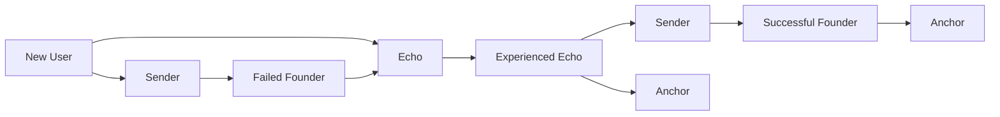

# Choosing Your Role

## Finding Your Place in Studio3

Every participant in Studio3 plays a vital role in the ecosystem's success. Understanding which role aligns with your skills, goals, and resources is the first step to meaningful participation.

## The Three Paths

<h3>🏗️ Become a Sender</h3>

**You should be a Sender if you:**
- ** Have a venture idea ready to build
- Enjoy public accountability
- Thrive under pressure
- Want full ownership potential
- Can handle transparent failure
** Required:
- ** Entrepreneurial drive
- Execution ability
- Communication skills
- Risk tolerance
- Long-term vision

<h3>📡 Become an Echo</h3>
** You should be an Echo if you:
- ** Enjoy evaluating opportunities
- Have capital to deploy
- Want diversified exposure
- Like community participation
- Seek merit-based returns
** Required:
- ** $SIGNAL tokens
- Analytical mindset
- Risk management
- Active engagement
- Learning appetite

<h3>⚓ Become an Anchor</h3>
** You should be an Anchor if you:
- ** Have venture experience
- Enjoy mentoring founders
- Want ecosystem impact
- Value quality standards
- Seek consistent income
** Required:
- ** Proven track record
- Validation skills
- Time commitment
- Fair judgment
- Mentor mindset

## Role Comparison

### Time Commitment

| Role | Daily Time | Peak Periods | Flexibility |
|------|------------|--------------|-------------|
|**Sender** | 8-12 hours | Milestone deadlines | Low - must deliver |
|**Echo** | 0.5-2 hours | New opportunities | High - choose engagement |
|**Anchor** | 2-4 hours | Validation windows | Medium - scheduled work |

### Financial Requirements

| Role | Initial Capital | Ongoing Costs | Potential Returns |
|------|----------------|---------------|-------------------|
|**Sender** | 1,000+ $SIGNAL | Operating expenses | Unlimited upside |
|**Echo** | 100+ $SIGNAL | Signal stakes | 1.2x
- 3x per signal |
|**Anchor** | Minimal | Time investment | 3-10% per validation |

### Risk Profile

<h3>⚖️ Risk vs Reward Analysis</h3>
**Highest Risk, Highest Reward: Sender
- ** Can lose entire venture
- Can achieve full sovereignty
- Reputation permanently affected
- Unlimited value creation
**Moderate Risk, Moderate Reward: Echo
- ** Can lose signal stakes
- Can earn consistent multipliers
- Diversification possible
- Compound growth potential
**Lowest Risk, Steady Reward: Anchor
- ** Minimal financial risk
- Steady fee income
- Reputation-based growth
- Network value accrual

## Skills Assessment

### For Potential Senders

Rate yourself 1-5 on each:

- **Vision & Strategy**
- Can you see the big picture?
- **Execution Speed**
- Do you ship fast?
- **Public Communication**
- Are you transparent?
- **Stress Management**
- Can you handle pressure?
- **Team Building**
- Can you attract talent?
**Score 20+**: You're ready to be a Sender  **Score 15-19:** : Build skills first  Score <15**: Consider Echo or Anchor role**### For Potential Echoes

Rate yourself 1-5 on each:

- **Market Analysis**
- Can you spot opportunities?
- **Risk Assessment**
- Do you manage downside?
- **Pattern Recognition**
- Can you identify trends?
- **Patience**
- Can you hold through volatility?
- **Community Engagement**
- Are you active?
**Score 20+**: Perfect Echo material  **Score 15-19:** : Start small and learn  Score <15**: Study successful Echoes first**### For Potential Anchors

Rate yourself 1-5 on each:

- **Industry Expertise**
- Deep knowledge in domains?
- **Mentorship Skills**
- Can you guide others?
- **Objective Judgment**
- Are you impartial?
- **Communication**
- Can you give hard feedback?
- **Time Management**
- Can you meet deadlines?
**Score 20+**: Apply for Anchor status  **Score 15-19:** : Gain more experience  Score <15**: Build expertise as Echo first**## Multiple Roles

### Can You Play Multiple Roles?

** Yes, with restrictions:
- **Echo + Future Sender** : Common progression path
- **Successful Sender → Anchor** : Natural evolution
- **Echo + Anchor** : Allowed with disclosure
** Conflicts to avoid:
- ** Don't signal on ventures you validate
- Don't validate ventures you founded
- Always disclose any relationships

## Role Progression

### Typical Journeys

### Starting Recommendations

<h4>🌱 Complete Beginner</h4>

Start as an**Echo**  with small signals to:
- ** Learn the ecosystem
- Build reputation
- Network with others
- Understand ventures
- Minimize risk

<h4>🚀 Experienced Entrepreneur</h4>

Jump in as a**Sender**  if you have:
- ** Clear venture idea
- Execution track record
- Risk tolerance
- Time to commit
- Public comfort

<h4>🎓 Industry Expert</h4>

Consider**Anchor**  role if you have:
- ** 5+ years experience
- Mentorship history
- Quality standards
- Available time
- Ecosystem vision

## Decision Framework

### Step 1: Assess Your Resources

- **Time**: How many hours per day?
- **Capital** : How much $SIGNAL available?
- **Skills** : What's your superpower?
- **Risk** : What can you afford to lose?
- **Goals** : What do you want to achieve?
### Step 2: Match to Role

| If You Have... | Best Role | Why |
|----------------|-----------|-----|
| Venture idea + time | Sender | Build your vision |
| Capital + analysis skills | Echo | Earn through signals |
| Experience + mentorship | Anchor | Guide and validate |
| Just curiosity | Echo | Lowest barrier entry |

### Step 3: Start Small

Whatever role you choose:

- 1.** Observe first
- Watch active participants
2. **Start minimal**
- Small stakes/commitments
3. **Learn actively**
- Engage with community
4. **Build reputation**
- Consistency matters
5. **Scale gradually**
- Grow with experience**## Common Mistakes

### Choosing Wrong Role

!!! warning "Avoid These Pitfalls"

- **Ego-driven Sender** : Starting a venture for status
- **    -**Gambling Echo** : Treating signals like casino bets
- **    -**Biased Anchor** : Validating based on relationships
- **    -**Overcommitted** : Taking on too much too fast
- **    -**Undercommitted**: Not giving enough effort**### Role Misalignment Signs

- **Senders**: Constant stress, missing deadlines, poor communication
- **Echoes** : All signals failing, emotional decisions, portfolio concentration
- **Anchors** : Validation disputes, mentor conflicts, time management issues
## Making Your Choice

### Final Questions

1. **What excites you most about Studio3?**
- ** Building ventures → Sender
- Finding opportunities → Echo

- Guiding others → Anchor

2. **What's your primary constraint?**
- ** Need capital → Sender
- Need time → Echo

- Need purpose → Anchor

3. **How do you handle failure?**
- ** Public learning → Sender
- Private analysis → Echo

- Teaching moment → Anchor

### Ready to Commit?

Once you've chosen your role:

- **Read the specific guide** for detailed instructions
- **Join role-specific channels**  in the community
- **  Find a mentor

- * who's succeeded in that role
- **Set realistic goals** for your first 30 days

- **Track your progress** and adjust as needed

## Role Resources

### Sender Resources
- [Senders Guide](../senders-guide/index.md)
- Complete founder handbook
- Founder community channels
- Mentorship matching
- Venture templates

### Echo Resources
- [Echoes Guide](../echoes-guide/index.md)
- Signal strategy guide
- Analysis tools and dashboards
- Echo strategy groups
- Portfolio trackers

### Anchor Resources
- [Anchors Guide](../anchors-guide/index.md)
- Validation framework
- Anchor Council access
- Quality guidelines
- Mentor training

## Your Next Step

Now that you understand the roles:

1. **Make your choice** based on the assessment**2. **Proceed to [First Steps](first-steps.md)** for quick start**3. **Dive into your role-specific guide** for mastery**4. **Join the community** and introduce yourself

**Remember:** Your role can evolve as you grow within Studio3. Start where you're comfortable and let your journey unfold naturally.