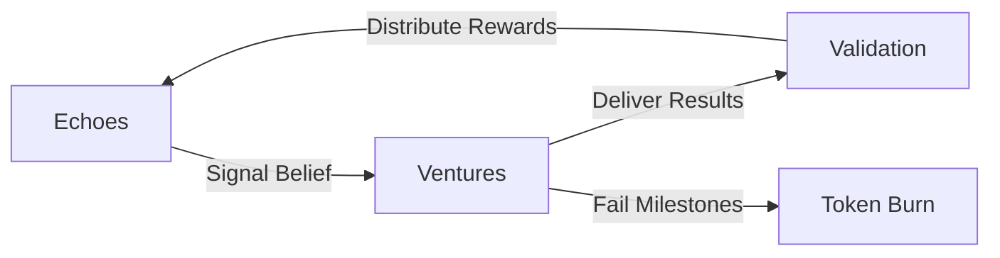

# Ecosystem Overview

## The Studio3 Universe

Studio3 exists at the center of a revolutionary ecosystem designed to transform how ventures are built, supported, and grown. Understanding this ecosystem is crucial to maximizing your success on the platform.

## Core Components

### 🏟️ The Arena System

At the heart of Studio3 lies the Arena - public spaces where ventures prove themselves through transparent execution and community validation.

!!! info "Arena Types"

    - **Spark Arenas**: Where ideas compete for attention**
    - **Forge Arenas**: Battlegrounds for founder duels**
    - **Milestone Arenas**: Public execution venues**
    - **Validation Arenas**: Where progress is verified

### 📡 The Signal Economy

The $SIGNAL token creates a unique economy of belief:

### 🏗️ The Three Pillars

    

        <h4>1. Transparent Execution</h4>
        
All progress happens in public view, creating accountability and enabling collective intelligence.

    

    

        <h4>2. Community Validation</h4>
        
The crowd decides what succeeds through belief signals and anchor verification.

    

    

        <h4>3. Aligned Incentives</h4>
        
Everyone wins when ventures succeed - founders, supporters, and validators alike.

    

## Ecosystem Participants

### Primary Roles

| Role | Function | Rewards |
|------|----------|----------|
| **Senders** (Founders) | Build ventures through public milestones | Ownership & funding |
|**Echoes** (Supporters) | Signal belief or doubt in ventures | Token multipliers |
|**Anchors** (Validators) | Verify progress and guide ventures | Validation fees |

### Supporting Infrastructure

- **Container DAOs**: Lightweight governance wrappers for each venture
- **Genesis Wallets**: Multisig treasuries holding venture NFTs
- **Signal Pools**: Aggregated belief/doubt for each milestone
- **Reputation System**: XP tracking for all participants**

## Value Flows

### During Active Phases

1. **Echoes** stake $SIGNAL tokens on venture milestones
2. **Senders** work publicly to achieve declared goals
3. **Anchors** validate completion and quality
4. **Rewards** flow to accurate predictors
5. **Penalties** burn tokens from wrong predictions

### At Graduation

1. **Ventures** buy back their NFTs for sovereignty
2. **Container DAOs** transfer ownership to founders
3. **Successful participants** earn graduation bonuses
4. **New Studios** can be launched by graduates

## Integration Points

### 🎨 Flambette Marketplace

The source of all Spark NFTs through IP remixing:

- Browse research and patents
- Combine IPs into venture concepts
- Mint Spark NFTs from combinations
- Access to global innovation

### 🤝 Partner Networks

- **Technical Validators**: Specialized anchors for deep tech
- **Capital Partners**: Funding sources for Flare phase
- **Service Providers**: Legal, marketing, development support
- **Alumni Network**: Graduated ventures supporting newcomers**

## Network Effects

### Positive Feedback Loops

1. **More ventures** → More opportunities for Echoes
2. **More Echoes** → Better signal quality
3. **Better signals** → Higher venture success rates
4. **Higher success** → More ventures attracted

### Defensive Moats

- **Reputation persistence**: XP can't be gamed or transferred
- **Skin in the game**: Real token stakes prevent spam
- **Public execution**: Transparency deters bad actors
- **Community memory**: Past performance influences future**

## Ecosystem Health Metrics

### Platform Vitals

| Metric | Healthy Range | Warning Signs |
|--------|---------------|---------------|
| Active Ventures | 50-500 | <10 or >1000 |
| Echo Participation | >60% | <30% |
| Milestone Success Rate | 40-70% | <20% or >90% |
| Token Velocity | Moderate | Too high/low |

### Growth Indicators

- New venture creation rate
- Average signal pool sizes
- Anchor response times
- Graduation success rate
- Alumni reinvestment rate

## Future Evolution

### Planned Expansions

!!! tip "Coming Soon"

    - **Conditional Signals**: "I believe IF..."**
    - **Cross-Venture Strategies**: Portfolio approaches**
    - **Recursive Studios**: Graduates launching sub-platforms**
    - **Global Anchor Network**: Specialized validation

### Ecosystem Sustainability

1. **Token Economics**: Controlled supply with strategic burns
2. **Quality Gates**: Anchor standards prevent degradation
3. **Incentive Alignment**: Long-term thinking rewarded
4. **Community Governance**: Gradual decentralization

## Getting Connected

### Essential Resources

- **Discord Community**: Real-time discussions and support
- **Arena Dashboard**: Track all active ventures
- **Signal Analytics**: Market intelligence tools
- **Anchor Network**: Find mentors and validators**

### First Steps

1. **Observe** active Arenas to understand dynamics
2. **Connect** with community members in your interest areas
3. **Practice** with small signals before major commitments
4. **Learn** from successful ventures and their journeys

## Key Takeaways

!!! success "Remember"
    - Studio3 is more than a platform - it's a living ecosystem
    - Success comes from understanding and leveraging network effects
    - Every participant plays a crucial role in ecosystem health
    - Transparency and alignment create sustainable growth

## Next Steps

- Explore [Key Principles](key-principles.md) that govern the ecosystem
- Understand [The Arena System](arena-system.md) in detail
- Learn about [Belief & Doubt Signals](belief-signals.md)
- Discover your role in [Three Roles Overview](roles-overview.md)