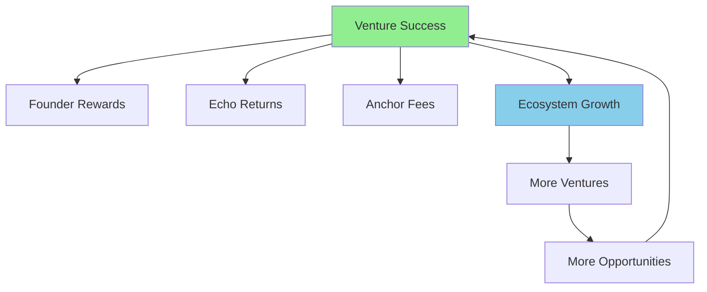
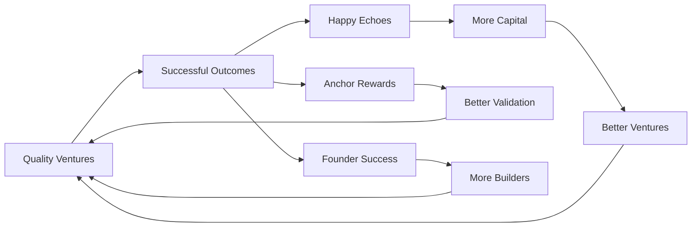
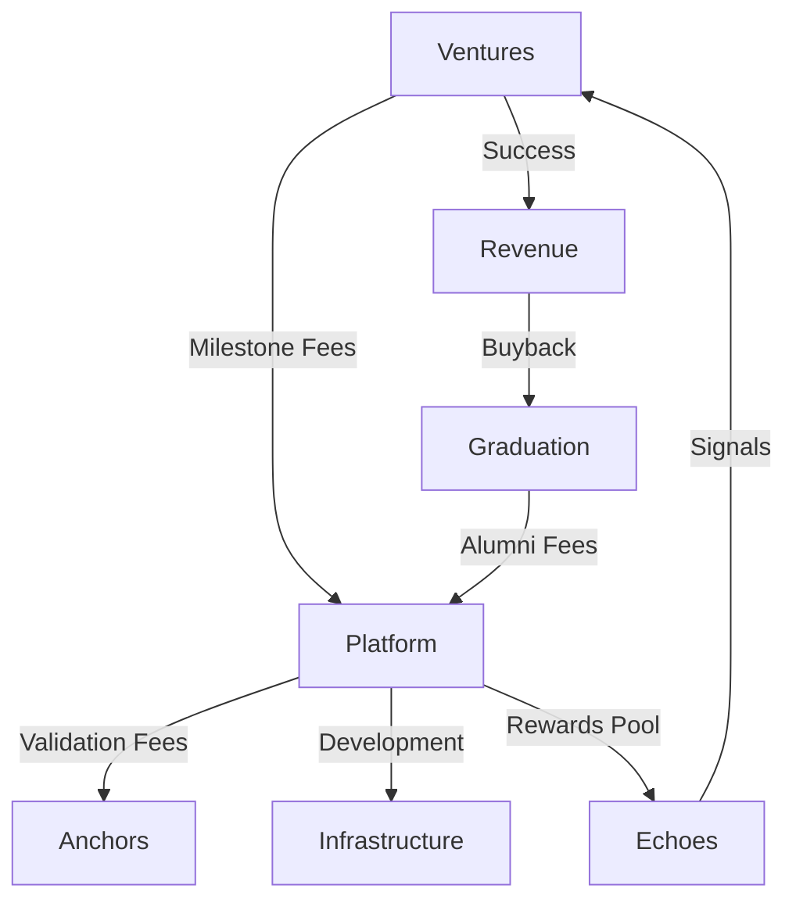

# Aligned Incentives

## Where Everyone Wins Together

Studio3's revolutionary design aligns the interests of all participants, creating a positive-sum ecosystem where individual success drives collective prosperity. This alignment is the secret sauce that makes the platform work.

## The Alignment Philosophy

### Breaking Traditional Misalignment

<div class="arena-card">
<h3>🔗 Traditional vs Studio3 Model</h3>

**Traditional Venture Ecosystem:**

- VCs want huge returns, founders want control
- Investors seek quick exits, builders need time
- Advisors give minimal time for maximum equity
- Community gets nothing despite creating value

**Studio3 Alignment:**

- Everyone profits from venture success
- Transparent milestones align timelines
- Active participation rewarded fairly
- Community captures value they create
</div>

### The Positive-Sum Game



## Incentive Structures

### For Senders (Founders)

<div class="arena-card">
<h3>🏗️ Founder Incentive Stack</h3>

**Short-term Incentives:**

- 💰 **Milestone Funding**: Immediate resources for execution
- 📡 **Community Support**: Belief signals provide validation
- 🎓 **Expert Guidance**: Anchor mentorship accelerates growth
- 🏆 **Public Recognition**: Arena success builds reputation

**Long-term Incentives:**

- 👑 **Full Ownership**: Sovereignty through Ascension
- 🚀 **Unlimited Upside**: No cap on venture value
- 🌐 **Network Effects**: Alumni status opens doors
- 🏭 **Sub-Studio Rights**: Launch your own ecosystem

**Behavioral Alignment:**

- Transparency rewarded with more support
- Consistent delivery builds belief momentum
- Community engagement multiplies resources
- Long-term thinking enables graduation
</div>

### For Echoes (Supporters)

<div class="arena-card">
<h3>📡 Echo Incentive Matrix</h3>

**Direct Returns:**

| Signal Type | Accuracy | Return Multiple | Risk |
|-------------|----------|-----------------|------|
| Early Belief | Correct | 2.5-3x | High |
| Late Belief | Correct | 1.5-2x | Medium |
| Early Doubt | Correct | 1.8-2x | Medium |
| Contrarian | Correct | +0.3x bonus | Varies |

**Indirect Benefits:**

- 🌟 **Reputation Growth**: XP from accurate predictions
- 🤝 **Network Access**: Connect with winners early
- 🎓 **Learning Opportunity**: Understand venture building
- 🎯 **Influence Power**: Shape venture direction

**Behavioral Incentives:**

- Research rewarded over speculation
- Diversification encouraged through portfolio approach
- Active engagement improves outcomes
- Long-term holders gain reputation compound
</div>

### For Anchors (Validators)

<div class="arena-card">
<h3>⚓ Anchor Reward System</h3>

**Fee Structure:**

```python
def calculate_anchor_compensation(milestone):
    base_fee = milestone.value * 0.03  # 3% base
    
    # Quality multiplier (1-3x)
    quality_score = get_validation_quality_score()
    quality_mult = 1 + (quality_score - 0.7) * 2
    
    # Speed bonus (up to 20%)
    speed_bonus = 0.2 if completed_within_24h else 0
    
    # Reputation multiplier
    rep_mult = 1 + (anchor.xp / 10000) * 0.1
    
    total = base_fee * quality_mult * (1 + speed_bonus) * rep_mult
    return min(total, milestone.value * 0.1)  # Cap at 10%
```

**Additional Incentives:**

- 🎆 **Success Participation**: Tokens in validated ventures
- 👥 **Network Premium**: Access to top founders
- 🏅 **Status Recognition**: Elite validator standing
- 🌱 **Ecosystem Impact**: Shape quality standards

**Behavioral Alignment:**

- Thorough validation rewarded over rushed
- Mentorship improves venture success rates
- Fair judgments build long-term reputation
- Ecosystem health creates more opportunities
</div>

## Systemic Alignments

### The Virtuous Cycle



### Punishment Alignment

!!! warning "Negative Incentives Also Align"
    
    **For Senders:**
    - Failed milestones damage reputation permanently
    - Poor communication reduces future support
    - Abandoned ventures blacklist founders
    
    **For Echoes:**
    - Wrong signals burn tokens irrecoverably  
    - Herd following punished through contrarian bonuses
    - Inactive accounts lose reputation over time
    
    **For Anchors:**
    - Poor validations reduce future assignments
    - Biased judgments trigger Council review
    - Inactive Anchors lose status quickly

## Economic Alignments

### Token Economics

<div class="grid cards">
    <div class="card">
        <h4>💵 Value Accrual</h4>
        <p>Success increases token demand</p>
        <ul>
            <li>More ventures need signals</li>
            <li>Burned tokens reduce supply</li>
            <li>Reputation requires holding</li>
        </ul>
    </div>
    
    <div class="card">
        <h4>🔥 Burn Mechanics</h4>
        <p>Failure removes tokens permanently</p>
        <ul>
            <li>No redistribution to winners</li>
            <li>Deflationary pressure</li>
            <li>Quality maintenance</li>
        </ul>
    </div>
    
    <div class="card">
        <h4>🌀 Velocity Control</h4>
        <p>Incentives for optimal flow</p>
        <ul>
            <li>Staking for signals</li>
            <li>Reputation time-locks</li>
            <li>Graduation requirements</li>
        </ul>
    </div>
</div>

### Revenue Flows



## Social Alignments

### Reputation as Currency

<div class="arena-card">
<h3>🌟 The XP Economy</h3>

**How Reputation Aligns Behavior:**

1. **Cannot Be Bought** - Only earned through performance
2. **Cannot Be Transferred** - Prevents gaming
3. **Decays Without Activity** - Encourages participation
4. **Multiplies Opportunities** - Success breeds success

**Reputation Benefits:**

- 🎯 Higher signal multipliers
- 🗿️ Governance voting weight
- 🎆 Priority access to opportunities
- 🤝 Trust in interactions
</div>

### Network Effect Alignment

!!! info "Everyone Benefits from Growth"
    - **More Senders** = More opportunities for Echoes
    - **More Echoes** = Better funding for Senders
    - **More Anchors** = Higher quality standards
    - **Higher Quality** = Attracts more participants
    - **Larger Network** = Greater value for all

## Temporal Alignments

### Short vs Long Term

<div class="grid cards">
    <div class="arena-card">
        <h4>⏱️ Short-term Alignment</h4>
        <p><strong>Immediate Rewards for Good Behavior</strong></p>
        <ul>
            <li>Quick signal returns</li>
            <li>Milestone funding</li>
            <li>Validation fees</li>
            <li>Daily XP gains</li>
        </ul>
    </div>
    
    <div class="arena-card">
        <h4>📈 Long-term Alignment</h4>
        <p><strong>Compound Benefits for Patience</strong></p>
        <ul>
            <li>Reputation accumulation</li>
            <li>Network building</li>
            <li>Venture graduation</li>
            <li>Ecosystem ownership</li>
        </ul>
    </div>
</div>

### Phase-Based Incentives

| Phase | Sender Focus | Echo Focus | Anchor Focus |
|-------|--------------|------------|-------------|
| **Spark** | Gather support | Find opportunities | Scout talent |
| **Forge** | Win leadership | Pick winners | Judge fairly |
| **Ignition** | Build fast | Support early | Guide setup |
| **Drift** | Find PMF | Patient capital | Navigate pivots |
| **Orbit** | Stable growth | Compound returns | Ensure quality |
| **Flare** | Scale rapidly | Maximize upside | Maintain standards |
| **Ascension** | Achieve sovereignty | Exit profits | Celebrate success |

## Misalignment Safeguards

### Preventing Gaming

<div class="arena-card">
<h3>🚫 Anti-Gaming Mechanisms</h3>

**Prevented Behaviors:**

1. **Sybil Attacks**
   - Reputation tied to single identity
   - Minimum stakes prevent spam
   - Network analysis detects clusters

2. **Collusion**
   - Public transparency
   - Random Anchor assignment
   - Community oversight

3. **Pump & Dump**
   - Long-term reputation effects
   - Burn mechanics punish failure
   - Vesting requirements

4. **Information Asymmetry**
   - All updates public
   - Insider trading impossible
   - Equal access to data
</div>

### Conflict Resolution

When incentives seem misaligned:

1. **Transparency First** - Make all positions clear
2. **Find Common Ground** - Shared success metrics
3. **Long-term View** - Reputation matters more
4. **Community Decision** - Let ecosystem decide
5. **Learn & Adjust** - Evolve the system

## Incentive Evolution

### Continuous Improvement

```python
class IncentiveOptimizer:
    def analyze_behavior(self):
        """
        Monitor if incentives drive desired behavior
        """
        metrics = {
            'venture_quality': self.measure_success_rates(),
            'echo_participation': self.measure_signal_volume(),
            'anchor_performance': self.measure_validation_quality(),
            'ecosystem_growth': self.measure_new_participants()
        }
        return metrics
    
    def adjust_parameters(self, metrics):
        """
        Tune incentives based on outcomes
        """
        if metrics['venture_quality'] < target:
            increase_failure_penalties()
        
        if metrics['echo_participation'] < target:
            increase_return_multipliers()
        
        if metrics['anchor_performance'] < target:
            increase_quality_bonuses()
```

### Future Incentive Features

!!! tip "Planned Enhancements"
    - **Dynamic Multipliers**: Adjust based on market conditions
    - **Skill-Based Matching**: Connect compatible participants
    - **Achievement Unlocks**: Gamified progression rewards
    - **Cross-Venture Synergies**: Incentivize collaboration
    - **Retroactive Rewards**: Surprise bonuses for excellence

## Success Metrics

### Measuring Alignment

| Metric | Target | Current | Health |
|--------|--------|---------|--------|
| **Venture Success Rate** | >40% | 38% | 🟡 Good |
| **Echo Profit Rate** | >65% | 71% | 🟢 Excellent |
| **Anchor Accuracy** | >85% | 89% | 🟢 Excellent |
| **Retention (1 year)** | >70% | 68% | 🟡 Good |
| **NPS Score** | >50 | 62 | 🟢 Excellent |

### Behavioral Indicators

<div class="grid cards">
    <div class="card">
        <h4>✅ Aligned Behaviors</h4>
        <ul>
            <li>Transparent communication</li>
            <li>Long-term thinking</li>
            <li>Collaborative problem solving</li>
            <li>Quality over quantity</li>
            <li>Ecosystem advocacy</li>
        </ul>
    </div>
    
    <div class="card">
        <h4>❌ Misaligned Behaviors</h4>
        <ul>
            <li>Information hoarding</li>
            <li>Short-term extraction</li>
            <li>Zero-sum competition</li>
            <li>Gaming metrics</li>
            <li>Ecosystem exploitation</li>
        </ul>
    </div>
</div>

## Case Studies

### Alignment in Action

<div class="arena-card">
<h4>🌟 The DataMesh Success</h4>
<p><strong>Situation:</strong> Complex technical venture needing patient capital</p>
<p><strong>Alignment:</strong> Long-term Echoes matched with technical Anchors</p>
<p><strong>Result:</strong> 18-month journey to profitability, 5x returns</p>
<blockquote>"The aligned incentives meant our Echoes supported us through the hard times, knowing the long-term payoff. Traditional VCs would have pushed for premature scaling." - DataMesh CTO</blockquote>
</div>

<div class="arena-card">
<h4>💪 The QuickPivot Comeback</h4>
<p><strong>Situation:</strong> Failed first product, needed major pivot</p>
<p><strong>Alignment:</strong> Burn mechanics motivated honest assessment</p>
<p><strong>Result:</strong> Fast pivot, community retained, eventual success</p>
<blockquote>"Losing tokens hurt, but it forced us to be honest about our failure. The quick pivot saved the venture and our supporters appreciated the transparency." - QuickPivot Founder</blockquote>
</div>

## Your Incentive Strategy

### Maximizing Your Alignment

1. **Understand the System** - Know what behaviors are rewarded
2. **Play Long Games** - Reputation compounds over time
3. **Create Value** - Focus on positive-sum outcomes
4. **Build Relationships** - Network effects multiply returns
5. **Stay Engaged** - Active participation captures more value

## Next Steps

- Review role-specific incentives in detailed guides
- Study [Token Economics](signal-token.md) for deeper understanding
- Learn [Rewards & Penalties](rewards-system.md) specifics
- Explore [Value Flow](value-flow.md) through ecosystem