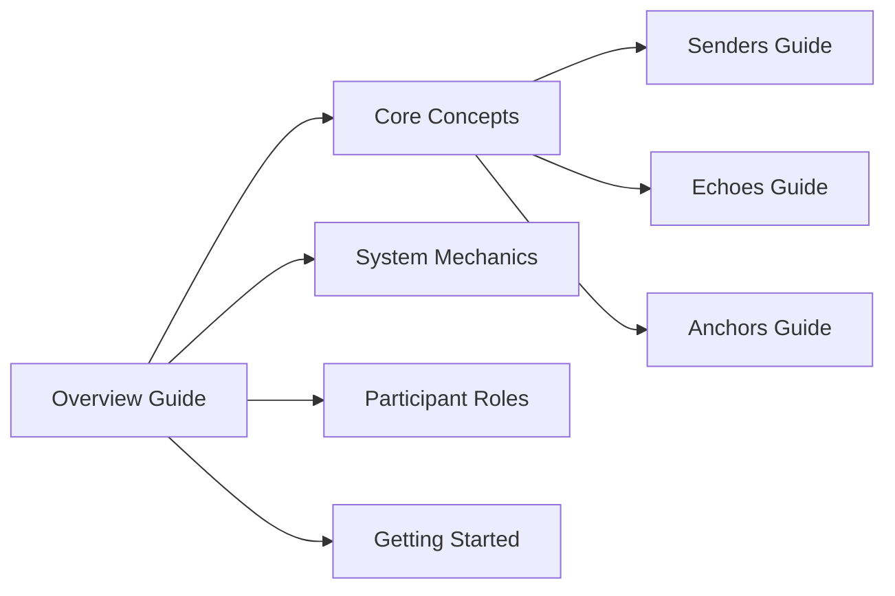

# Overview Guide

<h1>Understanding Studio3</h1>

Your complete introduction to the venture building ecosystem where belief becomes momentum

## 📖 About This Guide

This guide provides a comprehensive overview of Studio3, explaining how the platform works, its core concepts, and the journey from idea to successful venture. Whether you're a potential founder, supporter, or validator, this guide will help you understand the Studio3 ecosystem.

## 📚 Guide Contents

<h3>1. Introduction</h3>
<ul>
<li><a href="what-is-studio3.md">What is Studio3?</a></li>
<li><a href="ecosystem-overview.md">Ecosystem Overview</a></li>
<li><a href="key-principles.md">Key Principles</a></li>

</ul>

<h3>2. Core Concepts</h3>
<ul>
<li><a href="arena-system.md">The Arena System</a></li>
<li><a href="belief-signals.md">Belief & Doubt Signals</a></li>
<li><a href="nft-system.md">Three-NFT System</a></li>

</ul>

<h3>3. The Journey</h3>
<ul>
<li><a href="seven-phases.md">Seven Phase Lifecycle</a></li>
<li><a href="milestones.md">Milestone System</a></li>
<li><a href="progression.md">Progression Rules</a></li>

</ul>

<h3>4. Participants</h3>
<ul>
<li><a href="roles-overview.md">Three Roles Overview</a></li>
<li><a href="interactions.md">How They Interact</a></li>
<li><a href="incentives.md">Aligned Incentives</a></li>

</ul>

<h3>5. Economics</h3>
<ul>
<li><a href="signal-token.md">$SIGNAL Token</a></li>
<li><a href="rewards-system.md">Rewards & Penalties</a></li>
<li><a href="value-flow.md">Value Flow</a></li>

</ul>

<h3>6. Getting Started</h3>
<ul>
<li><a href="choosing-role.md">Choosing Your Role</a></li>
<li><a href="first-steps.md">First Steps</a></li>
<li><a href="resources.md">Resources & Support</a></li>

</ul>

## 🎯 Who Should Read This Guide?

- **🆕 Newcomers** wanting to understand Studio3
- **💼 Investors** evaluating the ecosystem
- **🏗️ Potential Founders** exploring the platform

- **📡 Future Supporters** learning the mechanics

- **⚓ Aspiring Validators** understanding requirements

- **🏛️ Partners** considering integration

## 📄 Download Options

<a href="../pdf/studio3-overview-guide.pdf" class="md-button md-button--primary">
📥 Download Complete PDF Guide
</a>

56 pages • 2.3 MB • Last updated: January 2025

## 🚀 Quick Navigation

Based on your interests:

!!! tip "For Builders"
    After reading this overview, check out the [Senders Guide](../senders-guide/index.md) for detailed founder instructions.

!!! tip "For Supporters"
    Ready to signal? The [Echoes Guide](../echoes-guide/index.md) covers everything about belief mechanics.

!!! tip "For Validators"
    Experienced builders should explore the [Anchors Guide](../anchors-guide/index.md) to become ecosystem guardians.

## 📊 Guide Structure

!!! success "Start Your Journey"
    Begin with [What is Studio3?](what-is-studio3.md) to understand the vision and mission of the platform.