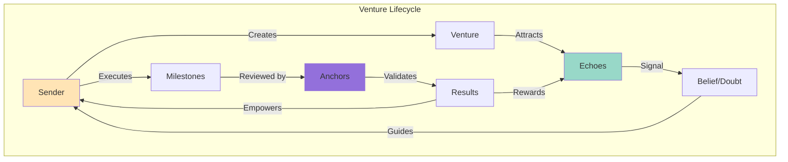
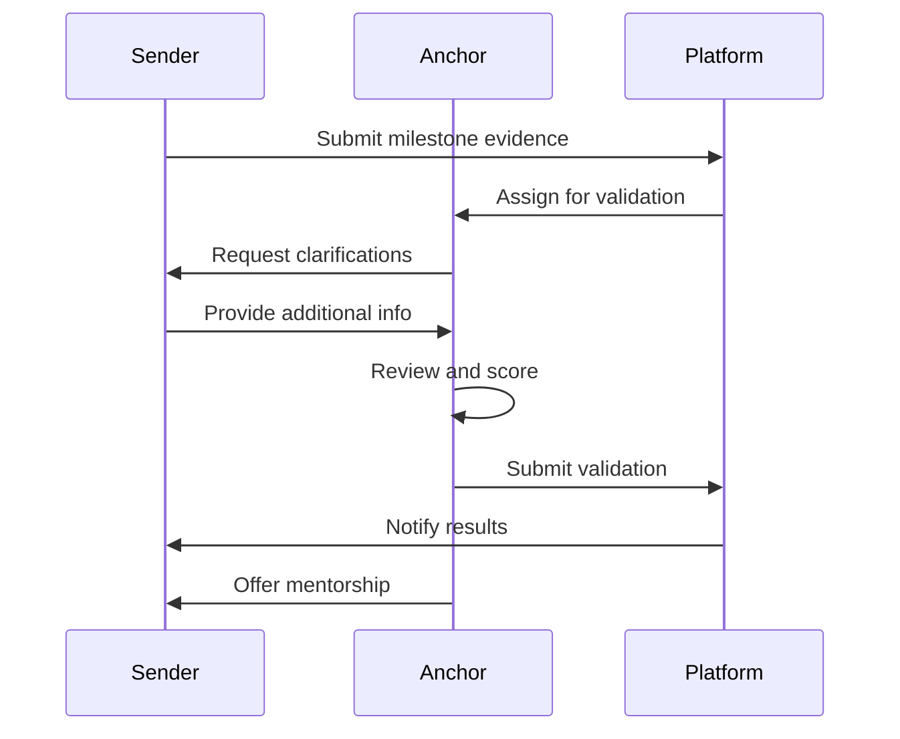
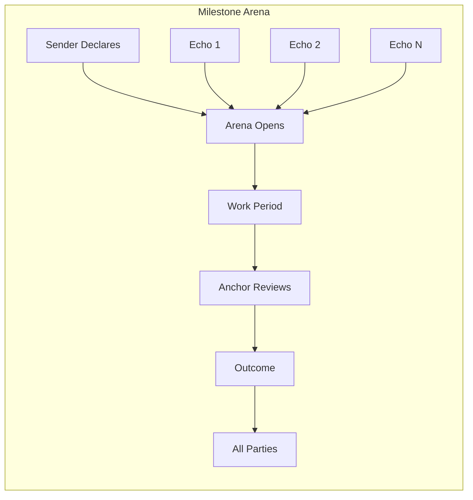

# How They Interact

## The Symphony of Collaboration

Studio3's magic emerges from the intricate interactions between Senders, Echoes, and Anchors. Understanding these dynamics is crucial for navigating the ecosystem successfully.

## Interaction Overview

### The Ecosystem Flow

## Primary Interactions

### Sender ↔ Echo Dynamics

### 🤝 The Investment Relationship

**How They Connect:**

#### Discovery Phase

- Senders pitch ventures in Arenas
- Echoes research and evaluate
- Initial conversations begin

#### Signaling Phase

- Echoes place belief/doubt stakes
- Senders see support levels
- Feedback flows both ways

#### Execution Phase

- Senders deliver on promises
- Echoes monitor progress
- Communication stays open

#### Settlement Phase

- Results determine rewards
- Relationships strengthen or end
- Lessons learned by both

### Communication Patterns

!!! info "Sender → Echo Communications"
    - **Milestone Declarations**: Clear, specific commitments
    - **Progress Updates**: Daily during active periods
    - **Challenge Transparency**: Honest about obstacles
    - **Success Celebrations**: Share wins with supporters
    - **Pivot Explanations**: Justify major changes

!!! info "Echo → Sender Communications"
    - **Due Diligence Questions**: Understand the venture
    - **Constructive Feedback**: Improve execution
    - **Market Intelligence**: Share relevant insights
    - **Network Connections**: Introduce helpful contacts
    - **Moral Support**: Encourage during challenges

### Value Exchange

| What Senders Give | What Echoes Give |
|-------------------|------------------|
| Transparency | Risk capital |
| Execution | Market validation |
| Returns potential | Community wisdom |
| Learning opportunity | Network effects |
| Innovation | Distribution |

## Sender ↔ Anchor Dynamics

### The Mentorship Bond

### 🎓 Growth Through Guidance

**Key Interactions:**

#### Validation Moments

- Senders submit evidence
- Anchors review thoroughly
- Feedback improves execution

#### Mentorship Sessions

- Strategic planning help
- Technical guidance
- Network introductions
- Crisis management

#### Standards Setting

- Anchors define quality
- Senders strive to exceed
- Continuous improvement

#### Dispute Resolution

- Fair hearings
- Evidence-based decisions
- Learning opportunities

### Interaction Protocols

### Mutual Benefits

    

        <h4>🏗️ What Senders Gain</h4>
        <ul>
            <li>Expert guidance</li>
            <li>Quality validation</li>
            <li>Credibility boost</li>
            <li>Network access</li>
            <li>Skill development</li>
        </ul>
    

    
    

        <h4>⚓ What Anchors Gain</h4>
        <ul>
            <li>Validation fees</li>
            <li>Ecosystem growth</li>
            <li>Satisfaction of helping</li>
            <li>Reputation building</li>
            <li>Deal flow access</li>
        </ul>
    

## Echo ↔ Anchor Dynamics

### The Quality Assurance Loop

### 🔍 Trust Through Verification

**How They Collaborate:**

#### Signal Confidence

- Anchors provide quality assurance
- Echoes trust validation process
- Reduces investment risk

#### Information Flow

- Anchors share insights
- Echoes provide market sentiment
- Collective intelligence emerges

#### Dispute Mediation

- Anchors investigate concerns
- Echoes present evidence
- Fair resolutions build trust

#### Ecosystem Protection

- Both identify bad actors
- Collaborative defense
- Maintains platform integrity

### Information Asymmetry

!!! warning "Balancing Knowledge"
    - **Anchors know more** about technical execution
    - **Echoes know more** about market sentiment
    - **Together they create** complete picture
    - **Transparency bridges** information gaps

## Multi-Party Interactions

### The Arena Experience

### Complex Scenarios

    

#### 🎭 Scenario: Pivot Decision

**Participants:** 
Sender + Multiple Echoes + Anchor

- Sender proposes major pivot
- Echoes debate merits
- Anchor provides expert opinion
- Collective decision emerges

    
    

#### ⚖️ Scenario: Disputed Validation

**Participants:** Sender + Echoes + Multiple Anchors

- Sender claims success
- Primary Anchor disagrees
- Echoes split on outcome
- Anchor Council decides

## Communication Channels

### Official Channels

    

        <h4>🏟️ Arena Forums</h4>
        
Public discussions

        
All can participate

    

    
    

        <h4>📢 Update Feeds</h4>
        
Progress broadcasts

        
One-to-many comms

    

    
    

        <h4>📧 Direct Messages</h4>
        
Private conversations

        
Relationship building

    

    
    

        <h4>🎬 Video Sessions</h4>
        
Live interactions

        
Deep discussions

    

### Communication Best Practices

!!! tip "Effective Interaction Guidelines"
    
    **For All Parties:**
    - Be respectful and professional
    - Respond promptly to queries
    - Document important decisions
    - Maintain transparency
    - Build relationships beyond transactions
    
    **Channel Selection:**
    - Public forums for general updates
    - Direct messages for specific questions
    - Video calls for complex discussions
    - Written summaries after verbal agreements

## Conflict Resolution

### When Interactions Break Down

### ⚖️ Dispute Resolution Framework

#### Level 1: Direct Resolution

- Parties attempt to resolve directly
- Open communication encouraged
- Focus on mutual benefit

#### Level 2: Community Mediation

- Neutral Echoes facilitate
- Public discussion if appropriate
- Seek consensus solution

#### Level 3: Anchor Arbitration

- Formal Anchor review
- Evidence-based decision
- Binding resolution

#### Level 4: Council Judgment

- Anchor Council final say
- Sets precedent for future
- Reputation consequences

### Common Conflicts

| Conflict Type | Typical Cause | Resolution Approach |
|---------------|---------------|--------------------|
|**Milestone Disputes** | Unclear success criteria | Better documentation |
|**Communication Breakdown** | Unmet expectations | Regular check-ins |
|**Resource Conflicts** | Budget overruns | Transparent accounting |
|**Timeline Issues** | Unrealistic deadlines | Collaborative replanning |
|**Quality Disagreements** | Subjective standards | Clear metrics upfront |

## Network Effects

### How Interactions Scale

**Network Value Calculation:**
- **Each role creates value**: Senders² + Echoes² + Anchors²
- **Cross-role interactions multiply**: Senders × Echoes + Senders × Anchors + Echoes × Anchors
- **Total network value**: Role value × Interaction multiplier
- **Result**: Exponential growth as ecosystem expands

**Example:** 100 Senders + 1000 Echoes + 50 Anchors = 150,000 base value × 155,000 interactions = 23.25M network value units

### Emergent Behaviors

!!! info "Positive Emergent Patterns"
    - **Reputation Networks**: Trust builds exponentially
    - **Knowledge Sharing**: Collective intelligence emerges
    - **Innovation Clusters**: Similar ventures collaborate
    - **Mentorship Chains**: Successful founders become Anchors
    - **Investment Syndicates**: Echoes coordinate strategies

## Interaction Metrics

### Measuring Interaction Health

| Metric | Healthy Range | Warning Signs |
|--------|---------------|---------------|
| **Response Time** | <24 hours | >72 hours |
|**Engagement Rate** | >60% active | <30% active |
|**Conflict Rate** | <5% interactions | >15% interactions |
|**Resolution Time** | <7 days | >30 days |
|**Satisfaction Score** | >4.2/5 | <3.5/5 |

### Interaction Quality Indicators

    

        <h4>💚 High Quality</h4>
        <ul>
            <li>Clear communication</li>
            <li>Mutual respect</li>
            <li>Timely responses</li>
            <li>Constructive feedback</li>
            <li>Win-win outcomes</li>
        </ul>
    

    
    

        <h4>🔴 Low Quality</h4>
        <ul>
            <li>Poor communication</li>
            <li>Adversarial tone</li>
            <li>Delayed responses</li>
            <li>Destructive criticism</li>
            <li>Zero-sum thinking</li>
        </ul>
    

## Cultural Norms

### The Studio3 Way

### 🌐 Interaction Principles

**Core Values:**

#### Transparency Above All

- Share information openly
- Admit mistakes quickly
- Celebrate successes together

#### Constructive Engagement

- Criticism with solutions
- Support through challenges
- Learn from failures

#### Long-term Thinking

- Build lasting relationships
- Reputation over quick gains
- Ecosystem health priority

#### Meritocratic Respect

- Ideas over identities
- Performance over politics
- Results over rhetoric

## Success Stories

### Interaction Excellence

#### 🌟 Case: The Pivot Partnership

**Participants:** TechVenture (Sender), 200+ Echoes, 3 Anchors

- **Situation:** Major pivot needed after market shift
- **Interaction:** Transparent communication, collaborative replanning
- **Outcome:** 85% Echo retention, successful pivot, 3x returns

> "The open dialogue during our pivot saved the venture. Our Echoes became true partners, not just investors."
> 
> — TechVenture Founder

## Interaction Evolution

### Future Enhancements

!!! tip "Coming Interaction Features"
    - **AI-Mediated Discussions**: Better conversation facilitation
    - **Reputation Weighted Voting**: Influence based on track record
    - **Cross-Venture Collaboration**: Formal partnership tools
    - **Automated Conflict Detection**: Early warning systems
    - **Interaction Rewards**: Incentivize quality engagement

## Your Interaction Strategy

### Building Strong Relationships

#### Start with Empathy

- Understand other perspectives

#### Communicate Clearly

- Avoid ambiguity

#### Follow Through

- Do what you say

#### Add Value

- Give before you receive

#### Think Long-term

- Reputation compounds

## Next Steps

- Understand [Aligned Incentives](incentives.md) driving interactions
- Learn role-specific communication in respective guides
- Study [Arena System](arena-system.md) for interaction context
- Review [Progression Rules](progression.md) for phase interactions