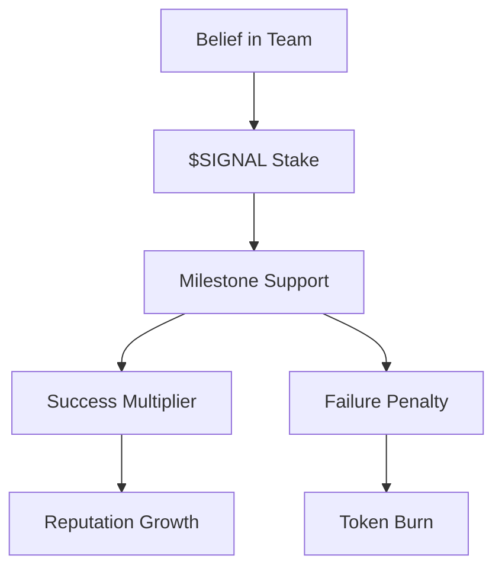
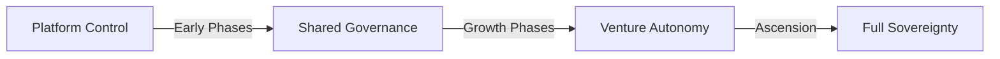

# Key Principles

## The Foundation of Studio3

Studio3 operates on revolutionary principles that transform how ventures are built, funded, and grown. These core tenets guide every aspect of our ecosystem.

## 1. Transparency as Default

### Everything Happens in Public

In traditional venture building, progress happens behind closed doors. Studio3 flips this model:

!!! quote "The Arena Principle"
    "In the Arena, there are no secrets - only execution."

- **All milestones** are declared publicly
- **All progress**  is tracked transparently
- **All failures** are visible to everyone

- **All successes** are celebrated openly

This radical transparency creates:

- **Accountability** through public commitment
- **Trust**  through verifiable progress
- **Learning** through shared experiences

- **Speed** through immediate feedback

## 2. Belief as Currency

### Conviction Has Real Value

The $SIGNAL token transforms abstract belief into tangible support:

** Key aspects:**
- **Belief must be **backed by tokens** ** ** Conviction carries **real risk** ****

* Accuracy builds **lasting reputation**  
* Mistakes have **permanent consequences** ## 3. Community Validation

### The Crowd Decides

No single authority determines success. Instead:

    

        <h4>🗳️ Signal Aggregation</h4>
        
Collective belief/doubt determines support levels

    

    

        <h4>⚓ Anchor Verification</h4>
        
Expert validators ensure quality standards

    

    

        <h4>📊 Market Dynamics</h4>
        
Real-time sentiment guides venture direction

    

## 4. Gamified Progression

### Seven Phases, Clear Rules

Venture building becomes a game with:

- **Defined stages** from Spark to Ascension
- **Clear objectives**  for each phase
- **Measurable progress** through milestones

- **Tangible rewards** for achievement

- **Real penalties** for failure

!!! info "Game Mechanics"
    Unlike traditional "gamification," Studio3's game has real stakes. Tokens are burned, reputations are built or destroyed, and ventures live or die based on performance.

## 5. Aligned Incentives

### Everyone Wins Together

The ecosystem aligns all participants:

| Role | Wants | Gets | Gives |
|------|-------|------|-------|
| **Founders** | Funding & support | Resources & validation | Transparent execution |
| **Echoes** | Returns on belief | Token multipliers | Risk capital |
| **Anchors** | Quality ventures | Validation fees | Expert guidance |
| **Ecosystem** | Sustainable growth | Successful ventures | Fair platform |

## 6. Permissionless Innovation

### Anyone Can Play

No gatekeepers, no applications, no committees:

- **Any idea** can become a Spark
- **Any founder**  can enter the Forge
- **Any supporter** can signal belief

- **Any expert** can become an Anchor

!!! warning "With Freedom Comes Responsibility"
    Permissionless doesn't mean consequence-free. Bad actors are naturally filtered out through token burns and reputation loss.

## 7. Progressive Decentralization

### From Central to Sovereign

Ventures gradually gain independence:

1. **Start** with platform support**2. **Grow** with community governance**3. **Mature** with increasing autonomy**4. **Graduate** to full sovereignty**## 8. Failure as Feature

### Learning Through Loss

Failure isn't hidden or minimized:

- **Failed milestones** burn tokens permanently
- **Failed ventures**  become case studies
- **Failed predictions** damage reputation

- **Failed strategies** inform future attempts

!!! quote "The Failure Principle"
    "In Studio3, failure is expensive but educational. Every burned token teaches the ecosystem what doesn't work."

## 9. Compound Reputation

### Trust Builds Over Time

Reputation (XP) in Studio3:

- **Cannot be bought**
- only earned
- **Cannot be transferred**
- tied to identity
- **Cannot be gamed**
- based on results
- **Compounds over time**
- early success matters

## 10. Recursive Growth

### Success Creates Success

The ecosystem is designed for exponential growth:

1. **Successful ventures** graduate to sovereignty**2. **Sovereign ventures** can launch sub-studios**3. **Sub-studios** follow the same principles**4. **Network effects** compound across levels**## Living These Principles

### Daily Practice

These aren't just ideas - they're daily practices:

!!! tip "For Founders"

- Declare milestones publicly

- Share progress openly

- Accept community feedback

- Build in the Arena

!!! tip "For Supporters"

- Back belief with tokens

- Accept the risk of being wrong

- Learn from failures

- Celebrate successes

!!! tip "For Validators"

- Maintain high standards

- Provide honest feedback

- Guide without controlling

- Protect ecosystem integrity

## The Principles in Action

### Real Examples

#### 🌟 Case Study: OpenHealth Venture

**Principle Applied:**

**Radical Transparency**

When OpenHealth hit technical challenges in Phase 3, they shared their struggles publicly. The community rallied with technical support, and they pivoted successfully.

**Result:**

**Stronger product, loyal community, successful graduation**

#### 💥 Case Study: QuickFlip Failure

**Principle Applied:**

**Failure as Feature**

QuickFlip consistently missed milestones, burning 500K $SIGNAL tokens. Their detailed post-mortem became required reading for new founders.

**Result:**

**Expensive lesson that improved ecosystem quality**

## Principles vs. Practice

### Common Misconceptions

| Misconception | Reality |
|---------------|------|
| "It's just gambling" | Signals represent conviction about execution ability |
| "Transparency is optional" | Public execution is mandatory |
| "Reputation can be bought" | XP only comes from accurate predictions |
| "Failure is shameful" | Failure is expensive but valuable |

## Evolution of Principles

### Continuous Refinement

These principles evolve through:

- **Community feedback** shapes interpretation
- **Edge cases**  refine implementation
- **Success patterns** inform best practices

- **Failure modes** highlight necessary adjustments

!!! info "Living Document"
    These principles are living guidelines, not rigid rules. They evolve as the ecosystem learns and grows.

## Next Steps

### Applying the Principles

1. **Understand** how principles guide decisions**2. **Observe** them in action in the Arena**3. **Practice** applying them to your role**4. **Share** experiences with the community**## Related Reading

- Dive into [The Arena System](arena-system.md) to see principles in practice
- Explore [Belief & Doubt Signals](belief-signals.md) for conviction mechanics
- Learn about [Three-NFT System](nft-system.md) for ownership principles
- Understand [Seven Phase Lifecycle](seven-phases.md) for progression principles