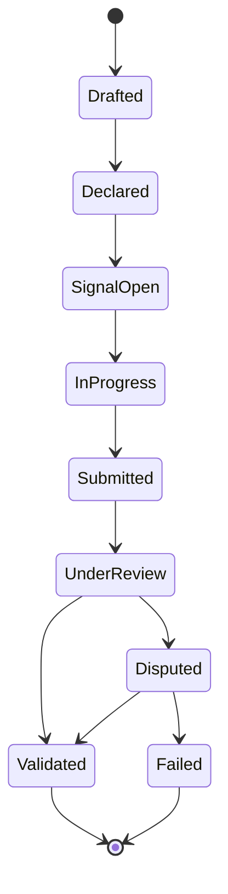
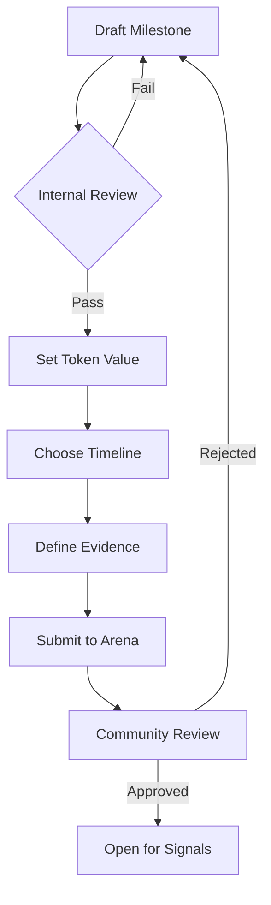
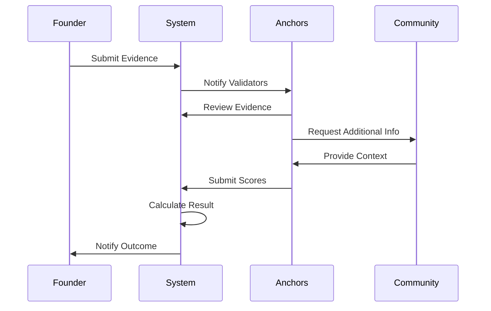
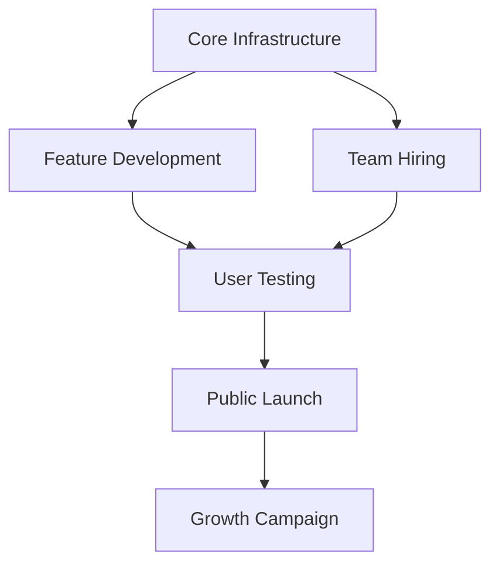

# Milestone System

## The Building Blocks of Progress

Milestones are the fundamental units of progress in Studio3. They represent specific, measurable commitments that ventures make to their community, creating accountability and enabling support through belief signals.

## What Are Milestones?

### Definition

<div class="arena-card">

<h3>🎯 Milestone Essentials</h3>

<p>A milestone is a public commitment to achieve a specific outcome by a defined deadline.</p>

<p><strong>Key Components:</strong></p>

<ul>
<li><strong>Specific Goal</strong> : Clear, unambiguous objective</li>
<li><strong>Success Criteria</strong> : Measurable completion requirements</li>
<li><strong>Timeline</strong> : Fixed deadline for achievement</li>
<li><strong>Evidence Requirements</strong> : Proof needed for validation</li>
<li><strong>Token Value</strong> : Amount at stake for signals</li>

</ul>
</div>

### Milestone Lifecycle



## Milestone Types

### By Category

<div class="grid cards">
    <div class="card">
        <h4>🛠️ Technical</h4>
        <p>Code, features, infrastructure</p>
        <ul>
            <li>MVP launch</li>
            <li>Feature release</li>
            <li>Performance improvement</li>
            <li>Security audit</li>
        </ul>
    </div>
    
    <div class="card">
        <h4>📈 Growth</h4>
        <p>Users, revenue, market share</p>
        <ul>
            <li>User acquisition</li>
            <li>Revenue targets</li>
            <li>Market expansion</li>
            <li>Partnership deals</li>
        </ul>
    </div>
    
    <div class="card">
        <h4>🤝 Operational</h4>
        <p>Team, processes, governance</p>
        <ul>
            <li>Team hiring</li>
            <li>Process implementation</li>
            <li>DAO governance</li>
            <li>Legal compliance</li>
        </ul>
    </div>
    
    <div class="card">
        <h4>💰 Financial</h4>
        <p>Funding, tokenomics, sustainability</p>
        <ul>
            <li>Fundraising rounds</li>
            <li>Token launches</li>
            <li>Profitability targets</li>
            <li>Treasury management</li>
        </ul>
    </div>
</div>

### By Phase

| Phase | Typical Milestones | Average Count |
|-------|-------------------|---------------|
| **Spark** | Concept validation, team formation | 2-3 |
| **Forge** | Pitch preparation, vision articulation | 1-2 |
| **Ignition** | MVP development, DAO setup | 4-6 |
| **Drift** | PMF iterations, user feedback | 8-12 |
| **Orbit** | Growth metrics, operational efficiency | 10-15 |
| **Flare** | Scaling targets, funding rounds | 8-10 |
| **Ascension** | Buyback preparation, handover | 3-4 |

## Creating Effective Milestones

### SMART Framework

!!! tip "SMART Milestones"

- **S** pecific: Clear and unambiguous
- **-**M**easurable: Quantifiable success criteria** -**A** chievable: Realistic given resources
- **-**R**elevant: Aligned with venture goals** -**T**ime-bound: Fixed deadline**### Good vs Bad Milestones

<div class="grid">
<div class="arena-card">

<h4>✅ Good Milestone</h4>
<p><strong>"Launch MVP with 3 core features by March 15"</strong></p>**
<ul>
<li>Specific features defined</li>
<li>Clear deliverable (MVP)</li>
<li>Fixed deadline</li>
<li>Measurable outcome</li>
</ul>
</div>

<div class="arena-card">

<h4>❌ Bad Milestone</h4>
<p><strong>"Make significant progress on product"</strong></p>**
<ul>
<li>Vague objective</li>
<li>No success criteria</li>
<li>Missing deadline</li>
<li>Unmeasurable</li>
</ul>
</div>
</div>

## Milestone Declaration

### The Declaration Process



### Declaration Requirements

<div class="arena-card">

<h3>📝 Declaration Checklist</h3>

<p><strong> Required Elements:</strong></p>
<ul>
<li><strong>[ ] Clear objective statement</strong></li>
<li>[ ] Success criteria (3-5 points)</li>
<li>[ ] Evidence requirements</li>
<li>[ ] Realistic timeline</li>
<li>[ ] Token value (min 1,000 $SIGNAL)</li>
<li>[ ] Risk assessment</li>
<li>[ ] Dependencies identified</li>

</ul>
<p><strong> Optional Enhancements:</strong></p>
<ul>
<li><strong>[ ] Stretch goals</strong></li>
<li>[ ] Partial success criteria</li>
<li>[ ] Progress checkpoints</li>
<li>[ ] Contingency plans</li>

</ul>
</div>

## Milestone Valuation

### Setting Token Values

!!! info "Valuation Factors"
    Token values should reflect:

- **Difficulty**: Technical or operational complexity
- **Impact** : Importance to venture success

**    -:** Risk** : Probability of failure
- **-**Timeline** : Urgency and duration
- **-**Dependencies**: External factors**### Valuation Guidelines

| Milestone Type | Typical Range | Factors |
|----------------|---------------|----------|
| **Minor Feature** | 1K
- 10K | Low complexity, quick delivery |
| **Major Feature** | 10K
- 50K | High complexity, critical path |
| **Growth Target** | 20K
- 100K | Market dependent, measurable |
| **Funding Round** | 50K
- 500K | High impact, binary outcome |
| **Phase Transition** | 100K
- 1M | Comprehensive requirements |

## Evidence Requirements

### Types of Evidence

<div class="grid cards">
    <div class="card">
        <h4>📊 Quantitative</h4>
        <ul>
            <li>Analytics dashboards</li>
            <li>Financial statements</li>
            <li>User metrics</li>
            <li>Performance benchmarks</li>
        </ul>
    </div>
    
    <div class="card">
        <h4>📷 Demonstrative</h4>
        <ul>
            <li>Live demos</li>
            <li>Video walkthroughs</li>
            <li>Public URLs</li>
            <li>GitHub commits</li>
        </ul>
    </div>
    
    <div class="card">
        <h4>📄 Documentary</h4>
        <ul>
            <li>Contracts signed</li>
            <li>Audit reports</li>
            <li>Press coverage</li>
            <li>User testimonials</li>
        </ul>
    </div>
    
    <div class="card">
        <h4>✅ Verificative</h4>
        <ul>
            <li>Third-party confirmation</li>
            <li>On-chain transactions</li>
            <li>API endpoints</li>
            <li>Public registrations</li>
        </ul>
    </div>
</div>

### Evidence Standards

!!! warning "Evidence Must Be"

- **Authentic** : Not fabricated or manipulated
- **-**Relevant** : Directly proves milestone completion
- **-**Sufficient** : Comprehensive enough for validation
- **-**Timely** : Generated within milestone period
- **-**Accessible**: Validators can verify independently**## Milestone Execution

### Best Practices

<div class="arena-card">

<h3>🏆 Execution Excellence</h3>

<p><strong>During Development:</strong></p>

<p>1. <strong>Daily Updates</strong>: Keep community informed</p>
<p>2. <strong>Progress Tracking</strong></p>
<p>: Show incremental advancement</p>
<p>3. <strong>Challenge Transparency</strong></p>
<p>: Share obstacles openly</p>
<p>4. <strong>Resource Management</strong></p>
<p>: Allocate wisely</p>
<p>5. <strong>Time Buffering</strong></p>
<p>: Plan for unexpected delays**</p>

<ul>
<li><strong>Communication Guidelines:</strong></li>
<li><strong>Post updates at consistent times</strong></li>
<li>Use visual progress indicators</li>
<li>Respond to community questions</li>
<li>Acknowledge concerns promptly</li>
<li>Celebrate small wins</li>

</ul>
</div>

### Common Pitfalls

| Pitfall | Impact | Prevention |
|---------|---------|------------|
| **Scope Creep** | Missed deadlines | Strict feature freeze |
| **Poor Planning** | Resource shortage | Detailed breakdown |
| **Over-promising** | Failed delivery | Conservative estimates |
| **Under-communicating** | Lost confidence | Daily updates |
| **Ignoring Feedback** | Wrong direction | Active engagement |

## Validation Process

### How Validation Works



### Validation Criteria

!!! info "Anchors Evaluate"
    1. **Completeness** : All requirements met?**
1. 
2. **Quality** : Meets professional standards?
2. 
3. **Timeliness**: Delivered on schedule?    4.**Evidence**: Properly documented?**    5.**Impact**: Achieves intended outcome?**### Validation Outcomes

| Outcome | Result | Token Impact |
|---------|--------|-------------|
| **Full Success** | 100% complete | Believers rewarded 1.5-3x |
| **Partial Success** | 70-99% complete | Reduced multipliers |
| **Extension Granted** | More time given | Signals locked |
| **Failed** | <70% complete | All signals burned |
| **Disputed** | Contested result | Re-validation required |

## Milestone Strategies

### For Founders

<div class="grid cards">
    <div class="card">
        <h4>🎯 Strategic Planning</h4>
        <ul>
            <li>Chain dependent milestones</li>
            <li>Balance risk across portfolio</li>
            <li>Front-load critical paths</li>
            <li>Build credibility gradually</li>
        </ul>
    </div>
    
    <div class="card">
        <h4>📢 Community Building</h4>
        <ul>
            <li>Involve supporters early</li>
            <li>Create anticipation</li>
            <li>Share behind-scenes</li>
            <li>Celebrate together</li>
        </ul>
    </div>
</div>

### For Echoes

<div class="grid cards">
    <div class="card">
        <h4>🔍 Analysis Framework</h4>
        <ul>
            <li>Assess founder track record</li>
            <li>Evaluate technical feasibility</li>
            <li>Consider market conditions</li>
            <li>Check resource availability</li>
        </ul>
    </div>
    
    <div class="card">
        <h4>📊 Risk Management</h4>
        <ul>
            <li>Diversify across ventures</li>
            <li>Size stakes appropriately</li>
            <li>Monitor progress actively</li>
            <li>Learn from patterns</li>
        </ul>
    </div>
</div>

## Advanced Concepts

### Milestone Dependencies



### Conditional Milestones

!!! tip "Coming Soon: Conditional Logic"
    Future milestones will support:

- **IF-THEN**  statements
- **-** AND/OR
- 
- requirements   Prerequisite
- chains**  Fallback
- options**  Bonus
- objectives**## Success Metrics

### Tracking Performance

```python
# Milestone Success Metrics
class MilestoneMetrics:
    completion_rate = 0.75  # 75% success rate
    average_duration = 21  # days
    signal_accuracy = 0.68  # 68% correct predictions
    extension_rate = 0.15  # 15% request extensions
    dispute_rate = 0.05  # 5% contested results
```

### Improvement Areas

| Metric | Target | Current | Action |
|--------|--------|---------|--------|
| **Success Rate** | 80% | 75% | Better planning tools |
| **Signal Participation** | 70% | 62% | Increase awareness |
| **Validation Time** | 24hr | 36hr | More Anchors needed |
| **Evidence Quality** | 95% | 89% | Clearer guidelines |

## Common Questions

### Milestone FAQ
**Q: Can I modify a milestone after declaration?**
**A: No, declared milestones are immutable. Plan carefully.**
**Q: What happens if I get sick during execution?**
**A: Apply for extension with medical evidence. Community decides.**
**Q: Can I declare multiple milestones simultaneously?**
**A: Yes, but ensure you have resources for parallel execution.**
**Q: How do partial completions work?**
**A: Anchors score 0-100%. 70%+ may receive partial rewards.**
**Q: Can milestones be cancelled?**
**A: Only in extreme circumstances with Anchor approval.**

## Your Milestone Journey

### Getting Started

- 1.** Study Examples
- Learn from successful milestones
2. **Start Small**
- Build confidence with achievable goals
3. **Engage Early**
- Discuss plans with community
4. **Document Everything**
- Evidence collection from day one
5. **Deliver Consistently**
- Build reputation over time**## Next Steps

- Review [Progression Rules](progression.md) for phase requirements

- Explore [Signal Mechanics](belief-signals.md) for supporter perspective
- Learn [Validation Framework](../anchors-guide/validation-framework.md)
- Study [Milestone Planning](../senders-guide/milestone-planning.md) guide