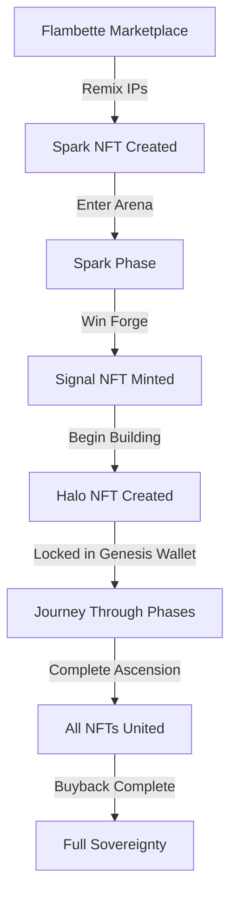
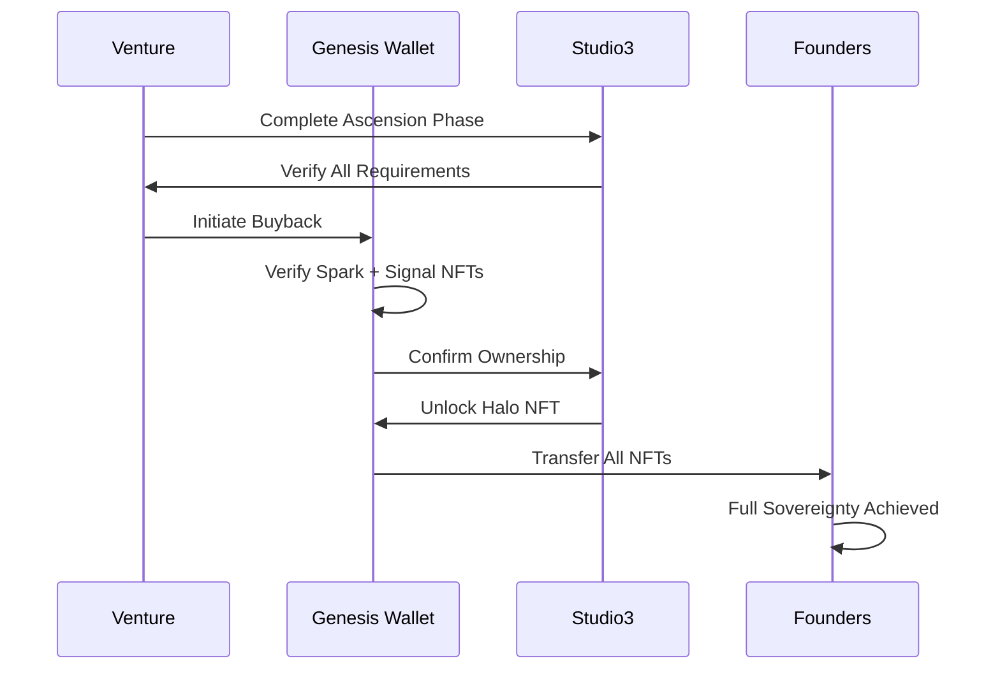
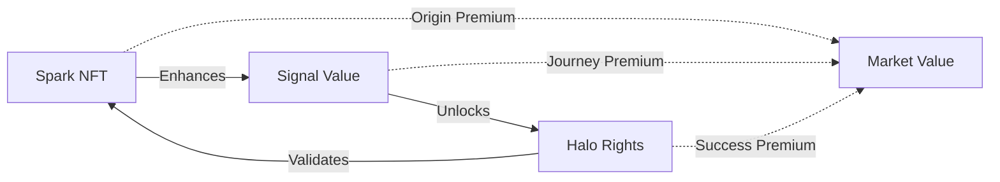

# The Three-NFT System

## Digital Assets That Tell a Story

Studio3's innovative three-NFT system creates a complete narrative arc for every venture, from initial spark of inspiration to full sovereignty. Each NFT serves a unique purpose in the venture's journey.

## The Three NFTs

### Overview

<div class="grid cards">
    <div class="arena-card" markdown="1">

### 🎨 Spark NFT
        <strong>The Origin</strong>

        Represents the original idea and IP combination

        - Created from Flambette marketplace- Contains remixed IP metadata- Tradeable and collectible- Required for Forge entry

</div>
    
    <div class="arena-card" markdown="1">

### 📡 Signal NFT
        <strong>The Journey</strong>

        Dynamic NFT tracking the venture's entire lifecycle

        - Awarded to Forge winner- Updates with each milestone- Records all signals received- Becomes more valuable over time

</div>
    
    <div class="arena-card" markdown="1">

### 🛡️ Halo NFT
        <strong>The Achievement</strong>

        Soulbound proof of successful graduation

        - Created at venture inception- Locked until Ascension- Non-transferable honor- Unlocks sovereign rights

</div>
</div>

## NFT Lifecycle

### The Complete Journey



## Spark NFT

### The Beginning of Everything

!!! info "Spark NFT Details"
    **Purpose:** Capture and validate innovative ideas  
    **Creation:** Remix existing IP-NFTs on Flambette  
    **Utility:** Entry ticket to Studio3 ecosystem  
    **Trading:** Fully transferable on secondary markets

### Creation Process

1. **Browse Flambette** - Explore available IP-NFTs
2. **Select Components** - Choose 2-5 IPs to combine
3. **Define Synthesis** - Explain how they connect
4. **Mint Spark** - Pay minting fee, receive NFT
5. **Enter Arena** - Use Spark to launch venture

### Spark Metadata

```json
{
  "name": "DeFi Health Records Spark",
  "description": "Combining blockchain medical records with DeFi lending",
  "remixed_ips": [
    "ipfs://QmX..." // Medical records patent
    "ipfs://QmY..." // DeFi protocol framework
  ],
  "synthesis": "Enable medical history-based credit scoring",
  "creator": "0x742d35Cc6634C0532925a3b844Bc9e7595f7E123",
  "timestamp": "2024-03-15T10:30:00Z",
  "spark_id": "SPARK-2024-0342"
}
```

### Spark Value Factors

| Factor | Impact on Value |
|--------|----------------|
| **IP Quality** | Higher quality sources = higher value |
| **Synthesis Novelty** | Unique combinations command premiums |
| **Market Timing** | Hot sectors increase demand |
| **Creator Reputation** | Proven creators' Sparks valued higher |
| **Historical Performance** | Sparks that led to successful ventures |

## Signal NFT

### The Living Chronicle

!!! info "Signal NFT Details"
    **Purpose:** Track and visualize venture progress  
    **Creation:** Awarded to Forge duel winner  
    **Utility:** Governance rights and milestone tracking  
    **Updates:** Dynamically evolves with venture progress

### Dynamic Properties

<div class="arena-card" markdown="1">

### 🎨 Visual Evolution
The Signal NFT's appearance changes based on:

- <strong>Phase Progress:</strong> Color shifts with each phase
- <strong>Signal Strength:</strong> Brightness indicates support
- <strong>Milestone Success:</strong> New elements appear
- <strong>Community Size:</strong> Complexity increases
- <strong>Time Active:</strong> Aged patina develops

</div>

### Signal NFT Metadata Structure

```json
{
  "name": "MediLend Protocol Signal",
  "phase": "Orbit",
  "stats": {
    "milestones_completed": 8,
    "milestones_failed": 1,
    "total_signals_received": 45000000,
    "belief_ratio": 0.73,
    "supporter_count": 1847,
    "days_active": 234
  },
  "visual_traits": {
    "base_color": "#4A90E2",
    "glow_intensity": 0.8,
    "pattern_complexity": 7,
    "special_effects": ["phase_transition", "milestone_sparkle"]
  },
  "achievements": [
    "First Pivot Success",
    "Community Choice Award",
    "Anchor Excellence"
  ]
}
```

### Signal NFT Utility

| Utility | Description |
|---------|-------------|
| **Governance Weight** | Vote power in Container DAO decisions |
| **Revenue Share** | Claim on protocol revenues |
| **Access Rights** | Entry to founder-only resources |
| **Network Benefits** | Priority access to partners |
| **Historical Record** | Immutable proof of journey |

## Halo NFT

### The Ultimate Achievement

!!! info "Halo NFT Details"
    **Purpose:** Represent ultimate venture sovereignty  
    **Creation:** Minted at Ignition, locked until Ascension  
    **Utility:** Unlock full venture control  
    **Transfer:** Soulbound - forever tied to venture

### Sovereignty Rights

The Halo NFT unlocks:

<div class="grid cards">
    <div class="card">
        <h4>🏛️ Full Control</h4>
        <p>Complete ownership of all venture assets</p>
    </div>
    <div class="card">
        <h4>🚀 Launch Rights</h4>
        <p>Ability to create sub-studios</p>
    </div>
    <div class="card">
        <h4>👑 Alumni Status</h4>
        <p>Permanent recognition in ecosystem</p>
    </div>
    <div class="card">
        <h4>🌐 Network Access</h4>
        <p>Lifetime Studio3 graduate benefits</p>
    </div>
</div>

### Halo Activation Process



## The Genesis Wallet

### Sacred Vault of Venture Identity

!!! important "Genesis Wallet Mechanics"
    The Genesis Wallet is a multisig smart contract that holds all three NFTs during the venture's journey. It ensures no single party can compromise the venture's digital identity.

### Multisig Structure

| Phase | Signers | Threshold |
|-------|---------|----------|
| **Ignition-Drift** | 2 Founders + 1 Anchor + 2 Studio3 | 3 of 5 |
| **Orbit** | 3 Founders + 1 Anchor + 1 Studio3 | 3 of 5 |
| **Flare** | 4 Founders + 1 Studio3 | 3 of 5 |
| **Ascension** | 5 Founders | 3 of 5 |

## NFT Interactions

### How They Work Together

<div class="arena-card" markdown="1">

### 🔗 The Trinity Effect
When all three NFTs are united in one wallet:

- 🎨 <strong>Spark</strong> provides the origin story- 📡 <strong>Signal</strong> shows the journey- 🛡️ <strong>Halo</strong> proves the achievement<strong>Result:</strong> Complete sovereignty over the venture's future

</div>

### Cross-NFT Benefits



## NFT Economics

### Value Drivers

| NFT Type | Primary Value | Secondary Value |
|----------|---------------|----------------|
| **Spark** | IP combination quality | Historical significance |
| **Signal** | Venture performance | Community size |
| **Halo** | Sovereignty rights | Alumni network |

### Market Dynamics

!!! tip "Trading Strategies"
    - **Spark Trading**: Buy promising ideas early
    - **Signal Watching**: Track rising ventures
    - **Halo Hunting**: Identify near-graduation ventures
    - **Trinity Collecting**: Acquire complete sets

## Technical Implementation

### Smart Contract Architecture

```solidity
// Simplified NFT Contract Interfaces
interface ISparkNFT {
    function mintFromIPs(address[] memory ipNFTs) external returns (uint256);
    function getRemixHistory(uint256 tokenId) external view returns (address[] memory);
}

interface ISignalNFT {
    function updateMilestone(uint256 tokenId, bool success) external;
    function addSignals(uint256 tokenId, uint256 signals) external;
    function getVentureStats(uint256 tokenId) external view returns (VentureStats memory);
}

interface IHaloNFT {
    function lock(uint256 tokenId, address genesisWallet) external;
    function unlock(uint256 tokenId) external;
    function isSovereign(uint256 tokenId) external view returns (bool);
}
```

### Metadata Standards

All NFTs follow extended ERC-721 with:

- On-chain core properties
- IPFS metadata for rich content
- Upgradeable visual renderers
- Cross-chain bridge compatibility

## Future Developments

### Planned Enhancements

<div class="grid cards">
    <div class="card">
        <h4>🌌 Interoperability</h4>
        <p>Cross-chain NFT bridges for wider access</p>
    </div>
    <div class="card">
        <h4>🎮 Gamification</h4>
        <p>Achievement badges and special traits</p>
    </div>
    <div class="card">
        <h4>🤝 Composability</h4>
        <p>NFTs as building blocks for new ventures</p>
    </div>
    <div class="card">
        <h4>🎥 Rich Media</h4>
        <p>Video and interactive NFT experiences</p>
    </div>
</div>

## Common Questions

### NFT FAQ

**Q: Can I sell my Signal NFT during the journey?**  
A: Yes, but it transfers all governance rights and future claims.

**Q: What happens to NFTs if a venture fails?**  
A: Spark remains tradeable, Signal stops updating, Halo stays locked.

**Q: Can multiple Sparks be combined?**  
A: Not directly, but you can reference multiple Sparks in proposals.

**Q: Are NFTs required to participate as an Echo?**  
A: No, only Founders need NFTs. Echoes only need $SIGNAL tokens.

**Q: Can NFTs be used as collateral?**  
A: Some DeFi protocols accept Spark and Signal NFTs as collateral.

## Success Stories

### Notable NFT Journeys

<div class="arena-card" markdown="1">

#### 🌟 The First Trinity
<strong>Venture:</strong> DecentralHealth

<strong>Journey:</strong> 18 months from Spark to Sovereignty

<strong>Current Value:</strong> Spark (50 ETH), Signal (200 ETH), Halo (Priceless)

<blockquote>"Watching our Signal NFT evolve with each milestone was magical. When we finally unlocked our Halo, it felt like graduation day." - DecentralHealth Founder</blockquote>

</div>

## Getting Started

### Your NFT Journey

1. **As a Creator**: Start on Flambette, mint your Spark
2. **As a Founder**: Win the Forge, earn your Signal
3. **As a Collector**: Trade Sparks, watch Signals
4. **As a Builder**: Work toward your Halo

## Next Steps

- Explore [Seven Phase Lifecycle](seven-phases.md) to understand the journey
- Learn about [The Arena System](arena-system.md) where NFTs are earned
- Study [Container DAO Setup](../senders-guide/container-dao.md) for governance
- Visit Flambette marketplace to browse IP-NFTs