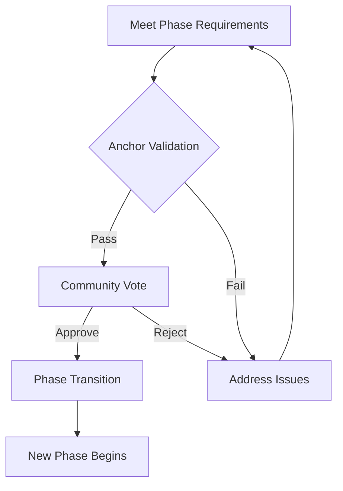
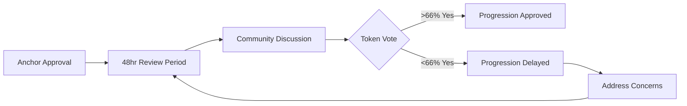
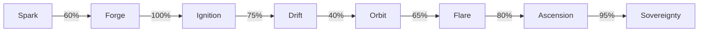

# Progression Rules

## The Laws of Venture Evolution

Progression through Studio3's seven phases follows clear rules designed to ensure sustainable growth while maintaining ecosystem integrity. These rules create a fair, transparent system where success is earned, not given.

## Core Progression Principles

### Fundamental Rules

<div class="arena-card" markdown="1">

<h3>📏 The Five Laws</h3>

- 1. **Sequential Progress**
- Phases must be completed in order
2. **No Skipping**
- Every venture experiences every phase
3. **Merit-Based**
- Advancement requires proven achievement
4. **Community Validated**
- Progress confirmed by ecosystem
5. **Time Bounded**
- Minimum and maximum durations apply**</div>

### The Progression Framework



## Phase Requirements

### Universal Requirements

All phase transitions require:

!!! info "Base Requirements"
    - ✅ Complete all declared milestones (or approved pivots)
    - 📡 Maintain >60% belief ratio throughout phase
    - ⚓ Pass Anchor validation assessment
    - 🕒 Meet minimum phase duration
    - 📊 Achieve phase-specific metrics

### Phase-Specific Requirements

<div class="grid cards">
    <div class="arena-card" markdown="1">

<h4>✨ Spark → Forge</h4>

- 100+ $SIGNAL in belief

- 10+ unique supporters

- Clear problem
- solution fit


- Feasible execution plan

- 7
- day minimum duration

</div>
    
    <div class="arena-card" markdown="1">

<h4>⚔️ Forge → Ignition</h4>

- Win founder duel

- Claim Signal NFT


- 1,000+ $SIGNAL staked


- Present winning vision


- Automatic upon victory

</div>
    
    <div class="arena-card" markdown="1">

<h4>🚀 Ignition → Drift</h4>

- Container DAO formed

- Core team assembled (3+)


- MVP launched publicly


- Initial users onboarded

- 14
- day minimum

</div>
    
    <div class="arena-card" markdown="1">

<h4>🌊 Drift → Orbit</h4>
- Product
- market fit signals
- 40%+ user retention


- Sustainable unit economics


- Clear growth trajectory

- 60
- day minimum

</div>
    
    <div class="arena-card" markdown="1">

<h4>🛸 Orbit → Flare</h4>

- 6 months stable operations

- 80%+ milestone success rate


- Revenue/usage growing 10%+ monthly


- External funding interest

- 180
- day minimum

</div>
    
    <div class="arena-card" markdown="1">

<h4>🔥 Flare → Ascension</h4>

- Funding secured

- 20+ team members


- Market leadership position


- Buyback funds available

- 180
- day minimum

</div>
</div>

## Validation Process

### Anchor Assessment

<div class="arena-card" markdown="1">

<h3>⚓ Validation Framework</h3>

**Anchors evaluate:**

1. **Milestone Completion** (40%) All declared goals achieved?

- Evidence properly documented?

- Quality meets standards?

2. **Community Health** (30%)**   - Supporter engagement level

- Belief/doubt ratio

- Communication quality

3. **Operational Excellence** (20%)**   - Team performance

- Resource management

- Process maturity

4. **Strategic Position** (10%)**   - Market opportunity

- Competitive advantage

- Growth potential
**Minimum score: 70% to proceed
**</div>

### Community Confirmation

After Anchor approval:



## Time Boundaries

### Duration Requirements

| Phase | Minimum | Target | Maximum | Extensions |
|-------|---------|--------|---------|------------|
|**Spark** | 7 days | 14 days | 30 days | Not allowed |
|**Forge** | 3 days | 5 days | 7 days | Not allowed |
|**Ignition** | 14 days | 30 days | 60 days | 1x30 days |
|**Drift** | 60 days | 120 days | 365 days | 2x60 days |
|**Orbit** | 180 days | 365 days | No max | Unlimited |
|**Flare** | 180 days | 365 days | No max | Unlimited |
|**Ascension** | 30 days | 60 days | 180 days | 1x60 days |

### Extension Mechanics

!!! warning "Extension Rules"

- Request before phase maximum reached

- Provide compelling justification

- Maintain >50% community support

- Anchor approval required

- Only one extension per phase (except Orbit/Flare)

## Performance Metrics

### Success Indicators

<div class="grid cards">
    <div class="card">
        <h4>📊 Quantitative Metrics</h4>
        <ul>
            <li>Milestone completion rate</li>
            <li>Revenue/user growth</li>
            <li>Token signal volume</li>
            <li>Team expansion rate</li>
            <li>Funding secured</li>
        </ul>
    </div>
    
    <div class="card">
        <h4>🌟 Qualitative Metrics</h4>
        <ul>
            <li>Community sentiment</li>
            <li>Product quality</li>
            <li>Team cohesion</li>
            <li>Market position</li>
            <li>Innovation level</li>
        </ul>
    </div>
</div>

### Phase Health Scoring

```python
def calculate_phase_health(venture):
    """
    Score 0-100 indicating readiness for progression
    """
    scores = {
        'milestones': milestone_completion_rate * 40,
        'community': belief_ratio * 30,
        'operations': team_efficiency * 20,
        'growth': growth_metrics * 10
    }
    
    total_score = sum(scores.values())
    
    # Apply phase-specific modifiers
    if venture.phase == 'Drift' and has_pivoted:
        total_score *= 0.9  # Pivot penalty
    
    if venture.phase == 'Orbit' and consistent_delivery:
        total_score *= 1.1  # Consistency bonus
    
    return min(total_score, 100)
```

## Special Circumstances

### Accelerated Progression

<div class="arena-card" markdown="1">

<h3>⚡ Fast Track Qualification</h3>

**Exceptional ventures may progress faster if:**
- ** Exceed all metrics by 200%+
- Unanimous Anchor approval
- 90%+ community support
- Demonstrated exceptional execution
- Strategic opportunity requires speed
** Fast Track Limits:
- ** Minimum durations still apply
- Cannot skip phases
- Extra scrutiny on validation
- Higher evidence standards

</div>

### Regression Scenarios

!!! danger "When Ventures Move Backward"
    
   ** Regression only allowed during Drift phase:
- ** Failed product-market fit

- Major pivot required

- Team reformation needed
    
    Regression Process:

    1. Founder requests regression
    2. Anchors assess situation
    3. Community votes on allowing
    4. Return to Ignition if approved
    5. Reputation penalty applied

### Stalled Progressions

When ventures can't advance:

| Scenario | Options | Consequences |
|----------|---------|-------------|
|**Missing Requirements** | Extension or remediation | Delayed progression |
|**Failed Validation** | Address issues and retry | Reputation impact |
|**Lost Community Support** | Rebuild confidence | Potential dissolution |
|**Resource Depletion** | Seek emergency funding | May force pivot |
|**Team Collapse** | Recruit replacements | Major delays |

## Progression Strategies

### For Founders

<div class="grid cards">
    <div class="card">
        <h4>🎯 Planning Ahead</h4>
        <p>Know next phase requirements from day one</p>
        <ul>
            <li>Study successful transitions</li>
            <li>Build buffer time</li>
            <li>Over-deliver on metrics</li>
            <li>Document everything</li>
        </ul>
    </div>
    
    <div class="card">
        <h4>🤝 Community First</h4>
        <p>Progression requires ecosystem support</p>
        <ul>
            <li>Communicate constantly</li>
            <li>Address concerns early</li>
            <li>Build believer base</li>
            <li>Engage doubters respectfully</li>
        </ul>
    </div>
</div>

### For Echoes

!!! tip "Supporting Smart Progression"

- **Signal strategically**
- on transition milestones Provide feedback

- during phase reviews** Support extensions**
- when justified**  Challenge rushers
- **
- who aren't ready** Reward consistency**
- over speed**## Edge Cases

### Complex Scenarios

<div class="arena-card" markdown="1">

<h3>🤔 What If...</h3>

**Q: Venture succeeds wildly but hasn't met time minimum?**A: Must wait. Time requirements ensure proper foundation.

**Q: All requirements met but Anchors see red flags?**A: Anchors can require additional evidence or delays.

**Q: Community loves venture but metrics are weak?**A: Objective metrics must be met. Sentiment alone insufficient.

**Q: External event disrupts progress (pandemic, war)?**A: Force majeure provisions allow special extensions.

**Q: Founders want to stay in current phase longer?**A: Allowed in Orbit/Flare. Other phases have maximums.

</div>

## Historical Progression Data

### Success Rates by Transition



### Average Duration by Phase

| Phase | Average | Fastest | Slowest |
|-------|---------|---------|----------|
| **Spark** | 12 days | 7 days | 30 days |
|**Forge** | 4 days | 3 days | 7 days |
|**Ignition** | 28 days | 14 days | 58 days |
|**Drift** | 142 days | 64 days | 361 days |
|**Orbit** | 287 days | 182 days | 548 days |
|**Flare** | 394 days | 186 days | 892 days |
|**Ascension** | 47 days | 31 days | 176 days |

## Common Mistakes

### Progression Pitfalls

!!! danger "Avoid These Errors"

- **Rushing progression**
- Meeting minimums isn't enough

- **Ignoring community**
- Support can evaporate quickly

- **Weak documentation**
- Evidence must be bulletproof

- **Surprise pivots**
- Changes need community buy-in

- **Burning bridges**
- Failed progressions damage reputation

## Appeals Process

### Challenging Decisions

If progression is denied:

- 1.** Review Feedback
- Understand specific issues
2. **Prepare Appeal**
- Address each concern
3. **Submit to Council**
- Anchor Council reviews
4. **Community Input**
- Public comment period
5. **Final Decision**
- Binding determination**!!! info "Appeal Success Rate: 23%"
    Most denials are upheld. Better to address issues than appeal.

## Your Progression Path

### Planning Your Journey

- 1. ** Map Requirements
- Know every phase's needs
2. **Build Buffers**
- Plan for delays
3. **Track Metrics**
- Monitor continuously
4. **Engage Community**
- Maintain support
5. **Document Progress**
- Evidence from day one**## Next Steps

- Study [Seven Phase Lifecycle](seven-phases.md) in detail
- Review [Milestone System](milestones.md) for execution
- Learn [Validation Framework](../anchors-guide/validation-framework.md)
- Explore phase-specific guides in [Senders Guide](../senders-guide/index.md)