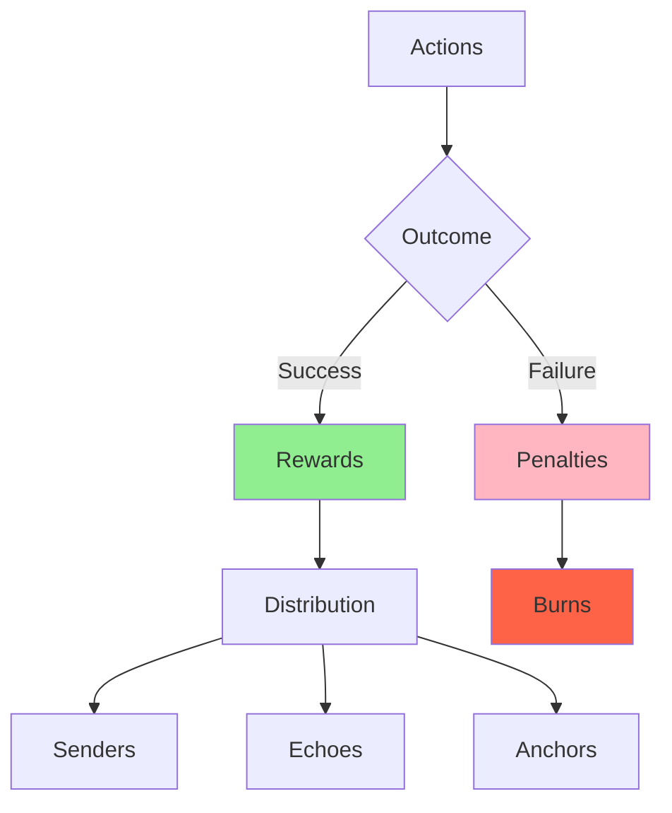
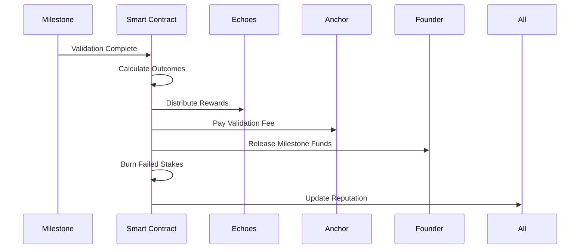

# Rewards & Penalties

## The Economics of Execution

Studio3's rewards and penalties system creates powerful incentives for quality execution while fairly distributing value among all participants. This balanced approach ensures sustainable ecosystem growth.

## System Overview

### The Balance of Consequences

### ⚖️ Rewards vs Penalties

**Core Philosophy:**

- 🏆 **Rewards** incentivize positive behavior
- 🔥 **Penalties** discourage negative behavior
- ⚖️ **Balance** creates sustainable ecosystem
- 🎯 **Fairness** ensures long-term participation

**Key Principles:**

1. Rewards proportional to risk taken
2. Penalties severe enough to deter gaming
3. Transparent calculation methods
4. Immediate settlement when possible
5. No retroactive changes

### System Components

## Rewards Structure

### For Echoes (Supporters)

### 📡 Echo Reward Matrix

**Base Reward Calculation:**

- Base multiplier for correct belief signals: 1.5x
- Base multiplier for correct doubt signals: 1.2x
- Wrong predictions result in 100% loss

**Bonus Multipliers:**

- **Timing Bonus**: Up to 0.5x for early signals (decreases linearly over time)
- **Contrarian Bonus**: 0.3x for going against the majority and being right
- **Reputation Bonus**: Up to 0.3x based on your XP level
- **Phase Bonus**: Higher multipliers for later-stage ventures
- **Maximum Total Multiplier**: 3x (capped to prevent extreme returns)

**Reward Examples:**

| Scenario | Stake | Multiplier | Reward | Profit |
|----------|-------|------------|--------|--------|
| Early belief, success | 1,000 | 2.1x | 2,100 | 1,100 |
| Late belief, success | 1,000 | 1.6x | 1,600 | 600 |
| Contrarian doubt, correct | 1,000 | 1.8x | 1,800 | 800 |
| Reputation bonus max | 1,000 | 2.5x | 2,500 | 1,500 |

### For Senders (Founders)

### 🏗️ Sender Reward System

**Milestone Completion Rewards:**

1. **Unlock Milestone Funds**
   - Pre-declared budget released
   - Can exceed if over-deliver
   - Immediate availability

2. **Reputation Boost**
   - XP based on difficulty
   - Compounds future opportunities
   - Permanent record

3. **Community Trust**
   - Increased future support
   - Higher belief ratios
   - Network effects

4. **Phase Progression**
   - Unlock next stage
   - Access new resources
   - Greater autonomy

**Success Multipliers:**

- **Funding Unlock**: 100% of milestone budget released
- **XP Gain**: Base XP multiplied by milestone difficulty
- **Trust Score**: 10% increase on successful delivery
- **Next Milestone**: 5% boost to belief ratio per success

### For Anchors (Validators)

### ⚓ Anchor Compensation Structure

**Base Validation Fees:**

| Milestone Value | Base Fee | Range with Bonuses |
|-----------------|----------|--------------------|
| < 10K $SIGNAL | 3% | 3-9% |
| 10K-100K | 2.5% | 2.5-7.5% |
| 100K-1M | 2% | 2-6% |
| > 1M | 1.5% | 1.5-4.5% |

**Performance Multipliers:**

- **Quality Multiplier**: 1x to 3x based on validation thoroughness
- **Speed Bonus**: +20% for completion within 24 hours
- **Accuracy History**: Up to +30% based on past performance
- **Mentorship Bonus**: +50% if venture succeeds after your guidance
- **Maximum Total Fee**: Capped at 10% of milestone value

## Penalties Structure

### For Echoes

### 🔥 Echo Penalty System

**Wrong Signal Penalties:**

- **Total Loss**: 100% of staked tokens burned
- **No Partial Refunds**: Binary outcome
- **Reputation Impact**: XP reduction
- **Permanent Record**: Affects future multipliers

**Penalty Scenarios:**

| Signal Type | Outcome | Penalty |
|-------------|---------|----------|
| Belief | Milestone Failed | 100% burn |
| Doubt | Milestone Succeeded | 100% burn |
| Any | Venture Abandoned | 100% burn |
| Any | Invalid Evidence | 100% burn |

**Additional Penalties:**

- Market manipulation: Account suspension
- Collusion detected: Permanent ban
- Spam signaling: Escalating fees
- Inactive account: XP decay

### For Senders

<h3>💥 Sender Penalty Framework</h3>

**Failure Consequences:**

1. **Immediate Penalties**
   - Milestone funds locked/returned
   - Belief signals burned
   - Reputation damage (-XP)
   - Public failure record

2. **Ongoing Impact**
   - Reduced future support
   - Higher evidence requirements
   - Limited phase progression
   - Anchor scrutiny increase

3. **Severe Violations**
   - Venture dissolution
   - Founder blacklisting
   - NFT lockdown
   - Legal action possible

**Penalty Calculation:**

- **Tokens Burned**: All belief signals on failed milestone
- **XP Loss**: -100 points multiplied by milestone difficulty
- **Trust Reduction**: 30% decrease in trust score
- **Future Penalty**: Next milestones 10% harder to fund

### For Anchors

<h3>⚠️ Anchor Accountability</h3>

**Quality Failures:**

- Poor validation: Reduced future assignments
- Biased judgments: Council review
- Negligent approval: Fee clawback
- Repeated issues: Anchor status loss

**Penalty Progression:**

1. **Warning** - First minor issue
2. **Probation** - Reduced fee rate
3. **Suspension** - No new validations
4. **Removal** - Permanent status loss

**Financial Penalties:**

If validation is overturned:
- **Fee Clawback**: Must return 2x the original fee
- **Reputation Loss**: -500 XP penalty
- **Future Rate Cut**: 20% reduction in fee rates

## Distribution Mechanics

### Reward Distribution Flow

### Settlement Timing

    

        <h4>⚡ Immediate Settlement</h4>
        <ul>
            <li>Echo rewards/burns</li>
            <li>Anchor base fees</li>
            <li>Reputation updates</li>
            <li>Token transfers</li>
        </ul>
    

    
    

        <h4>⏳ Delayed Settlement</h4>
        <ul>
            <li>Performance bonuses</li>
            <li>Mentorship rewards</li>
            <li>Long-term incentives</li>
            <li>Governance tokens</li>
        </ul>
    

## Special Reward Programs

### Ecosystem Incentives

<h3>🎆 Bonus Reward Programs</h3>

**Active Programs:**

1. **Early Adopter Rewards**
   - 2x XP for first 1000 users
   - Bonus multipliers for early ventures
   - Exclusive NFT badges

2. **Referral Program**
   - 5% of referred user's earnings
   - Bonus for successful ventures
   - Network growth rewards

3. **Bug Bounties**
   - Critical: 10,000 $SIGNAL
   - High: 5,000 $SIGNAL
   - Medium: 1,000 $SIGNAL
   - Low: 100 $SIGNAL

4. **Governance Participation**
   - Voting rewards: 10 $SIGNAL/vote
   - Proposal rewards: 1,000 $SIGNAL
   - Implementation: Revenue share

### Seasonal Campaigns

!!! tip "Limited Time Bonuses"
    - **Summer Sprint**: 1.5x all rewards
    - **New Year Launch**: Double XP month
    - **Anniversary Celebration**: Retroactive bonuses
    - **Milestone Mania**: Bonus for completions

## Penalty Mitigation

### Insurance Mechanisms

<h3>🛡️ Protection Options</h3>

**Signal Insurance** (Coming Soon)

- Pay 10% premium
- Get 50% refund on wrong signals
- Limited to 3 uses per month
- Not available for contrarian positions

**Founder Protection**

- Force majeure provisions
- Medical emergency extensions
- Natural disaster considerations
- Regulatory change adaptations

**Anchor Indemnity**

- Good faith protection
- Dispute resolution support
- Legal defense fund
- Professional insurance

## Tax Considerations

### Reward Taxation

!!! warning "Tax Disclaimer"
    Consult professional tax advisors. Rules vary by jurisdiction.

**Potential Tax Events:**

- Receiving reward tokens
- Converting to fiat
- Staking rewards
- Governance distributions

**Record Keeping:**

For tax purposes, maintain records of:
- Date and time of transaction
- Type of reward received
- Amount of tokens
- USD value at time of receipt
- Transaction ID for verification

## Performance Analytics

### System Metrics

    

        <h4>📊 Reward Metrics</h4>
        <ul>
            <li>Total distributed: 25M $SIGNAL</li>
            <li>Average multiplier: 1.8x</li>
            <li>Highest reward: 50K $SIGNAL</li>
            <li>Distribution rate: 98.5%</li>
        </ul>
    

    
    

        <h4>🔥 Penalty Metrics</h4>
        <ul>
            <li>Total burned: 5M $SIGNAL</li>
            <li>Failure rate: 28%</li>
            <li>Largest burn: 100K $SIGNAL</li>
            <li>Recovery rate: 45%</li>
        </ul>
    

### Optimization Opportunities

### Reward Optimization Strategy

**For Echoes:**

- **Strategy**: Focus on early contrarian signals
- **Expected Return**: 2.3x average multiplier
- **Risk Level**: High

**For Senders:**

- **Strategy**: Under-promise and over-deliver
- **Expected Bonus**: 15% above baseline
- **Risk Level**: Medium

**For Anchors:**

- **Strategy**: Thorough validation plus active mentorship
- **Expected Return**: 5.5% average fee rate
- **Risk Level**: Low

## Case Studies

### Reward Success Stories

<h4>🌟 The Perfect Signal</h4>

<strong>Echo:</strong> CryptoSage

<strong>Signal:</strong> 10,000 $SIGNAL belief on DeFiVault Phase 4

<strong>Timing:</strong> 14 days early

<strong>Result:</strong> 2.8x return (28,000 $SIGNAL)

<blockquote>"I spent days analyzing their code and team. The early signal risk paid off beautifully." - CryptoSage</blockquote>

### Penalty Lessons

<h4>💥 The Costly Mistake</h4>

<strong>Sender:</strong> RushProtocol

<strong>Failure:</strong> Overpromised on scaling milestone

<strong>Penalty:</strong> 250,000 $SIGNAL burned, -2000 XP

<blockquote>"We learned to be realistic with timelines. The penalty hurt but taught us valuable lessons." - RushProtocol CEO</blockquote>

## Future Enhancements

### Planned Improvements

!!! info "Roadmap Items"
    - **Dynamic Multipliers**: AI-adjusted based on difficulty
    - **Partial Rewards**: Graduated success levels
    - **Team Bonuses**: Collaborative achievement rewards
    - **Streak Rewards**: Consecutive success bonuses
    - **Social Rewards**: Community contribution points

## Your Strategy

### Maximizing Rewards

1. **Research Thoroughly** - Knowledge reduces risk
2. **Time Entry Well** - Early birds get bonuses
3. **Build Reputation** - Compounds all rewards
4. **Stay Active** - Avoid decay penalties
5. **Learn Continuously** - Adapt strategies

### Minimizing Penalties

1. **Start Small** - Learn with low stakes
2. **Diversify Risk** - Don't all-in
3. **Read Fine Print** - Understand requirements
4. **Communicate Issues** - Early disclosure helps
5. **Accept Losses** - Part of the game

## Next Steps

- Study [Value Flow](value-flow.md) to understand system economics
- Review role-specific guides for detailed strategies
- Practice with [First Steps](first-steps.md) tutorial
- Join community discussions on optimization