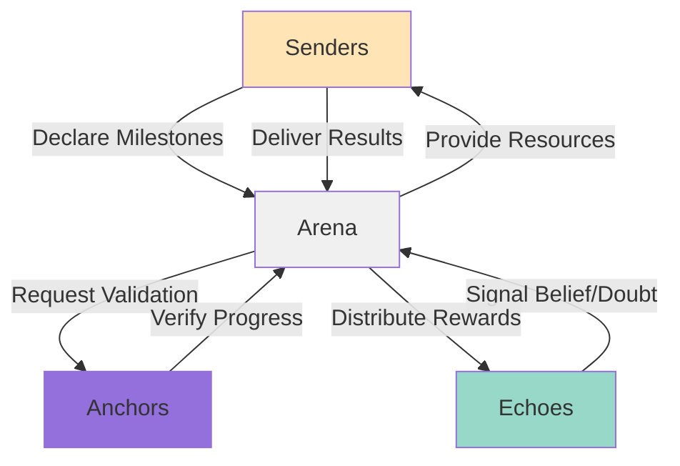
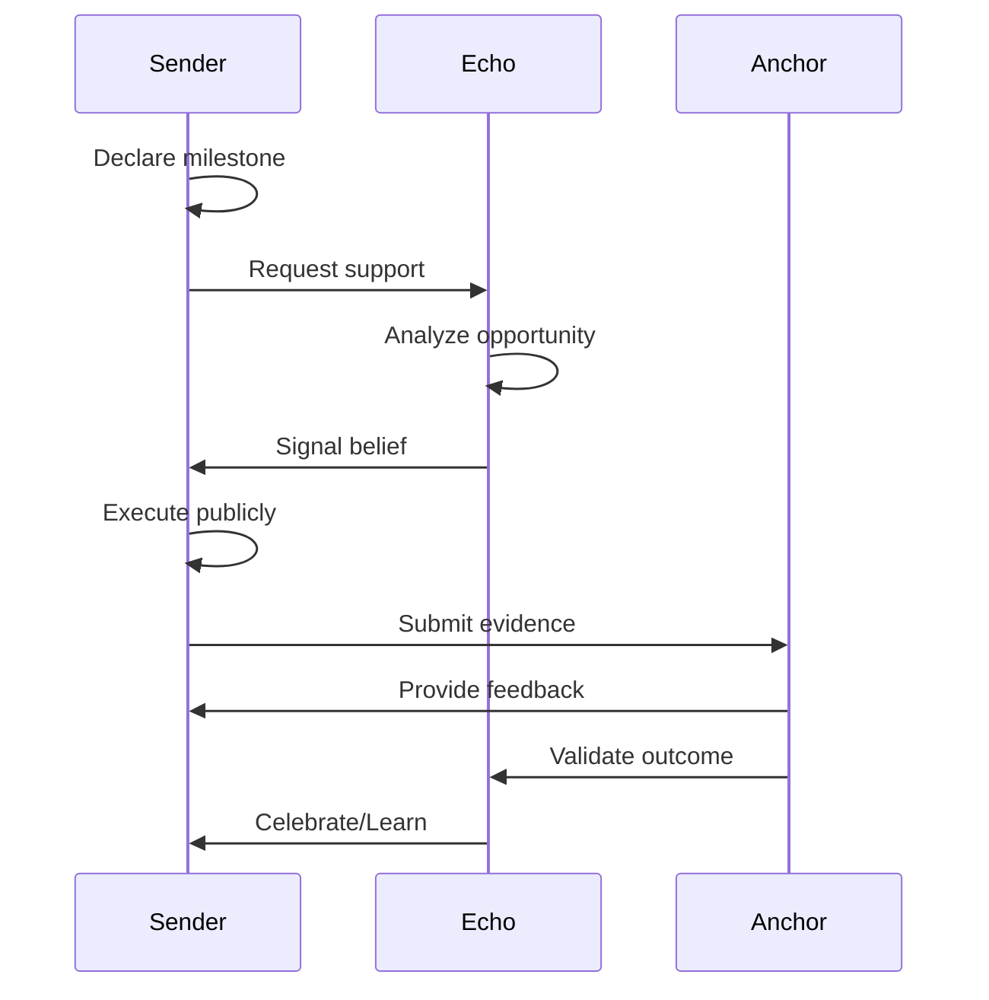

# Three Roles Overview

## The Trinity of Studio3

Studio3's ecosystem thrives on the balanced interaction of three distinct roles, each essential to the platform's success. Understanding these roles and their relationships is key to finding your place in the ecosystem.

## The Three Roles

### At a Glance

<div class="grid cards">
    <div class="arena-card" markdown="1">

<h3>🏗️ Senders (Founders)</h3>
        <strong>The Builders</strong>

        Entrepreneurs who transform ideas into ventures through transparent execution

        - Create and lead ventures

        - Execute public milestones

        - Build in the Arena

        - Achieve sovereignty

</div>
    
    <div class="arena-card" markdown="1">

<h3>📡 Echoes (Supporters)</h3>
        <strong>The Believers</strong>

        Community members who signal conviction through token stakes

        - Evaluate ventures

        - Signal belief or doubt

        - Earn from accuracy

        - Guide through wisdom

</div>
    
    <div class="arena-card" markdown="1">

<h3>⚓ Anchors (Validators)</h3>
        <strong>The Guardians</strong>

        Experienced builders who ensure quality and provide guidance

        - Validate milestones

        - Mentor founders

        - Maintain standards

        - Resolve disputes

</div>
</div>

## Role Relationships

### The Ecosystem Dance



### Interdependencies

!!! info "Everyone Needs Everyone"
    - **Senders need Echoes** - for funding and validation Senders need Anchors**
    - for guidance and verification** Echoes need Senders** - for investment opportunities** Echoes need Anchors
**    - for quality assurance** Anchors need Senders** - for ecosystem growth** Anchors need Echoes
**    - for decentralized wisdom**

## Senders (Founders) Deep Dive

### The Builder's Journey

<div class="arena-card" markdown="1">

<h3>🏗️ What Senders Do</h3>

**Primary Activities:** 1. **Ideation & Creation** Remix IPs into Spark NFTs
   - Develop venture concepts
   - Enter ideas into Arena

2. **Competition & Leadership**

   
- Compete in Forge duels

   
- Win Signal NFT rights
   - Form founding teams

3. **Execution & Delivery**

   
- Declare public milestones

   
- Build transparently
   - Deliver on promises

4. **Growth & Graduation**
   
- Scale ventures
   
- Achieve sovereignty
   - Launch sub-studios

</div>

### Sender Requirements

| Requirement | Description | Why It Matters |
|-------------|-------------|----------------|
| **Vision** | Clear venture concept | Attracts support |
| **Execution** | Ability to deliver | Builds trust |
| **Communication** | Public engagement | Maintains confidence |
| **Resilience** | Handle setbacks | Ventures face challenges |
| **Leadership** | Team building | Can't succeed alone |

### Sender Rewards

<div class="grid cards">
    <div class="card">
        <h4>💰 Financial</h4>
        <ul>
            <li>Milestone funding</li>
            <li>Revenue ownership</li>
            <li>Exit opportunities</li>
            <li>Token allocations</li>
        </ul>
    </div>
    
    <div class="card">
        <h4>🏆 Recognition</h4>
        <ul>
            <li>NFT ownership</li>
            <li>Public achievement</li>
            <li>Alumni status</li>
            <li>Legacy building</li>
        </ul>
    </div>
    
    <div class="card">
        <h4>🌱 Growth</h4>
        <ul>
            <li>Skill development</li>
            <li>Network expansion</li>
            <li>Mentorship access</li>
            <li>Future opportunities</li>
        </ul>
    </div>
</div>

## Echoes (Supporters) Deep Dive

### The Believer's Path

<div class="arena-card" markdown="1">

<h3>📡 What Echoes Do</h3>

**Primary Activities:** 1. **Research & Analysis** Evaluate ventures
   - Assess founders
   - Study milestones
   - Track patterns

2. **Signal Placement**

   
- Stake $SIGNAL tokens

   
- Express belief or doubt
   - Size positions wisely
   - Diversify portfolio

3. **Community Participation**

   
- Provide feedback

   
- Share insights
   - Support builders
   - Challenge assumptions

4. **Performance Tracking**
   
- Monitor progress
   
- Adjust strategies
   - Learn from outcomes
   - Build reputation

</div>

### Echo Skills

!!! tip "Successful Echo Traits"
    - **Analytical Mind** - Evaluate objectively
    - **Risk Management** - Size stakes appropriately
    - **Pattern Recognition** - Spot trends early
    - **Emotional Control** - Avoid FOMO/FUD
    - **Continuous Learning** - Adapt strategies

### Echo Earnings

```python
# Echo Return Calculation
def calculate_echo_returns(signal):
    base_multiplier = 1.5 if signal.type == 'belief' else 1.2
    
    # Timing bonus
    early_bonus = 0.1 * signal.days_early
    
    # Contrarian bonus
    contrarian_bonus = 0.3 if signal.against_majority else 0
    
    # Reputation bonus
    rep_bonus = 0.01 * (echo.xp / 1000)
    
    total_multiplier = base_multiplier + early_bonus + contrarian_bonus + rep_bonus
    
    return signal.stake * min(total_multiplier, 3.0)
```

## Anchors (Validators) Deep Dive

### The Guardian's Duty

<div class="arena-card" markdown="1">

<h3>⚓ What Anchors Do</h3>

**Primary Activities:** 1. **Validation Services** Review milestone evidence
   - Score completion quality
   - Provide detailed feedback
   - Resolve disputes

2. **Mentorship & Guidance**

   
- Advise founders

   
- Share expertise
   - Prevent failures
   - Accelerate growth

3. **Ecosystem Protection**

   
- Maintain standards

   
- Identify bad actors
   - Ensure fairness
   - Guide evolution

4. **Governance Participation**
   
- Vote on proposals
   
- Shape policies
   - Lead councils
   - Drive improvements

</div>

### Anchor Qualifications

| Qualification | Requirement | Verification |
|---------------|-------------|-------------|
| **Experience** | 5+ years building | Portfolio review |
| **Reputation** | Strong track record | Reference checks |
| **Availability** | 10+ hours/week | Commitment letter |
| **Expertise** | Domain knowledge | Skill assessment |
| **Objectivity** | Unbiased judgment | Ethics training |

### Anchor Compensation

<div class="grid cards">
    <div class="card">
        <h4>💵 Direct Fees</h4>
        <p>2-5% of milestone value</p>
        <p>Paid per validation</p>
    </div>
    
    <div class="card">
        <h4>🌟 Performance Bonus</h4>
        <p>Up to 3x multiplier</p>
        <p>Based on quality scores</p>
    </div>
    
    <div class="card">
        <h4>📊 Long-term Upside</h4>
        <p>Success participation</p>
        <p>Venture token allocations</p>
    </div>
</div>

## Role Dynamics

### Healthy Interactions



### Conflict Resolution

!!! warning "When Roles Clash"
    
    **Common Conflicts:**
- Sender overpromises, Echo loses tokens

- Echo signals doubt, Sender feels attacked
    - Anchor validates strictly, Sender disputes
    
    **Resolution Mechanisms:**
- Public dialogue for transparency

- Anchor Council for disputes
    - Community votes for deadlocks
    - Reputation impacts for bad behavior

## Choosing Your Role

### Self-Assessment Framework

<div class="arena-card" markdown="1">

<h3>🤔 Which Role Fits You?</h3>

**Consider Sender If You:**
- Have a venture idea
- Love building things
- Thrive under pressure
- Communicate well publicly
- Accept high risk/reward

**Consider Echo If You:**
- Enjoy analysis and research
- Have risk capital available
- Want portfolio approach
- Prefer supporting to leading
- Learn from patterns

**Consider Anchor If You:**
- Have deep expertise
- Built ventures before
- Enjoy mentoring others
- Value ecosystem health
- Can commit time regularly

</div>

### Role Progression

!!! info "Roles Can Evolve"
    - **Echo → Sender**: Build reputation, then launch venture
**    - **Sender → Anchor**: After successful exit, give back
**    - **Anchor → Sender**: Use expertise for new venture
**    - **Multiple Roles**: Can be Echo while building as Sender
## Role Statistics

### Current Distribution

```python
# Studio3 Role Distribution (2024)
total_participants = 12847

roles = {
    'senders': 892,      # 7% - Fewer builders
    'echoes': 10423,     # 81% - Most are supporters  
    'anchors': 156,      # 1% - Elite validators
    'multi_role': 1376   # 11% - Wear multiple hats
}

# Success Rates by Role
success_metrics = {
    'sender_graduation_rate': 0.34,  # 34% reach Ascension
    'echo_profit_rate': 0.67,       # 67% profitable overall
    'anchor_accuracy_rate': 0.89    # 89% validation accuracy
}
```

### Role Performance

| Metric | Senders | Echoes | Anchors |
|--------|---------|--------|----------|
| **Avg Weekly Hours** | 50-60 | 5-10 | 10-15 |
| **Success Rate** | 34% | 67% | 89% |
| **Avg Earnings** | $500K** | $45K | $120K |
| **Reputation Growth** | High | Medium | Very High |

*If successful to Ascension

## Multi-Role Strategies

### Wearing Multiple Hats

<div class="grid cards">
    <div class="card">
        <h4>🎭 Echo + Future Sender</h4>
        <p>Build reputation and capital as Echo before launching</p>
    </div>
    
    <div class="card">
        <h4>🎓 Sender + Future Anchor</h4>
        <p>Graduate successfully then mentor others</p>
    </div>
    
    <div class="card">
        <h4>🔄 Anchor + Active Echo</h4>
        <p>Validate while investing in ventures you don't judge</p>
    </div>
</div>

### Role Synergies

!!! success "Leveraging Multiple Perspectives"
    - **Echo experience** - improves Sender fundraising Sender experience**
    - makes better Anchors** Anchor insights** - enhance Echo strategies** Cross-role networks** create opportunities**
## Common Misconceptions

### Role Myths Debunked

| Myth | Reality |
|------|--------|
| "Only rich people can be Echoes" | Minimum stakes are accessible |
| "Senders need technical skills" | Many roles in founding teams |
| "Anchors must be famous" | Expertise matters more than fame |
| "Roles are permanent" | Can change roles anytime |
| "Success requires connections" | Merit-based system |

## Your Role Journey

### Getting Started

1. **Explore All Roles** - Understand each deeply
**2. **Assess Yourself** - Match skills and goals
**3. **Start Small** - Test before committing
**4. **Build Reputation** - Success in any role
**5. **Stay Flexible** - Adapt as you learn
### Role Resources

- **For Senders**: [Senders Guide](../senders-guide/index.md) - Complete founder handbook
- **For Echoes**: [Echoes Guide](../echoes-guide/index.md) - Master signaling
- **For Anchors**: [Anchors Guide](../anchors-guide/index.md) - Validation excellence
## Next Steps

- Dive deep into your chosen role's guide

- Study [How They Interact](interactions.md)
- Understand [Aligned Incentives](incentives.md)
- Review [Getting Started](choosing-role.md) for your path