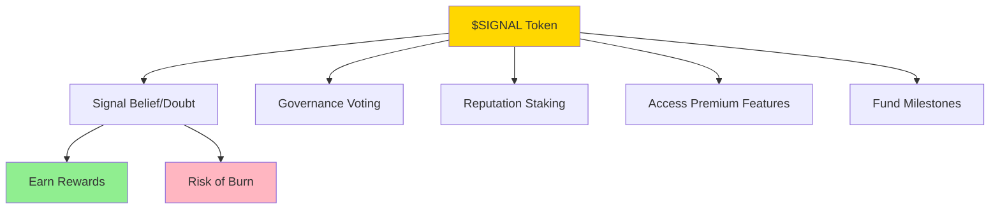
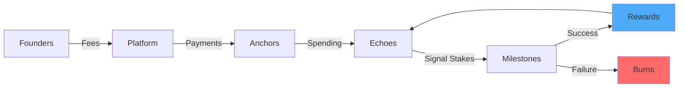

# $SIGNAL Token

## The Currency of Conviction

The $SIGNAL token is the lifeblood of Studio3's ecosystem, transforming belief into tangible support and creating a unique economy where conviction has real value. Understanding $SIGNAL is essential for all participants.

## Token Overview

### What is $SIGNAL?

<div class="arena-card">
<h3>📡 $SIGNAL Essentials</h3>

**Utility Token Properties:**

- **Purpose**: Express belief or doubt in venture milestones
- **Type**: Utility token for platform participation
- **Supply**: Fixed maximum with deflationary mechanics
- **Distribution**: Fair launch with no pre-mine
- **Governance**: Future DAO voting rights

**What $SIGNAL is NOT:**

- ❌ Not a security or investment contract
- ❌ Not a gambling or betting token
- ❌ Not a speculative trading asset
- ❌ Not a share in any company
- ❌ Not a stablecoin or currency
</div>

### Token Utility



## Token Economics

### Supply Dynamics

<div class="grid cards">
    <div class="card">
        <h4>📊 Initial Supply</h4>
        <p>100,000,000 $SIGNAL</p>
        <ul>
            <li>No pre-mine</li>
            <li>No team allocation</li>
            <li>Fair distribution</li>
        </ul>
    </div>
    
    <div class="card">
        <h4>🔥 Burn Mechanics</h4>
        <p>Deflationary by design</p>
        <ul>
            <li>Failed signals burn</li>
            <li>No redistribution</li>
            <li>Permanent removal</li>
        </ul>
    </div>
    
    <div class="card">
        <h4>🌱 Emission Schedule</h4>
        <p>Controlled release</p>
        <ul>
            <li>5-year distribution</li>
            <li>Decreasing rate</li>
            <li>Activity-based</li>
        </ul>
    </div>
</div>

### Distribution Model

| Allocation | Percentage | Purpose | Vesting |
|------------|------------|---------|----------|
| **Echo Rewards** | 40% | Signal accuracy rewards | Continuous |
| **Milestone Funding** | 30% | Venture development | Per milestone |
| **Anchor Compensation** | 15% | Validation services | Per validation |
| **Ecosystem Development** | 10% | Platform improvements | 4-year linear |
| **Emergency Reserve** | 5% | Crisis management | DAO controlled |

## Token Mechanics

### Earning $SIGNAL

<div class="arena-card">
<h3>💰 Ways to Earn</h3>

**1. Signal Accuracy (Echoes)**
```python
reward = stake * multiplier * accuracy_bonus
# multiplier: 1.5x - 3x for belief, 1.2x - 2x for doubt
# accuracy_bonus: Based on prediction success rate
```

**2. Validation Services (Anchors)**
```python
fee = milestone_value * 0.03 * quality_multiplier
# quality_multiplier: 1x - 3x based on thoroughness
```

**3. Participation Rewards**

- Daily active user bonuses
- Referral rewards
- Governance participation
- Bug bounties

**4. Liquidity Provision**

- DEX liquidity mining
- Lending protocol yields
- Staking rewards
</div>

### Using $SIGNAL

!!! info "Primary Use Cases"
    
    **1. Signaling on Milestones**
    - Minimum: 10 $SIGNAL
    - Maximum: No limit (but diversify!)
    - Locked until validation
    
    **2. Reputation Staking**
    - Lock tokens to boost XP multiplier
    - Longer locks = higher boost
    - Unlocks governance rights
    
    **3. Premium Access**
    - Advanced analytics: 100 $SIGNAL/month
    - Priority support: 50 $SIGNAL/month
    - Early access: 200 $SIGNAL/feature
    
    **4. Founder Services**
    - Milestone declaration: 100 $SIGNAL
    - Forge entry: 1,000 $SIGNAL
    - Emergency extensions: 500 $SIGNAL

### Burn Scenarios

<div class="arena-card">
<h3>🔥 When Tokens Burn</h3>

**Permanent Burns Occur When:**

1. **Wrong Signals** - 100% of stake burned
2. **Failed Milestones** - All belief signals burned
3. **Abandoned Ventures** - Founder stakes burned
4. **Penalty Violations** - Bad behavior fines
5. **Expired Options** - Unused allocations

**Burn Impact:**
```python
def calculate_burn_impact(burned_amount):
    total_supply = get_current_supply()
    burn_percentage = burned_amount / total_supply
    
    # Deflationary pressure increases token value
    supply_reduction = total_supply - burned_amount
    scarcity_multiplier = total_supply / supply_reduction
    
    return {
        'new_supply': supply_reduction,
        'scarcity_increase': scarcity_multiplier,
        'holder_benefit': (scarcity_multiplier - 1) * 100
    }
```
</div>

## Token Velocity

### Circulation Dynamics



### Velocity Controls

<div class="grid cards">
    <div class="card">
        <h4>🔒 Lock Mechanisms</h4>
        <ul>
            <li>Signal commitment periods</li>
            <li>Reputation staking terms</li>
            <li>Vesting schedules</li>
            <li>Governance time-locks</li>
        </ul>
    </div>
    
    <div class="card">
        <h4>🌀 Flow Incentives</h4>
        <ul>
            <li>Activity rewards</li>
            <li>Holding bonuses</li>
            <li>Liquidity incentives</li>
            <li>Burn pressure</li>
        </ul>
    </div>
</div>

## Governance Rights

### Token-Weighted Voting

<div class="arena-card">
<h3>🗿️ Governance Powers</h3>

**Voting Weight Calculation:**
```python
voting_power = (
    held_tokens * 1.0 +
    staked_tokens * 1.5 +
    reputation_bonus * 0.1
)
```

**Governance Decisions Include:**

- Platform parameter adjustments
- Fee structure modifications
- New feature proposals
- Emergency response measures
- Treasury allocations
- Anchor Council elections

**Proposal Requirements:**

- Minimum 10,000 $SIGNAL to propose
- 48-hour discussion period
- 7-day voting window
- 10% quorum requirement
- 66% approval threshold
</div>

## Market Dynamics

### Price Discovery

!!! warning "Not Investment Advice"
    $SIGNAL price fluctuates based on utility demand, not speculation. The token's value derives from platform usage, not investment returns.

### Demand Drivers

| Driver | Impact | Mechanism |
|--------|--------|------------|
| **More Ventures** | 🔼 Increases demand | More milestones to signal |
| **Higher Stakes** | 🔼 Increases demand | Larger positions needed |
| **Burn Rate** | 🔼 Increases scarcity | Supply reduction |
| **Platform Growth** | 🔼 Increases utility | More use cases |
| **Reputation Value** | 🔼 Increases holding | Staking benefits |

### Supply Pressures

| Pressure | Impact | Mechanism |
|----------|--------|------------|
| **Reward Emissions** | 🔽 Increases supply | New tokens minted |
| **Unlock Schedules** | 🔽 Increases circulation | Vested tokens release |
| **Profit Taking** | 🔽 Increases selling | Successful signals cash out |
| **Failed Ventures** | 🔼 Decreases supply | Mass burns |
| **Long-term Staking** | 🔼 Decreases circulation | Tokens locked |

## Security Features

### Token Safety

<div class="grid cards">
    <div class="card">
        <h4>🔐 Smart Contract Security</h4>
        <ul>
            <li>Multi-audit verified</li>
            <li>Time-locked upgrades</li>
            <li>Emergency pause</li>
            <li>No admin minting</li>
        </ul>
    </div>
    
    <div class="card">
        <h4>🛡️ Holder Protections</h4>
        <ul>
            <li>No rug pull possible</li>
            <li>Transparent burns</li>
            <li>On-chain governance</li>
            <li>Insurance fund</li>
        </ul>
    </div>
</div>

## Integration Ecosystem

### Where to Use $SIGNAL

<div class="arena-card">
<h3>🌐 Ecosystem Integration</h3>

**Native Platform:**

- Studio3 Arena signaling
- Reputation staking
- Governance voting
- Premium features

**Partner Integrations:**

- DEX trading pairs
- Lending collateral
- Yield farming
- Cross-chain bridges

**Future Integrations:**

- Sub-studio currencies
- Partner platform utility
- NFT marketplace currency
- Service payments
</div>

## Token Metrics

### Key Performance Indicators

```python
# Current Token Metrics (Example)
metrics = {
    'circulating_supply': 45_000_000,
    'total_burned': 5_000_000,
    'average_daily_volume': 2_500_000,
    'unique_holders': 15_000,
    'staking_percentage': 0.35,
    'velocity_ratio': 0.12,
    'burn_rate_monthly': 0.02
}

# Health Indicators
health_score = calculate_token_health(metrics)
# Returns: 8.5/10 - Healthy ecosystem
```

## Future Developments

### Roadmap Items

!!! tip "Upcoming Token Features"
    
    **Q1 2025:**
    - Cross-chain bridges
    - Enhanced staking options
    - Governance V2 launch
    
    **Q2 2025:**
    - Conditional signal tokens
    - Reputation NFT integration
    - Yield optimization
    
    **Q3 2025:**
    - Sub-studio token framework
    - Advanced DeFi integrations
    - Mobile wallet support
    
    **Q4 2025:**
    - Full DAO transition
    - Treasury diversification
    - Global exchange listings

## Common Questions

### Token FAQ

**Q: How do I acquire $SIGNAL tokens?**
A: Through DEX swaps, earning via participation, or purchasing from holders.

**Q: Can I mine $SIGNAL tokens?**
A: No traditional mining, but you can "mine" through accurate signals.

**Q: What happens to burned tokens?**
A: They're permanently removed from circulation, increasing scarcity.

**Q: Is there a token migration planned?**
A: No, the current contract is final with upgrade mechanisms.

**Q: Can I stake $SIGNAL for passive income?**
A: Yes, through reputation staking and liquidity provision.

## Your Token Strategy

### Getting Started with $SIGNAL

1. **Acquire Initial Tokens** - Start small to learn
2. **Practice Signaling** - Low stakes initially
3. **Build Reputation** - Stake for XP boost
4. **Diversify Usage** - Try different features
5. **Participate in Governance** - Shape the future

## Risk Disclosure

!!! danger "Important Risks"
    - **Total Loss Possible**: Wrong signals burn 100%
    - **No Guarantees**: Utility token, not investment
    - **Volatility**: Price can fluctuate significantly
    - **Smart Contract Risk**: Despite audits, bugs possible
    - **Regulatory Risk**: Token laws evolving globally

## Next Steps

- Learn [Belief & Doubt Signals](belief-signals.md) mechanics
- Understand [Rewards & Penalties](rewards-system.md) in detail
- Study [Value Flow](value-flow.md) through ecosystem
- Practice with [First Steps](first-steps.md) guide