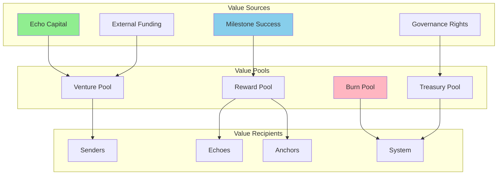
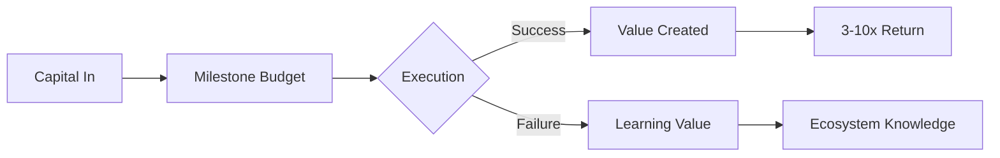
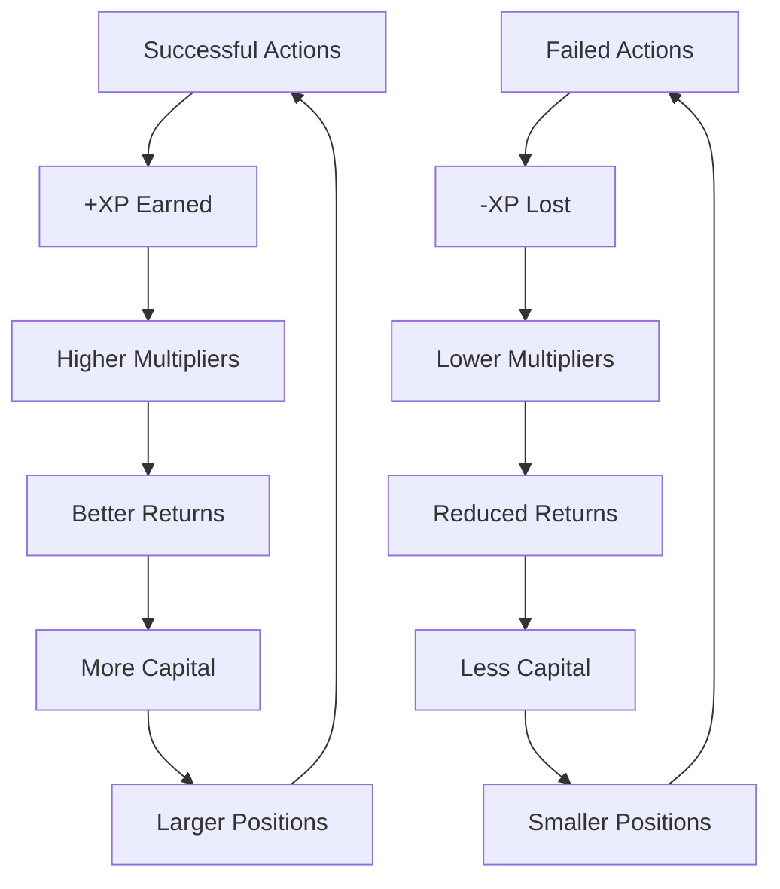
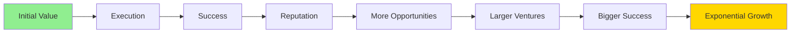

# Value Flow

## How Value Moves Through Studio3

Understanding how value flows through the Studio3 ecosystem reveals the elegant economic design that aligns all participants toward collective success. Every transaction strengthens the network.

## Value Flow Overview

### The Economic Circulation

## Primary Value Streams

### 1. Signal Value Flow

### 📡 Echo → Venture → Echo Flow

**The Signal Cycle:**

1. **Echoes stake $SIGNAL
*
* on milestone outcomes
2. **Stakes pool** in milestone smart contract
3. **Ventures execute** using pooled confidence
4. **Validation determines** success or failure
5. **Rewards distribute** to correct predictors
6. **Burns remove** tokens from failed predictions

**Value Multiplication:**

- **If milestone succeeds:

- *  
* Belief signals multiply by average 1.5x 
- 3x
- Doubt signals are burned (100% loss)
  - Net value created equals rewards minus original stakes
  - **If milestone fails:

* *

* Doubt signals multiply by average 1.2x 
- 2x  
- Belief signals are burned (100% loss)
  - Net value destroyed equals burned tokens
  - **Overall impact:

* *

* Success creates value through multipliers
  - Failure destroys value through burns
  - System naturally rewards accuracy

### 2. Milestone Funding Flow

### 💰 Platform → Venture → Execution Flow

**Funding Progression:**

| Phase | Funding Source | Typical Amount | Use Case |
|-------|----------------|----------------|----------|
| **Spark** | Platform grants | 1-5K $SIGNAL | Idea validation |
| **Ignition** | Echo signals | 10-50K | MVP development |
| **Drift** | Mixed sources | 50-200K | Product iteration |
| **Orbit** | Revenue + signals | 200K-1M | Growth operations |
| **Flare** | External capital | 1M-10M | Scale expansion |
| **Ascension** | Buyback funds | Variable | Sovereignty |

**Capital Efficiency:**

### 3. Validation Fee Flow

### ⚓ Venture → Anchor → Ecosystem Flow

**Fee Distribution:**

- **Base fee**: 3% of milestone value

- **Distribution breakdown:

* *

* 70% to validating anchor
  - 20% to anchor backup pool
  - 10% to platform operations

- **Performance adjustments:

- *  
* Quality score > 90%: 1.5x multiplier
  - Many anchors reinvest 30% back into ecosystem
  - Creates compound growth effect

**Value Multiplication:**

- Quality validation increases venture success

- Successful ventures create more milestones
- More milestones generate more fees
- Ecosystem growth benefits all

## Secondary Value Streams

### 4. Reputation Value Flow

### 🌟 Performance → XP → Opportunities Flow

**Reputation Economics:**

**XP Value Components:**

- **Direct monetary value**: 0.01% bonus per 100 XP on signals

- **Access value**: Unlock exclusive high-value opportunities
- **Network value**: Trust score equals XP/100 for connections
- **Governance value**: Voting power uses quadratic formula

**Total Value Impact:**

- Higher XP compounds all benefits

- Creates virtuous cycle of success
- Reputation becomes valuable asset
- Cannot be bought or transferred

### 5. NFT Value Flow

### 🎨 Creation → Journey → Sovereignty Flow

**NFT Value Progression:**

| NFT Type | Initial Value | Peak Value | Value Drivers |
|----------|---------------|------------|---------------|
| **Spark** | 0.1-1 ETH | 5-50 ETH | IP quality, venture success |
| **Signal** | 1-5 ETH | 10-100 ETH | Milestone history, community |
| **Halo** | Locked | Priceless | Sovereignty rights |

**Value Accrual Mechanics:**

1. **Spark NFTs
* * gain value from:
* Successful venture launches
   - IP combination uniqueness
   - Historical significance
   - Collector demand

2. **Signal NFTs** appreciate through:

- Milestone achievements

- Community growth
   - Revenue generation
   - Visual evolution

3. **Halo NFTs** unlock value via:

- Governance rights

- Alumni network
   - Sub-studio creation
   - Legacy status

### 6. Governance Token Flow

### 🗿️ Participation → Tokens → Influence Flow

**Governance Distribution:**

- **40%

- * to active Echoes (supporters)
* **30%

* * to successful Senders (graduated ventures)

* **20%

* * to Anchor Council (validators)

* **10%

*

* to treasury reserve (future use)

**Earning Mechanics:**

- **Base rewards

- * vary by action type
* **Activity multiplier**: Monthly actions / 100
- **Quality multiplier**: Success rate × 2
- **Tenure multiplier**: 1 + (months active / 12) × 0.1
- **Monthly cap
- * prevents farming

**Token Utility:**

- Vote on platform changes

- Elect Anchor Council
- Allocate treasury funds
- Shape ecosystem future

## Value Multiplication Effects

### Network Effects

    

        <h4>🌐 Direct Network Effects</h4>
        <ul>
            <li>More ventures → More signals</li>
            <li>More echoes → Better pricing</li>
            <li>More anchors → Higher quality</li>
            <li>Better quality → More ventures</li>
        </ul>
    

    
    

        <h4>🔄 Indirect Network Effects</h4>
        <ul>
            <li>Success stories → Media attention</li>
            <li>Media attention → New users</li>
            <li>New users → More innovation</li>
            <li>Innovation → Success stories</li>
        </ul>
    

### Compound Value Creation

## Value Leakage Prevention

### Anti-Extraction Mechanisms

### 🚫 Preventing Value Drain

**Protection Systems:**

1. **Burn Mechanics
* *
* Failed signals don't redistribute
   - Tokens permanently removed
   - Increases scarcity for holders

2. **Reputation Locks**
   
- XP can't be transferred
   
- Benefits tied to participation
   - No account selling value

3. **Vesting Schedules**
   
- Gradual token release
   
- Long-term alignment
   - Reduced dump risk

4. **Graduation Requirements**
   
- Must complete all phases
   
- Community approval needed
   - Value creation mandatory

### Economic Security

!!! warning "Value Protection Measures"
    - **Sybil Resistance**: One person, one reputation
    - **Wash Trading Prevention**: Signals require real risk
    - **Manipulation Detection**: AI monitors patterns
    - **Emergency Halts**: Circuit breakers for anomalies

## Treasury Management

### Platform Value Reserves

### 🏛️ Treasury Flow Management

**Revenue Sources:**

- **Platform fees**: 1% of milestone values

- **Graduation fees**: 0.5% of venture value at exit
- **Premium services**: Subscription revenue from advanced features
- **Partnership deals**: Strategic income from integrations
- **Investment returns**: Yield on treasury holdings

**Allocation Strategy:**

| Use Case | Allocation | Purpose |
|----------|------------|----------|
| **Development** | 40% | Platform improvements |
| **Marketing** | 20% | User acquisition |
| **Emergency Fund** | 20% | Crisis management |
| **Rewards Pool** | 15% | Incentive programs |
| **Operations** | 5% | Daily expenses |

**Value Recycling:**

- Treasury funds ecosystem growth

- Growth creates more revenue
- Revenue strengthens treasury
- Sustainable value loop

## Measuring Value Flow

### Key Metrics

    

        <h4>📊 Flow Metrics</h4>
        <ul>
            <li>Daily Active Value: $2.5M</li>
            <li>Value Velocity: 0.15</li>
            <li>Burn Rate: 2% monthly</li>
            <li>Creation Rate: 5% monthly</li>
        </ul>
    

    
    

        <h4>📈 Health Indicators</h4>
        <ul>
            <li>Net Value Positive: Yes</li>
            <li>Sustainable Burn: Yes</li>
            <li>Treasury Growing: Yes</li>
            <li>User Value Up: Yes</li>
        </ul>
    

### Value Analytics

### Value Analytics

**Health Calculation Metrics:**

- **Net value creation**: Total inflows minus outflows and burns

- **Value velocity**: Outflows divided by total value locked
- **Sustainability score**: Treasury divided by monthly burn rate
- **Growth rate**: Net value divided by total locked value

**Health Indicators:**

- **Healthy**: Months of runway > 24

- **Growing**: Positive net value creation
- **Sustainable**: Balanced velocity ratio
- **Thriving**: All metrics in green zone

## Value Flow Optimization

### For Participants

### 🎯 Maximizing Value Capture

**Echo Strategies:**

1. **Compound Earnings* 
- Reinvest rewards
2. **Reputation Building** - Long-term multipliers
3. **Network Leverage** - Collaborative strategies
4. **Timing Optimization** - Enter/exit efficiency

**Sender Strategies:**

1. **Bootstrap Efficiently* 
- Minimize burn rate
2. **Milestone Sizing** - Optimal funding amounts
3. **Community Building** - Increase believer base
4. **Value Demonstration** - Clear success metrics

**Anchor Strategies:**

1. **Quality Premium* 
- Thorough validation
2. **Mentor Actively** - Success bonuses
3. **Reputation Focus** - Compound opportunities
4. **Selective Engagement** - High-value milestones

## Future Value Flows

### Planned Enhancements

!!! info "Upcoming Value Streams"
    - **Cross-Chain Bridges**: Multi-network value
    - **DeFi Integration**: Yield generation
    - **Partner Tokens**: Ecosystem expansion
    - **Real-World Assets**: Bridge to traditional
    - **Automated Strategies**: AI-optimized flows

## Case Studies

### Successful Value Creation

#### 🌟 The Network Effect Venture

**Venture:** SocialFi Protocol  
**Value Created:** $10M → $250M in 18 months  

**Flow Optimization:**

- Reinvested 80% of early revenues

- Created token incentive loops
- Built strong network effects
- Graduated with 25x value multiple

> "Understanding value flow let us design sustainable token economics from day one." - SocialFi Founder

## Your Value Strategy

### Optimizing Your Flow

1. **Map Your Position** - Understand your role's flows
2. **Identify Multipliers** - Find leverage points
3. **Minimize Leakage** - Avoid value traps
4. **Compound Gains** - Reinvest wisely
5. **Think Long-term** - Sustainable strategies win

## Next Steps

- Choose your role with [Choosing Your Role](choosing-role.md)
- Start participating with [First Steps](first-steps.md)
- Deep dive into role-specific value strategies
- Join community discussions on optimization