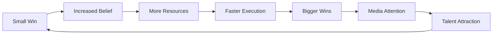

# Building Momentum

## Accelerating Your Venture's Growth

<div class="arena-card" markdown="1">

### 🚀 From Progress to Acceleration

Momentum is the difference between ventures that grind and ventures that soar. It's the compound effect of consistent wins, growing belief, and accelerating progress. This guide shows you how to build and maintain unstoppable momentum.

</div>

## Understanding Momentum

### The Physics of Startups

<div class="arena-card" markdown="1">

### ⚡ Momentum = Mass × Velocity

**Startup Momentum Equation:**

```python
** def calculate_momentum():
    mass = {
        "team_size": team_members,
        "customer_base": active_users,
        "community": echo_signals,
        "resources": runway_months,
        "partnerships": strategic_allies
    }
    
    velocity = {
        "growth_rate": month_over_month,
        "shipping_speed": features_per_sprint,
        "learning_rate": iterations_per_month,
        "signal_velocity": new_echoes_daily,
        "viral_coefficient": referral_rate
    }
    
    momentum = sum(mass.values()) * sum(velocity.values())
    return momentum
```

**Momentum Characteristics:**

- ** Self-reinforcing
- Compounds over time
- Attracts resources
- Reduces friction
- Creates inevitability

</div>

### The Momentum Flywheel

<div class="arena-card" markdown="1">

### 🔄 Self-Reinforcing Success


** Flywheel Components:
1. **Achievement** → Confidence
2. **Confidence** → Investment
3. **Investment** → Capability
4. **Capability** → Achievement
5. **Repeat**  → AccelerationCritical Mass Point:
- ** When momentum becomes self-sustaining
- External push no longer needed
- Growth becomes inevitable
- Market assumes success

</div>

## Building Initial Momentum

### Quick Wins Strategy

<div class="arena-card" markdown="1">

### 🏆 Stacking Small Victories
**30-Day Quick Win Plan:** Week 1: Foundation Wins```markdown
Day 1-2: Launch announcement
- ✅ Website live
- ✅ Community created
- ✅ First Echo signals

Day 3-4: First feature
- ✅ Core function working
- ✅ First user onboarded
- ✅ Initial feedback

Day 5-7: Social proof
- ✅ 10 testimonials
- ✅ Press mention
- ✅ 100 followers
```

**Week 2-3: Building Wins
- ** 50 active users
- First revenue
- Key partnership
- Product update
- Community event
**Week 4: Momentum Wins
- ** Hit milestone early
- Major announcement
- Influencer endorsement
- Team expansion
- Next phase preview

</div>

### Velocity Hacking

<div class="arena-card" markdown="1">

### ⏱️ Speed as Strategy
** Velocity Multipliers:
1. **Parallel Execution**
   ```python
   # Not this (sequential)
** def slow_execution():
       complete_feature_a()  # 2 weeks
       then_complete_feature_b()  # 2 weeks
       then_complete_feature_c()  # 2 weeks
       total_time = 6  # weeks
   
   # This (parallel)
** def fast_execution():
       thread_a = start_feature_a()
       thread_b = start_feature_b()
       thread_c = start_feature_c()
       total_time = 2  # weeks
   ```

2. **Rapid Iteration**

- Daily deployments

- Continuous feedback

- Instant pivots

- Fast decisions

- Quick experiments

3. **Resource Optimization**

- Automate everything

- Eliminate blockers
- Outsource non
- core

- Focus ruthlessly

- Say no often

</div>

## Momentum Metrics

### Tracking Acceleration

<div class="arena-card" markdown="1">

### 📊 Measuring What Matters
**Core Momentum KPIs:| Metric | Target | Frequency |
|--------|--------|------------|
| Weekly Growth Rate | >10% | Weekly |
| Echo Signal Velocity | >20/day | Daily |
| Feature Ship Rate | >2/week | Weekly |
| NPS Score | >50 | Monthly |
| Team Velocity | Increasing | Sprint |
| Press Mentions | >4/month | Monthly |
| Viral Coefficient | >1.2 | Weekly |
** Momentum Dashboard:
```javascript
const momentumDashboard = {
    velocity_metrics: {
        current_week: {
            growth: "12%",
            signals: "147",
            features: "3",
            status: "�︢"  // Green
        },
        trend: "accelerating",
        projection: "20% next week"
    },
    momentum_score: 87,
    risk_factors: ["competitor launch", "tech debt"],
    opportunities: ["PR coverage", "partnership close"]
};
```

</div>

### Leading vs Lagging

<div class="arena-card" markdown="1">

### 🎯 Predictive Indicators
**Leading Indicators**  (Predict Future):
- ** Daily active users trend
- Feature adoption rate
- Community engagement
- Pipeline velocity
- Code commit frequency

**Lagging Indicators**  (Confirm Past):
- ** Monthly revenue
- Customer count
- Churn rate
- Market share
- Profitability
** Balance Strategy:
- ** 70% focus on leading
- 30% tracking lagging
- Weekly leading review
- Monthly lagging analysis
- Quarterly correlation check

</div>

## Amplification Strategies

### Media Momentum

<div class="arena-card" markdown="1">

### 📣 Creating Buzz
** PR Momentum Tactics:
1. **Story Stacking**
   ```
   Week 1: Funding announcement
   Week 2: Key hire reveal
   Week 3: Partnership news
   Week 4: Product launch
   Week 5: Customer milestone
   = Continuous news cycle
   ```

2. **Exclusive Strategy**

- TechCrunch exclusive

- Podcast premiere

- Beta access stories
- Behind
- scenes content

- Founder interviews

3. **Newsjacking**

- Trend commentary

- Industry reactions

- Competitive comparisons

- Market insights

- Future predictions
** Media Multiplier Effect:
- ** One story → Three mentions
- Three mentions → Nine shares
- Nine shares → Trend status
- Trend status → Organic coverage

</div>

### Community Amplification

<div class="arena-card" markdown="1">

### 👥 Turning Echoes into Engines
** Community Momentum Programs:
1. **Ambassador Army**
   ```python
   ambassador_program = {
       "recruitment": "Top 10% engaged Echoes",
       "training": "Weekly momentum sessions",
       "tools": {
           "content_templates": True,
           "referral_codes": True,
           "exclusive_access": True,
           "swag_kit": True
       },
       "rewards": {
           "referrals": "10% signal bonus",
           "content": "100 $SIGNAL per piece",
           "events": "VIP access",
           "influence": "Advisory input"
       }
   }
   ```

2. **Viral Mechanics**

- Referral rewards

- Sharing incentives

- Network effects

- Social proof

- FOMO creation

3. **Event Momentum**

- Weekly demos

- Monthly launches

- Quarterly summits

- Annual conference

- Continuous energy

</div>

## Maintaining Momentum

### Avoiding Stalls

<div class="arena-card" markdown="1">

### ⚠️ Momentum Killers
** Common Stall Causes:
1. **Internal Friction**

- Team conflicts

- Decision paralysis

- Technical debt

- Process overhead

- Vision drift

2. **External Shocks**

- Competitor moves

- Market shifts

- Regulatory changes

- Economic downturns

- Key departures

3. **Execution Gaps**

- Missed deadlines

- Quality issues

- Customer churn

- Feature creep

- Focus loss
** Anti-Stall Protocols:
```python
** def prevent_momentum_stall():
    # Daily momentum check
** if velocity < threshold:
        diagnose_friction_points()
        implement_quick_wins()
        communicate_progress()
        rally_community()
    
    # Weekly momentum boost
    ship_something_visible()
    celebrate_wins_publicly()
    preview_next_milestone()
    
    return maintained_momentum
```

</div>

### Recovery Strategies

<div class="arena-card" markdown="1">

### 🔄 Restarting Stalled Momentum
**Momentum Recovery Plan:** Week 1: Diagnosis
- ** Identify stall cause
- Survey community
- Analyze metrics
- Team retrospective
- Create action plan
**Week 2: Quick Fixes
- ** Ship easy wins
- Fix visible bugs
- Improve communication
- Re-engage Echoes
- Show progress
**Week 3: Big Push
- ** Major announcement
- Product update
- Press coverage
- Community event
- Partnership reveal
**Week 4: Sustain
- ** Maintain cadence
- Build systems
- Prevent repeat
- Celebrate recovery
- Plan ahead

</div>

## Advanced Techniques

### Momentum Stacking

<div class="arena-card" markdown="1">

### 🎯 Compound Acceleration
** Multi-Layer Momentum:
```
Product Momentum
    │
    ├─> Feature velocity
    ├─> User growth
    └─> Quality improvements
         │
         ↓
Community Momentum
    │
    ├─> Echo signals
    ├─> Engagement rate
    └─> Viral spread
         │
         ↓
Market Momentum
    │
    ├─> Press coverage
    ├─> Competitor fear
    └─> Industry recognition
         │
         ↓
Team Momentum
    │
    ├─> Hiring velocity
    ├─> Skill growth
    └─> Culture strength
```
** Stacking Strategy:
- ** Build one layer first
- Use it to boost next
- Create reinforcement loops
- Monitor all layers
- Maintain balance

</div>

### Momentum Arbitrage

<div class="arena-card" markdown="1">

### 💹 Trading Momentum
** Arbitrage Opportunities:
1. **Attention Arbitrage**

- Undervalued channels

- Emerging platforms

- Niche communities

- Untapped markets

- Fresh angles

2. **Timing Arbitrage**

- News cycles

- Seasonal trends

- Market gaps

- Competitor mistakes

- Industry shifts

3. **Network Arbitrage**

- Influencer connections

- Partnership leverage

- Community bridges
- Cross
- promotion

- Ecosystem plays
** Execution:
```python
** def momentum_arbitrage():
    opportunities = scan_for_gaps()
    
** for opportunity in opportunities:
** if effort_to_impact_ratio(opportunity) > threshold:
            execute_quickly(opportunity)
            amplify_results()
            compound_gains()
    
    return multiplied_momentum
```

</div>

## Momentum Culture

### Building a Momentum Team

<div class="arena-card" markdown="1">

### 👥 Everyone an Accelerator
** Cultural Elements:
1. **Velocity Values**

- Ship daily

- Decide fast

- Learn quickly

- Iterate always

- Celebrate wins

2. **Momentum Rituals**

- Daily standups

- Weekly demos

- Sprint reviews

- Win celebrations

- Failure parties

3. **Accountability Systems**

- Public commitments

- Transparent metrics

- Peer pressure

- Reward velocity

- Remove blockers
** Team Momentum Stack:
```
Individual Momentum
  × Team Coordination
  × Resource Availability  
  × Cultural Alignment
  = Unstoppable Force
```

</div>

### Momentum Communication

<div class="arena-card" markdown="1">

### 📢 Broadcasting Acceleration
**Communication Framework:**  Internal (Team):
- ** Real-time dashboards
- Slack celebrations
- Weekly win emails
- Sprint velocities
- Personal records
** External (Community):
```markdown
### Weekly Momentum Update

🚀** This Week's Velocity:
- ** Users: +523 (+47% WoW)
- Revenue: +$12.3K (+62% WoW)  
- Features: 8 shipped
- Echoes: +89 believers

🎆** Momentum Highlights:
- ** Broke 1,000 user barrier
- TechCrunch coverage
- Series A interest
- Key hire joined

🎯** Next Week Preview:
- ** Major feature launch
- Partnership announcement
- Community event
- Surprise reveal 👀
```

</div>

## Momentum Milestones

### Setting Momentum Goals

<div class="arena-card" markdown="1">

### 🎯 Acceleration Targets
** Momentum-Based Milestones:
1. **Velocity Milestones**

- "Ship 50 features in 30 days"

- "Reach 100 signals/day"

- "10X growth in 90 days"

- "Daily press coverage"

2. **Compound Milestones**

- "Triple monthly triple"

- "Viral coefficient >2"
- "Self
- sustaining growth"

- "Market inevitability"

3. **Breakthrough Milestones**

- "Category creation"

- "Competitor acquisition"

- "Industry standard"

- "Unicorn valuation"

</div>

## Common Pitfalls

### Momentum Mistakes

<div class="arena-card" markdown="1">

### ⚠️ What Kills Acceleration
** Fatal Errors:
1. **Fake Momentum**

- Vanity metrics

- Paid growth only

- Hype without substance

- Unsustainable pace

2. **Momentum Addiction**

- Burnout culture

- Quality sacrifice

- Strategic drift

- Team exhaustion

3. **Momentum Blindness**

- Ignoring warnings

- Missing pivots

- Runway ignorance

- Market deafness
** Healthy Balance:
- ** Sustainable pace
- Quality + Speed
- Strategic focus
- Team wellness
- Long-term view

</div>

## Next Steps

### Riding the Wave

Ready for the next phase? Continue to:
1. [Drift Navigation](drift-navigation.md) - Finding product-market fit
2. [Achieving Orbit](achieving-orbit.md) - Reaching stable operations  
3. [Flare Scaling](flare-scaling.md) - Explosive growth tactics

---

!!! success "Momentum Mathematics"
    Momentum isn't linear - it's exponential. Every win makes the next win easier. Every believer attracts more believers. Every success compounds into greater success. Build momentum intentionally and watch your venture become unstoppable.

!!! tip "The Momentum Secret"
    True momentum comes from alignment: when team, product, market, and community all accelerate together. Focus on creating these alignment moments and momentum becomes inevitable.