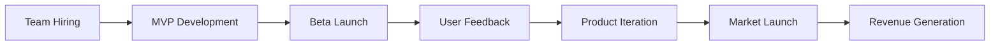

# Milestone Planning

## Setting Goals That Drive Success

<div class="arena-card" markdown="1">

<h3>🎯 The Art of Effective Milestones</h3>

Milestones are the heartbeat of Studio3 ventures. They're not just goals - they're public commitments that attract belief, drive progress, and unlock rewards. Master milestone planning to maximize your venture's momentum.

</div>

## Understanding Milestones

### What Makes a Great Milestone?

<div class="arena-card" markdown="1">

<h3>📊 The SMART-V Framework</h3>

**SMART-V Criteria:**
- **S**pecific - Clear and unambiguous
- **M**easurable - Quantifiable outcomes
- **A**chievable - Realistic yet ambitious
- **R**elevant - Aligned with phase goals
- **T**ime-bound - Clear deadline
- **V**erifiable - Provable to Anchors
**Examples:**
✅ Good: "Launch MVP with 100 beta users by March 31"
❌ Poor: "Build a great product soon"

✅ Good: "Achieve $10K MRR with 50 paying customers"
❌ Poor: "Get some revenue"

</div>

### Milestone Types

<div class="arena-card" markdown="1">

<h3>🏗️ Different Goals for Different Stages</h3>

**Technical Milestones:**
- Feature completion
- Performance targets
- Security audits
- Integration goals
- Infrastructure scaling

**Business Milestones:**
- Revenue targets
- User acquisition
- Market penetration
- Partnership deals
- Funding rounds

**Team Milestones:**
- Key hires
- Skill development
- Culture building
- Process implementation
- Knowledge transfer

**Community Milestones:**
- Echo engagement
- Network effects
- Content creation
- Event hosting
- Ecosystem contribution

</div>

## Phase-Specific Planning

### Ignition Phase Milestones

<div class="arena-card" markdown="1">

<h3>🚀 Early Stage Goals</h3>

**Typical Ignition Milestones:** Month 1-2:
```markdown
Milestone: "Complete Technical Architecture"
- Finalize tech stack
- Design system architecture
- Set up development environment
- Create deployment pipeline
Deliverable: Architecture documentation + demo
```

**Month 3-4:**
```markdown
Milestone: "Launch Functional MVP"
- Core features operational
- Basic UI/UX complete
- User authentication working
- Initial testing complete
Deliverable: Live MVP + 50 beta users
```

**Month 5-6:**
```markdown
Milestone: "Achieve Product-Market Fit Signal"
- 100+ active users
- 40% weekly retention
- NPS score >30
- Clear use case validation
Deliverable: Metrics dashboard + user testimonials
```

</div>

### Drift Phase Milestones

<div class="arena-card" markdown="1">

<h3>🌊 Finding Your Flow</h3>

**Drift Milestone Examples:**

1. **Market Validation**
   - 500 paying customers
   - 3 customer segments identified
   - Churn <5% monthly
   - CAC < LTV proven

2. **Product Evolution**
   - 3 major iterations completed
   - Feature-market fit achieved
   - Platform stability >99.9%
   - Mobile app launched

3. **Business Model**
   - Unit economics positive
   - $50K MRR achieved
   - Sales process defined
   - Pricing optimized

</div>

### Advanced Phase Milestones

<div class="arena-card" markdown="1">

<h3>🔥 Scaling Goals</h3>

**Orbit/Flare/Ascension Examples:** Orbit (Stability):
- $500K ARR
- 1000+ customers
- Team of 10+
- Series A ready

**Flare (Growth):**
- $5M ARR
- Market leader position
- International expansion
- Strategic acquisitions

**Ascension (Exit):**
- IPO readiness
- Acquisition offers
- Full decentralization
- Legacy established

</div>

## Planning Process

### Strategic Planning Framework

<div class="arena-card" markdown="1">

<h3>🦭 Building Your Roadmap</h3>

**Planning Steps:**

1. **Vision Setting**
   ```python
   def set_milestone_vision():
       # Where are we now?
       current_state = assess_current_position()
       
       # Where do we want to be?
       target_state = define_success_metrics()
       
       # What's the gap?
       gap_analysis = target_state - current_state
       
       # How do we get there?
       milestone_path = create_stepping_stones(gap_analysis)
       
       return milestone_path
   ```

2. **Backwards Planning**
   - Start with end goal
   - Work backwards to today
   - Identify dependencies
   - Set realistic timelines
   - Buffer for unknowns

3. **Risk Assessment**
   - Technical risks
   - Market risks
   - Team risks
   - Financial risks
   - External risks

</div>

### Milestone Dependencies

<div class="arena-card" markdown="1">

<h3>🔗 Managing Dependencies

**Dependency Mapping:**


**Dependency Types:**
- **Sequential** - Must complete A before B
- **Parallel** - Can do simultaneously
- **Conditional** - If A then B
- **External** - Outside dependencies
- **Resource** - Shared constraints

**Management Strategies:**
1. Map all dependencies
2. Identify critical path
3. Build in buffers
4. Have contingencies
5. Communicate clearly

</div>

## Setting Effective Targets

### Quantifying Success

<div class="arena-card" markdown="1">

<h3>📊 Metrics That Matter

**Metric Selection Framework:**

| Phase | Primary Metrics | Secondary Metrics |
|-------|----------------|-------------------|
| Ignition | Users, Engagement | Features, Feedback |
| Drift | Revenue, Retention | Growth, Efficiency |
| Orbit | Profit, Scale | Market Share, NPS |
| Flare | Valuation, Impact | Innovation, Reach |

**Good Metrics Are:**
- Directly measurable
- Business relevant
- Leading indicators
- Comparable over time
- Actionable insights

</div>

### Stretch vs. Safe

<div class="arena-card" markdown="1">

<h3>⚖️ Balancing Ambition and Reality

**The 70-20-10 Rule:**
- **70% Confidence** - Core milestones
- **20% Stretch** - Ambitious targets
- **10% Moonshot** - Breakthrough goals
```
High Reward
    │
    │  Moonshot      Stretch
    │  (Selective)   (Pursue)
    │
    │  Avoid         Core
    │  (Skip)        (Focus)
    │
    └───────────────────→
              Low Risk    High Risk
```

</div>

## Milestone Documentation

### Writing Clear Proposals

<div class="arena-card" markdown="1">

<h3>📝 Compelling Milestone Declarations

**Milestone Proposal Template:**
```markdown
# Milestone: [Clear Title]

## Objective
[What we're achieving and why it matters]

## Success Criteria
- [ ] Specific metric 1
- [ ] Specific metric 2
- [ ] Specific metric 3

## Deliverables
1. [Tangible output 1]
2. [Tangible output 2]
3. [Tangible output 3]

## Timeline
- Start: [Date]
- Key Checkpoints: [Dates]
- Completion: [Date]

## Resources Required
- Team: [Who's involved]
- Budget: [Financial needs]
- Tools: [Technical requirements]

## Validation Method
[How Anchors will verify completion]

## Risk Mitigation
[Key risks and management strategies]
```

</div>

### Evidence Planning

<div class="arena-card" markdown="1">

<h3>📊 Proving Your Success

**Evidence Categories:**

1. **Quantitative Evidence**
   - Analytics dashboards
   - Financial reports
   - User metrics
   - Performance data
   - Growth charts

2. **Qualitative Evidence**
   - User testimonials
   - Case studies
   - Media coverage
   - Expert endorsements
   - Community feedback

3. **Technical Evidence**
   - Code repositories
   - Live demos
   - API documentation
   - Security audits
   - Performance tests

**Evidence Collection Plan:**
- Set up tracking early
- Automate where possible
- Regular snapshots
- Third-party validation
- Clear documentation

</div>

## Execution Strategies

### Sprint Planning

<div class="arena-card" markdown="1">

<h3>🏃 Breaking Down Big Goals

**Milestone Sprint Structure:** Week 1-2: Foundation
```
Sprint 1 Goals:
- Set up infrastructure
- Assign responsibilities
- Create tracking systems
- Kick-off meetings
- Initial development
```

**Week 3-6: Core Development**
```
Sprint 2-3 Goals:
- Feature development
- Testing cycles
- User feedback
- Iteration loops
- Progress tracking
```

**Week 7-8: Finalization**
```
Sprint 4 Goals:
- Final testing
- Documentation
- Evidence gathering
- Anchor preparation
- Launch ready
```

</div>

### Team Alignment

<div class="arena-card" markdown="1">

<h3>👥 Getting Everyone On Board

**Alignment Tactics:**

1. **Clear Communication**
   - Daily standups
   - Weekly reviews
   - Milestone dashboard
   - Progress updates
   - Blocker discussions

2. **Responsibility Matrix**
   ```
   RACI Chart:
   R - Responsible (Does the work)
   A - Accountable (Owns outcome)
   C - Consulted (Provides input)
   I - Informed (Kept updated)
   ```

3. **Motivation Systems**
   - Milestone bonuses
   - Recognition programs
   - Team celebrations
   - Learning opportunities
   - Career growth

</div>

## Common Pitfalls

### Avoiding Milestone Mistakes

<div class="arena-card" markdown="1">

<h3>⚠️ What Not to Do

**Common Mistakes:**

1. **Vague Objectives**
   - Problem: "Improve the product"
   - Solution: "Increase load speed by 50%"

2. **Unrealistic Timelines**
   - Problem: "Build everything in 2 weeks"
   - Solution: Realistic phase planning

3. **No Buffer Time**
   - Problem: Zero margin for error
   - Solution: 20% time buffer

4. **Poor Dependencies**
   - Problem: Everything depends on one thing
   - Solution: Parallel work streams

5. **Weak Evidence**
   - Problem: "Trust us, we did it"
   - Solution: Comprehensive proof

</div>

## Advanced Techniques

### Dynamic Milestone Adjustment

<div class="arena-card" markdown="1">

<h3>🔄 Adapting to Reality

**When to Adjust:**
- Market conditions change
- New opportunities arise
- Resources shift
- Learnings emerge
- Pivots necessary

**How to Adjust:**
1. Early communication
2. Data-driven rationale
3. Stakeholder buy-in
4. Revised planning
5. Clear documentation

**Adjustment Protocol:**
```python
def milestone_adjustment_protocol():
    if significant_change_detected():
        impact = assess_impact()
        
        if impact > threshold:
            proposal = create_adjustment_proposal()
            approval = get_stakeholder_approval(proposal)
            
            if approval:
                update_milestone()
                communicate_changes()
                reset_expectations()
```

</div>

### Milestone Stacking

<div class="arena-card" markdown="1">

<h3>🎯 Compound Progress

**Stacking Strategy:**
- Each milestone builds on previous
- Create momentum cascade
- Compound learning effects
- Network value growth
- Ecosystem expansion

**Example Stack:**
1. 100 users → Product validation
2. Product validation → First revenue
3. First revenue → Team expansion
4. Team expansion → Feature velocity
5. Feature velocity → Market leadership

</div>

## Measurement & Tracking

### Progress Dashboards

<div class="arena-card" markdown="1">

<h3>📊 Real-Time Visibility

**Dashboard Elements:**
```javascript
// Milestone tracking dashboard
const milestoneDashboard = {
    overall_progress: "68%",
    days_remaining: 22,
    key_metrics: {
        users: { target: 1000, current: 680, trend: "↑" },
        revenue: { target: 50000, current: 34000, trend: "↑" },
        features: { target: 10, current: 7, trend: "→" }
    },
    risk_indicators: {
        timeline: "green",
        budget: "yellow",
        team: "green",
        technical: "green"
    },
    next_actions: [
        "Complete payment integration",
        "Launch marketing campaign",
        "Hire senior developer"
    ]
};
```

</div>

## Next Steps

### From Planning to Execution

Ready to build? Continue to:
1. [MVP Development](mvp-development.md) - Building your product
2. [Engaging Echoes](engaging-echoes.md) - Community growth
3. [Building Momentum](building-momentum.md) - Accelerating progress

---

!!! success "Milestone Mastery"
    Great milestones are the difference between ventures that meander and ventures that accelerate. Plan thoughtfully, execute relentlessly, and let each success compound into the next.

!!! tip "Pro Planning Tip"
    Your first milestone should be ambitious enough to excite but achievable enough to build confidence. Early wins create momentum that carries through difficult phases.