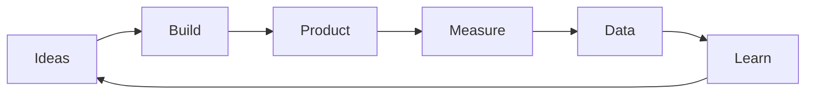

# MVP Development

## Building Your First Product Iteration

<div class="arena-card" markdown="1">

<h3>🚀 From Idea to Working Product</h3>

Your MVP (Minimum Viable Product) is your first real test in the market. It's not about perfection - it's about learning fast, validating assumptions, and building something people want. This guide shows you how to build an MVP that attracts users and signals.

</div>

## MVP Philosophy

### What Makes a Great MVP?

<div class="arena-card" markdown="1">

<h3>🎯 The Studio3 MVP Approach</h3>

**MVP Principles:**
1. **Minimum** - Just enough features
**2. **Viable** - Actually solves a problem
**3. **Product** - Real value, not a demo
**4. **Learnable** - Generates insights
**5. **Evolvable** - Foundation for growth
**What an MVP is NOT:**
- ❌ A half-built product
- ❌ A collection of features
- ❌ A technical demo
- ❌ The final vision
- ❌ Perfect or polished

**What an MVP IS:**
- ✅ A learning tool
- ✅ A value delivery system
- ✅ A hypothesis test
- ✅ A user magnet
- ✅ A foundation stone

</div>

### The Build-Measure-Learn Loop

<div class="arena-card" markdown="1">

<h3>🔄 Rapid Iteration Cycle</h3>



**Cycle Optimization:** Build Fast** - 2-4 week sprints**
- **Measure Everything** Learn Quickly
- **Iterate Constantly** Stay Lean
</div>

## Planning Your MVP

### Feature Prioritization

<div class="arena-card" markdown="1">

<h3>📋 The MoSCoW Method</h3>

**Feature Categories:** Must Have (60%)
- Core value proposition
- Basic user flow
- Essential functionality
- Security basics
- Data persistence

**Should Have (20%)**
- Enhanced UX
- Additional features
- Performance optimization
- Basic analytics
- Error handling

**Could Have (10%)**
- Nice-to-have features
- Advanced functionality
- Aesthetic improvements
- Social features
- Gamification

**Won't Have (10%)**
- Future vision features
- Platform expansion
- Advanced integrations
- Scaling infrastructure
- Premium features

**Example Prioritization:**
```python
features = {
    "must_have": [
        "user_authentication",
        "core_workflow",
        "payment_processing",
        "basic_dashboard"
    ],
    "should_have": [
        "email_notifications",
        "mobile_responsive",
        "data_export",
        "user_settings"
    ],
    "could_have": [
        "dark_mode",
        "social_sharing",
        "advanced_filters",
        "api_access"
    ],
    "wont_have": [
        "ai_features",
        "blockchain_integration",
        "vr_interface",
        "iot_connectivity"
    ]
}
```

</div>

### User Story Mapping

<div class="arena-card" markdown="1">

<h3>🗄️ Building User Journeys</h3>

**Story Structure:**
```
As a [user type]
I want to [action]
So that [benefit]

Acceptance Criteria:
- Given [context]
- When [action]
- Then [outcome]
```

**Example User Stories:** Story 1: First-Time User
```
As a new user
I want to sign up quickly
So that I can start using the product

Acceptance:
- Given I'm on the landing page
- When I click "Get Started"
- Then I can sign up in <30 seconds
```

**Story 2: Core Value**
```
As a daily user
I want to complete my main task
So that I get value from the product

Acceptance:
- Given I'm logged in
- When I access the main feature
- Then I can complete my task in <3 clicks
```

</div>

## Technical Architecture

### Tech Stack Selection

<div class="arena-card" markdown="1">

<h3>🛠️ Choosing Your Tools</h3>

**Stack Considerations:**

| Factor | Questions to Ask |
|--------|------------------|
| **Team Skills** | What does your team know? |
| **Time to Market** | How fast can you build? |
| **Scalability** | Will it grow with you? |
| **Cost** | What's the budget impact? |
| **Community** | Is help available? |
| **Integration** | Does it play nice? |

**Common MVP Stacks:** Fast & Simple:
```javascript
// MEAN/MERN Stack
const mvpStack = {
    frontend: "React",
    backend: "Node.js + Express",
    database: "MongoDB",
    hosting: "Vercel + MongoDB Atlas",
    auth: "Auth0",
    payments: "Stripe"
};
```

**Robust & Scalable:**
```python
# Django + React
mvp_stack = {
    "frontend": "React + TypeScript",
    "backend": "Django REST",
    "database": "PostgreSQL",
    "hosting": "AWS/Heroku",
    "auth": "Django Auth",
    "payments": "Stripe",
    "queue": "Celery + Redis"
}
```

</div>

### MVP Architecture

<div class="arena-card" markdown="1">

<h3>🏗️ Building for Evolution</h3>

**Architecture Principles:**

```
MVP Architecture
├── Frontend
│   ├── Landing Page
│   ├── Auth Flow
│   ├── Core Features
│   └── User Dashboard
├── Backend
│   ├── API Layer
│   ├── Business Logic
│   ├── Data Models
│   └── External Services
└── Infrastructure
    ├── Database
    ├── File Storage
    ├── Monitoring
    └── Analytics
```

**Best Practices:**
1. **Modular Design** - Easy to change
**2. **API-First** - Flexible frontend
**3. **Stateless** - Easy to scale
**4. **Documented** - Easy to maintain
**5. **Tested** - Easy to evolve
</div>

## Development Process

### Sprint Planning

<div class="arena-card" markdown="1">

<h3>🏃 2-Week Sprint Cycles</h3>

**Sprint Structure:** Week 1: Build
```
Day 1-2: Sprint Planning
- Define sprint goals
- Break down tasks
- Assign responsibilities
- Set up environments

Day 3-5: Core Development
- Feature implementation
- Daily standups
- Continuous integration
- Code reviews
```

**Week 2: Polish**
```
Day 6-8: Integration
- Feature integration
- Testing cycles
- Bug fixes
- Performance optimization

Day 9-10: Release Prep
- Final testing
- Documentation
- Deployment prep
- Sprint review
```

</div>

### Rapid Prototyping

<div class="arena-card" markdown="1">

<h3>⚡ Speed Techniques</h3>

**Prototyping Strategies:**

1. **Use Frameworks**
   ```bash
   # Quick starts
   npx create-react-app my-mvp
   django-admin startproject my-mvp
   rails new my-mvp
   flutter create my-mvp
   ```

2. **Leverage Services**
   - Auth: Auth0, Firebase Auth
   - Payments: Stripe, PayPal
   - Email: SendGrid, Mailgun
   - Storage: S3, Cloudinary
   - Analytics: Mixpanel, Amplitude

3. **UI Libraries**
   - Material-UI
   - Tailwind CSS
   - Bootstrap
   - Ant Design
   - Chakra UI

4. **No-Code Tools**
   - Bubble (full apps)
   - Webflow (landing pages)
   - Zapier (integrations)
   - Airtable (databases)
   - Retool (internal tools)

</div>

## Core Features

### Authentication & Onboarding

<div class="arena-card" markdown="1">

<h3>🔐 First User Experience</h3>

**Auth Requirements:**
```javascript
// Minimal auth flow
const authFlow = {
    signup: {
        fields: ["email", "password"],
        optional: ["name"],
        verification: "email",
        time: "<30 seconds"
    },
    login: {
        methods: ["email", "social"],
        remember_me: true,
        forgot_password: true,
        time: "<5 seconds"
    },
    onboarding: {
        steps: 3,  // Maximum
        skippable: true,
        personalization: "minimal",
        time: "<2 minutes"
    }
};
```

**Onboarding Best Practices:**
1. Show value immediately
2. Minimize friction
3. Progressive disclosure
4. Smart defaults
5. Quick wins

</div>

### Core Value Delivery

<div class="arena-card" markdown="1">

<h3>💡 The Magic Moment</h3>

**Value Delivery Framework:**

1. **Identify Core Value**
   - What problem do you solve?
   - What's the "aha" moment?
   - How quickly can users get there?

2. **Remove Barriers**
   - Simplify the path
   - Eliminate steps
   - Automate setup
   - Provide templates

3. **Measure Success**
   ```python
   success_metrics = {
       "time_to_value": "<5 minutes",
       "activation_rate": ">60%",
       "feature_adoption": ">40%",
       "return_rate": ">30% in 7 days"
   }
   ```

</div>

### Analytics & Feedback

<div class="arena-card" markdown="1">

<h3>📊 Learning from Users</h3>

**Essential Analytics:**

```javascript
// Track these from day 1
const analytics = {
    user_metrics: [
        "signups",
        "activations",
        "daily_active_users",
        "retention_cohorts",
        "churn_rate"
    ],
    feature_metrics: [
        "feature_adoption",
        "usage_frequency",
        "completion_rates",
        "error_rates",
        "performance"
    ],
    business_metrics: [
        "conversion_rate",
        "customer_acquisition_cost",
        "lifetime_value",
        "revenue_per_user",
        "viral_coefficient"
    ]
};
```

**Feedback Channels:**
- In-app feedback widget
- User interviews
- Support tickets
- Community forums
- Analytics behavior

</div>

## Testing Strategy

### MVP Testing Approach

<div class="arena-card" markdown="1">

<h3>🧪 Pragmatic Testing</h3>

**Testing Priorities:**

1. **Critical Path Testing**
   - User can sign up
   - User can use core feature
   - User can pay (if applicable)
   - Data is saved correctly
   - Security is maintained

2. **Automated Basics**
   ```python
   # Minimal test suite
   def test_mvp():
       test_user_registration()
       test_user_login()
       test_core_feature()
       test_payment_flow()
       test_data_persistence()
       test_basic_security()
   ```

3. **Manual Testing**
   - User journey testing
   - Edge case exploration
   - Cross-browser checks
   - Mobile responsiveness
   - Performance testing

</div>

### User Testing

<div class="arena-card" markdown="1">

<h3>👥 Getting Real Feedback</h3>

**Beta Testing Strategy:** Week 1: Closed Beta
- 10-20 friendly users
- Direct communication
- Rapid fixes
- Feature requests
- Bug reports

**Week 2-3: Limited Beta**
- 50-100 users
- Onboarding flow test
- Performance monitoring
- Feature validation
- Support testing

**Week 4+: Open Beta**
- Public access
- Marketing testing
- Scale testing
- Community building
- Revenue testing

</div>

## Launch Preparation

### Pre-Launch Checklist

<div class="arena-card" markdown="1">

<h3>✅ Ready for Launch?

**Technical Checklist:**
- [ ] Core features working
- [ ] Authentication secure
- [ ] Payment processing (if needed)
- [ ] Basic error handling
- [ ] Mobile responsive
- [ ] Analytics installed
- [ ] Monitoring active
- [ ] Backups configured

**Business Checklist:**
- [ ] Landing page ready
- [ ] Pricing decided
- [ ] Terms of service
- [ ] Privacy policy
- [ ] Support channel
- [ ] FAQ created
- [ ] Launch announcement
- [ ] Echo engagement plan

</div>

### Launch Strategy

<div class="arena-card" markdown="1">

<h3>🚀 Making a Splash</n
**Soft Launch Plan:** Day 1: Inner Circle
- Team and advisors
- Test all systems
- Fix critical issues
- Gather feedback

**Day 2-7: Echo Community**
- Signal holders first
- Exclusive access
- Community feedback
- Iterate quickly

**Week 2: Public Launch**
- Press release
- Social media
- Community posts
- Echo amplification
- Milestone announcement

</div>

## Common Pitfalls

### MVP Mistakes to Avoid

<div class="arena-card" markdown="1">

<h3>⚠️ Don't Do This</h3>

**Classic Mistakes:**

1. **Feature Creep**
   - Problem: Adding too much
   - Solution: Stick to MoSCoW

2. **Perfectionism**
   - Problem: Never launching
   - Solution: Ship at 80%

3. **Ignoring Feedback**
   - Problem: Building in vacuum
   - Solution: User interviews

4. **Technical Debt**
   - Problem: Shortcuts everywhere
   - Solution: Strategic debt

5. **No Analytics**
   - Problem: Flying blind
   - Solution: Measure from day 1

</div>

## Post-MVP Strategy

### From MVP to Product

<div class="arena-card" markdown="1">

<h3>🌱 Growing Beyond MVP</h3>

**Evolution Path:**

1. **Validate Core** (Weeks 1-4)
**   - Prove value proposition**
   - Find product-market fit
   - Identify key metrics

2. **Optimize Experience** (Weeks 5-8)
**   - Improve onboarding**
   - Enhance UI/UX
   - Reduce friction
   - Increase retention

3. **Add Features** (Weeks 9-12)
**   - User-requested features**
   - Competitive advantages
   - Revenue features
   - Growth features

4. **Scale Systems** (Months 3+)
**   - Performance optimization**
   - Infrastructure scaling
   - Team expansion
   - Process improvement

</div>

## Next Steps

### Continue Building

Ready to grow? Continue to:
1. [Engaging Echoes](engaging-echoes.md) - Community growth
2. [Building Momentum](building-momentum.md) - Accelerating progress
3. [Drift Navigation](drift-navigation.md) - Finding product-market fit

---

!!! success "MVP Magic"
    Your MVP is your first real conversation with the market. Make it count by focusing on core value, learning quickly, and iterating based on real user feedback.

!!! tip "Speed Secret"
    The best MVP is the one that's live. Ship fast, learn faster, and let your users guide you to product-market fit. Perfect is the enemy of good enough.